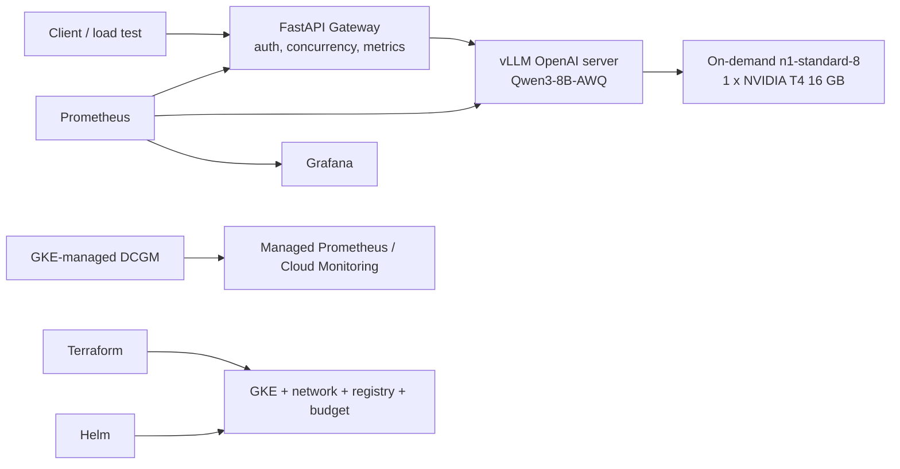

# Trade Balance LLM Platform

A production-style, cost-controlled inference platform for serving an open-weight LLM on Google Kubernetes Engine. It currently serves `Qwen/Qwen3-8B-AWQ` via vLLM on a single NVIDIA T4, fronted by a FastAPI gateway that exposes an API-key-protected, OpenAI-compatible streaming API.

> Status: infrastructure, application deployment, model loading, and authenticated SSE smoke tests are all working end to end; the model can scale to zero. Concurrency benchmarks, cold-start timings, GKE-managed DCGM GPU metrics, and final cost sign-off are still in progress.

## What's in this repo

- Terraform: GKE Standard, private VPC, a system node pool, a `0..1` on-demand T4 node pool, Artifact Registry, GCS, IAM, and a billing budget.
- Helm: vLLM, gateway, health probes, PVC, NetworkPolicy, ServiceMonitor, and PrometheusRule.
- FastAPI gateway: API key auth, request IDs, concurrency limiting, SSE passthrough, structured logging, and Prometheus metrics.
- Prometheus/Grafana: dashboards for gateway and vLLM request rate, latency, throughput, queue depth, and KV cache usage.
- Load testing: TTFT, end-to-end latency, per-request and aggregate tokens/s, request throughput, failure rate, across a concurrency ladder.

## Architecture



Terraform owns cloud infrastructure; Helm owns the Kubernetes workloads. Access today is via local `kubectl port-forward` to a ClusterIP — no public load balancer is created. GPU metrics go through GKE's officially managed DCGM path; a generic self-managed DCGM Helm release was tried and found incompatible with this GKE setup, so it's not part of the deployment flow.

## Cost guardrails

- Single-zone rather than regional GKE.
- GPU pool is on-demand, autoscaling `0..1`.
- vLLM installs with `replicaCount: 0` by default.
- No public LoadBalancer is created.
- The billing budget only alerts — it does not hard-stop spend.
- Run `bash scripts/model-session.sh down` after every session; `terraform destroy` if idle long-term.

## Getting started

Detailed architecture notes, the deployment runbook, and troubleshooting write-ups are being prepared and will be added here. For now, the source of truth is the code itself: `infra/terraform/`, `platform/helm/`, and `app/gateway/`, plus the Makefile targets below.

## Repo layout

```text
app/gateway/                  API gateway and tests
infra/terraform/               GCP infrastructure
platform/helm/                vLLM and gateway Helm chart
platform/monitoring/          Prometheus/Grafana configuration
platform/argocd/              optional GitOps application
loadtest/                     streaming performance test
scripts/                      operational helper scripts
```

## Local checks (no cloud resources created)

```bash
make test
make terraform-check
make helm-check
```

## Key terms

- **Qwen3-8B-AWQ**: the model, using 4-bit weight-only AWQ quantization.
- **vLLM**: the GPU inference/serving engine — not a model name.
- **Gateway**: the auth, rate-limiting, logging, and forwarding entry point in front of vLLM.
- **OpenAI-compatible**: reuses common OpenAI API paths and JSON/SSE conventions; requests are still served by vLLM in this project, not sent to OpenAI.
- **LLM/VLM**: model categories; this stage serves text-only LLM inference.
- **TensorRT-LLM**: a possible future comparison point for the inference runtime — not required for this stage.
