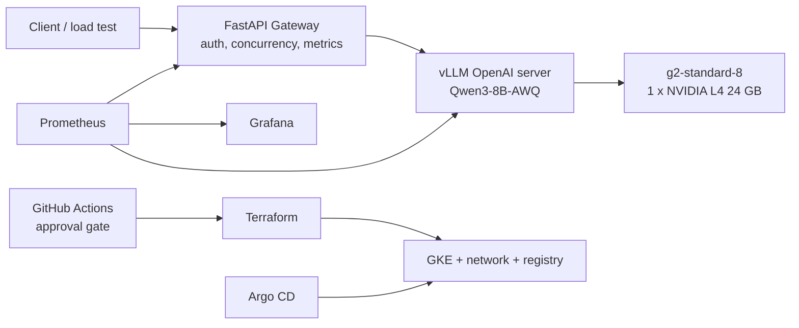

# Trade Balance LLM Platform

A production-style, cost-controlled inference platform for serving an open-weight LLM on Google
Kubernetes Engine. It serves `Qwen/Qwen3-8B-AWQ` via vLLM on a single NVIDIA L4, fronted by a
FastAPI gateway exposing an API-key-protected, OpenAI-compatible streaming API.

Infrastructure is Terraform (bootstrap + reusable modules + per-environment stacks), delivery is
GitHub Actions with a manual approval gate, and cluster state is reconciled by Argo CD.

Operational procedures are in **[RUNBOOK.md](RUNBOOK.md)**.

## Measured results

Every number below was measured on this cluster.

| | Result |
|---|---|
| Peak sustained throughput | **~1,500 output tokens/s** at 125 concurrent requests, 0 preemptions |
| Batching efficiency | **7.29x** throughput from concurrency 1 → 8 (91% of ideal) |
| Single-request decode | 49 tokens/s, 20.4 ms inter-token latency |
| Cold start (scale-from-zero) | **6m19s**, reduced 17% from 7m35s via GKE Image Streaming |
| Cost at full load | **$0.54 per million output tokens** (break-even vs. a commercial API ≈ 76M tokens/month) |
| KV cache capacity | 93,584 tokens — 144 KB/token, derived from model architecture |

## Service level objectives

"Maximum concurrency" is meaningless without a quality bar attached. Capacity here is **defined as
the highest concurrency that still meets these objectives**, not the highest number the server will
accept before it falls over.

| Objective | Target | Measured at 125 concurrent |
|---|---|---|
| Time to first token | p95 < 500 ms | 397 ms |
| Inter-token latency | p95 < 100 ms | 84 ms |
| Error rate | < 1% | 0% |
| KV cache preemptions | 0 | 0 |

Latency figures come from the saturation run; `loadtest/benchmark.py` records the full p50/p95
breakdown per concurrency level into `benchmark-results/`.

**Where these thresholds come from**, since arbitrary targets are worse than none:

- **TTFT p95 < 500 ms** — the point at which a streaming UI stops feeling like it hung. Prefill
  dominates TTFT, so this threshold constrains prompt length and queue depth, not decode.
- **ITL p95 < 100 ms** — 100 ms per token is ~10 tokens/s, roughly comfortable reading speed. Slower
  than this and the stream visibly stutters, regardless of how good total throughput looks.
- **Error rate < 1%** — the gateway returns 429 rather than queueing without bound, so this measures
  admission control working, not the model failing.
- **Zero preemptions** — a preemption means vLLM evicted an in-flight sequence because the KV cache
  filled, and its work is recomputed later. Any throughput measured while preempting is inflated and
  not comparable across runs.

**Utilisation figures are deliberately not SLOs.** An SLO describes what a user experiences;
utilisation describes what the hardware is doing. Committing to "GPU utilisation > 80%" would
optimise for a number nobody feels — and on this platform it would be trivially and meaninglessly
satisfied (see below).

Inter-token latency is the objective that binds first. It degrades from 20.4 ms at low concurrency
to 84 ms at 125 — a 4x regression that buys ~32x aggregate throughput. Past this point ITL crosses
100 ms and the stream becomes visibly choppy, which is why capacity is stated as 125 rather than
the higher number the KV cache could physically hold.

**Availability is deliberately not claimed.** A single replica on a single GPU node, with a 6m19s
cold start, cannot support a meaningful availability target. See [Limitations](#limitations).

### Resource utilisation at saturation

The headline figure normally quoted for GPU work — `utilization.gpu` — reads near 100% here at
*every* load level, because it counts "a kernel is resident on the device", not "arithmetic units
are busy". It cannot distinguish a saturated GPU from a stalled one, and was not used as a signal.
These were used instead:

| Resource | Utilisation | Interpretation |
|---|---|---|
| **Memory bandwidth** | **~100%** of the L4's 300 GB/s | **The binding constraint.** Decode reads all model weights per token. |
| KV cache | 50% of 93,584 tokens | Headroom remains; memory is not the limit for this request shape. |
| Compute (FP16 TFLOPS) | **<1%** | Idle. A GPU with more compute would change nothing. |
| GPU cost while idle | **$0** | Node pool scales to zero; no GPU exists between sessions. |

Saturating the resource that actually binds, and proving the other two do not, is what makes the
tuning decisions in this repo defensible.

**Throughput gained on unchanged hardware.** Tuning continuous batching took the same single L4
from 46.8 to ~1,500 output tokens/s. Put the other way round: serving this workload without that
tuning would need roughly 32 L4s to match what one tuned instance delivers.

This is deliberately *not* phrased as "improved GPU utilisation". For LLM decode that phrase is
close to meaningless — `utilization.gpu` was already near 100% before any tuning, because the card
was busy waiting on memory rather than computing. The honest statements are that throughput per GPU
rose 32x, that memory bandwidth (the binding resource) now runs at ~100%, and that compute sits
below 1% and cannot be recovered on this hardware.

## How the operating parameters were derived

The serving limits in this repo are not defaults and are not guesses. Each one comes from a
measured quantity, and the chain is reproducible for any other model or GPU.

**Step 1 — cost of one token, from architecture.** KV cache per token depends only on the model:

```
2 × layers × KV heads × head_dim × bytes_per_value
2 × 36     × 8        × 128      × 2                = 147,456 bytes = 144 KB/token
```

It is **KV heads (8), not attention heads (32)** — this model uses grouped-query attention, so its
KV cache is a quarter of what a naive reading gives. Getting this wrong overestimates capacity 4x.

**Step 2 — how many tokens fit.** vLLM reports its KV pool at startup: 12.85 GiB.

```
12.85 GiB ÷ 144 KB = 93,594 tokens      (vLLM's own log says 93,584 — the formula checks out)
```

**Step 3 — turn tokens into concurrency.** The measured workload averages ~374 tokens per request
(short prompt, 256 output tokens):

```
93,584 ÷ 374 ≈ 250 concurrent requests, if memory were the only constraint
```

**Step 4 — load test against the SLO.** The limit turned out to be **125**, not 250 — set by
inter-token latency approaching its 100 ms objective, at which point KV cache sat at only **50%**.
Memory was not what ran out.

**Step 5 — set the limits from the measured number.** `maxNumSeqs` is set deliberately *above* both
figures (512) so that vLLM's scheduler is bounded by memory and bandwidth rather than by an
arbitrary cap, and the gateway's concurrency limit is the real admission control. A `maxNumSeqs`
below the achievable concurrency silently caps throughput and looks like a hardware limit.

### What is actually the bottleneck: memory bandwidth

Decode must read **every model weight from VRAM to generate every single token**. That gives a hard
floor independent of how fast the GPU can compute:

```
6.14 GB of weights ÷ 300 GB/s of L4 bandwidth = 20.5 ms per token
```

Measured inter-token latency at low concurrency: **20.4 ms.** Theory and measurement agree, which
means decode is running at essentially 100% of the card's memory bandwidth.

Compute, over the same step, is idle:

```
2 × 8e9 params × batch 1 = 16 GFLOP ÷ 121 TFLOPS = 0.13 ms
```

**The GPU spends over 99% of decode time waiting on memory.** (Note that `utilization.gpu` reads
near 100% throughout — that metric counts "a kernel is resident", not "arithmetic units are busy",
and is misleading here.)

Under load the bottleneck stays in memory but changes shape. Weights are read once per step no
matter the batch size, but KV cache must be read per sequence:

| | concurrency 8 | concurrency 125 |
|---|---|---|
| Weight traffic per step | 6.14 GB | 6.14 GB (unchanged) |
| KV cache traffic per step | ~0.4 GB | **~6.9 GB** |
| Predicted inter-token latency | 22 ms | 43 ms |
| **Measured** | **20.4 ms** | **84 ms** |

The low-concurrency prediction is near exact. The high-concurrency case is about 2x worse than the
memory model alone predicts — the remainder is attention score computation (which scales with
batch × context and reads no weights), scheduling overhead, and padding waste from ragged batches.

**The crossover is ~750 tokens per request.** Below it, bandwidth saturates while memory sits idle
— this workload's case. Above it, memory fills first. That single number determines whether the
next capacity problem is solved by a bigger card or a faster one.

**Consequences for tuning:** larger batches and more aggressive quantisation help; a GPU with more
compute would not. Meaningfully more throughput requires more memory bandwidth — an A100 (HBM2e,
1,555 GB/s) or H100 (HBM3, 3,350 GB/s) rather than the L4's GDDR6.

## What's in this repo

- **Terraform** — `bootstrap` (remote state bucket, Workload Identity Federation, CI service
  account, billing budget) and `environments/{dev,production}` composed from a shared
  `modules/platform`: private regional GKE, system node pool, scale-to-zero GPU pool, Artifact
  Registry, IAM.
- **Helm** — vLLM, gateway, health probes, PVC, NetworkPolicy, ServiceMonitor, PrometheusRule.
- **FastAPI gateway** — API key auth, request IDs, bounded concurrency, SSE passthrough, structured
  logging, Prometheus metrics.
- **Argo CD** — GitOps for both the application stack and the monitoring stack, with self-healing.
- **Prometheus/Grafana** — request rate, latency, throughput, queue depth, KV cache usage.
- **CI/CD** — `ci.yml` runs tests and validation on every push; `deploy.yml` is manually dispatched
  and blocks on a GitHub Environment approval before `terraform apply`.
- **Load testing** — streaming-aware benchmark recording TTFT, inter-token latency, per-request and
  aggregate tokens/s, and failure rate across a concurrency ladder.

## Architecture



Terraform owns cloud infrastructure; Argo CD owns Kubernetes workloads. Access is via local
`kubectl port-forward` to a ClusterIP — no public load balancer is created.

## Engineering decisions worth explaining

- **Scale-to-zero over always-on.** The GPU pool autoscales `0..1` and vLLM ships with
  `replicaCount: 0`. Cold start is the price; it was measured, decomposed by phase, and then
  reduced 17% by enabling GKE Image Streaming once image pull was identified as the largest single
  phase (3m17s of 7m35s).
- **Bottleneck attribution before tuning.** A throughput number without a bottleneck explanation is
  an anecdote. Deriving the bandwidth floor and confirming it against measurement ruled out an
  entire class of optimisations before any time was spent on them.
- **Separate state per environment, no state in the repo.** Backends use partial configuration; the
  bucket is supplied at `init` time (locally from a gitignored file, in CI from a secret). An early
  CI run with empty state attempted to recreate the whole platform — that incident drove this
  design.
- **Keyless CI.** GitHub Actions authenticates to GCP through Workload Identity Federation; no
  service account keys exist in the repo or in secrets.
- **The billing budget lives in bootstrap, not the environment stack.** A billing account is a
  separate IAM level from a project; a budget defined alongside the cluster fails in CI with a 403
  while working locally.

## Limitations

Honest gaps between this platform and one that could take production traffic:

- **No high availability.** A single vLLM replica on a single GPU node. GPU quota on this account
  is 1, so multi-replica serving has not been exercised.
- **Cold start is incompatible with an interactive SLA.** 6m19s from zero. Serving real users
  requires either a warm replica (continuous GPU cost) or accepting that the first request after
  idle fails.
- **Authentication is a static API key.** No OIDC/JWT, no per-tenant identity, no per-tenant
  quotas or rate limits.
- **No public ingress.** Access is via `port-forward`; there is no load balancer, TLS termination,
  or WAF.
- **No progressive delivery for model changes.** Swapping the model revision is a rolling restart,
  not a canary — there is no automated quality gate on the new weights.
- **Alerts fire nowhere.** `PrometheusRule` objects exist, but Alertmanager is disabled and metric
  retention is 2 days. There is no long-term metric storage.
- **`PrometheusRule` validation is deferred.** The admission webhook is disabled (it breaks Argo CD
  sync via self-deleting hook Jobs), so a malformed rule is caught by Prometheus at load time
  rather than rejected at admission.
- **Single region, no failover.** Two region-wide GPU stockouts during development were handled by
  manual cross-region migration, not automatically.
- **No distributed tracing.** Metrics and structured logs only.

## Roadmap

### 1. Reduce warm-start time

Terminology, since the two are optimised differently: **cold start** is scale-from-zero with no GPU
node (6m19s measured); **warm start** is a pod restart on a node that already exists with the image
cached and the weights already on the PVC.

The measured cold-start breakdown determines what is worth attacking:

| Phase | Time | Share |
|---|---:|---:|
| Node provisioning | 1m38s | 26% |
| Image pull | 2.5s | <1% |
| Container start → first log | 1m31s | 24% |
| First log → weight load begins | 1m07s | 18% |
| Weight load | 33s | 9% |
| `torch.compile` / CUDA graph capture | 46s | 12% |

**Image pull is already solved** — Image Streaming took it from 3m17s to 2.5 seconds. Caching the
image on a secondary boot disk would target the same phase and gain nothing further; that option
was evaluated and rejected for this reason.

The remaining candidates, in order of value per unit of effort:

1. **Persist the compilation cache on the PVC** (~46s). CUDA graph capture and `torch.compile`
   output are recomputed on every start. Pointing vLLM's cache root at the existing PVC makes
   subsequent starts reuse it.
2. **The 2m38s of Python and CUDA initialisation** before weight loading even begins. This is now
   the single largest block. Requires profiling library import and CUDA context creation; likely a
   slimmer image and deferred imports rather than one fix.
3. **Node provisioning (1m38s)** is only removable by keeping a node warm, which reintroduces
   continuous GPU cost. Not worth it for this workload.

### 2. Horizontal autoscaling across multiple GPUs

Currently blocked on a GPU quota of 1. The design:

- **Scale on queue depth (`vllm:num_requests_waiting`), not GPU utilisation.** The bandwidth
  analysis above shows why: `utilization.gpu` reads near 100% at both idle-ish and saturated load,
  so it cannot distinguish them. Queue depth measures the thing users actually feel.
- **Use KEDA rather than plain HPA.** HPA cannot read Prometheus without an adapter, and cannot
  scale to zero at all — which would forfeit this platform's main cost control. KEDA does both.
- **The PVC must change.** Model weights are on a `ReadWriteOnce` volume, which a second replica on
  a different node cannot mount. Either move to `ReadWriteMany`, or give each replica its own
  volume and accept duplicated weight storage and load time.
- **Scale-up latency is bounded by cold start.** Until item 1 lands, a scale-out event takes
  minutes, so the trigger threshold has to lead demand rather than react to it.

## Cost guardrails

- GPU pool autoscales `0..1`; vLLM installs with `replicaCount: 0` by default.
- No public LoadBalancer.
- The billing budget alerts only — it does not hard-stop spend.
- Run `bash scripts/model-session.sh down` after every session; `terraform destroy` if idle
  long-term. **The GPU bills until the node disappears, not until the pod does.**

## Repo layout

```text
app/gateway/                   API gateway and tests
infra/bootstrap/               remote state, WIF, CI service account, budget
infra/modules/platform/        reusable GKE + network + registry module
infra/environments/dev/        dev stack
infra/environments/production/ production stack
platform/helm/                 vLLM and gateway Helm chart
platform/monitoring/           Prometheus/Grafana configuration and dashboards
platform/argocd/               Argo CD applications
loadtest/                      streaming performance test
scripts/                       operational helper scripts
.github/workflows/             CI and gated deploy
```

## Local checks (no cloud resources created)

```bash
python -m pytest app/gateway/tests -q
helm lint platform/helm/trade-balance-llm
terraform -chdir=infra/environments/production init -backend=false
terraform -chdir=infra/environments/production validate
```

## Key terms

- **Qwen3-8B-AWQ** — the model, using 4-bit weight-only AWQ quantization.
- **vLLM** — the GPU inference/serving engine; not a model name.
- **Gateway** — the auth, rate-limiting, logging and forwarding entry point in front of vLLM.
- **OpenAI-compatible** — reuses common OpenAI API paths and JSON/SSE conventions; requests are
  served by vLLM in this project, not sent to OpenAI.
- **Continuous batching** — vLLM admits and retires requests mid-flight rather than per fixed
  batch, which is why concurrency 1 → 8 yields 7.29x rather than 1x.
- **TTFT / ITL** — time to first token (dominated by prefill, which is compute-bound) and
  inter-token latency (dominated by decode, which is bandwidth-bound). Different bottlenecks,
  tuned separately.
- **Prefill vs decode** — prefill processes the whole prompt at once and can use the GPU's compute;
  decode produces one token per sequence per step and is limited by weight reads. The crossover for
  this model and card is around 155 tokens.
