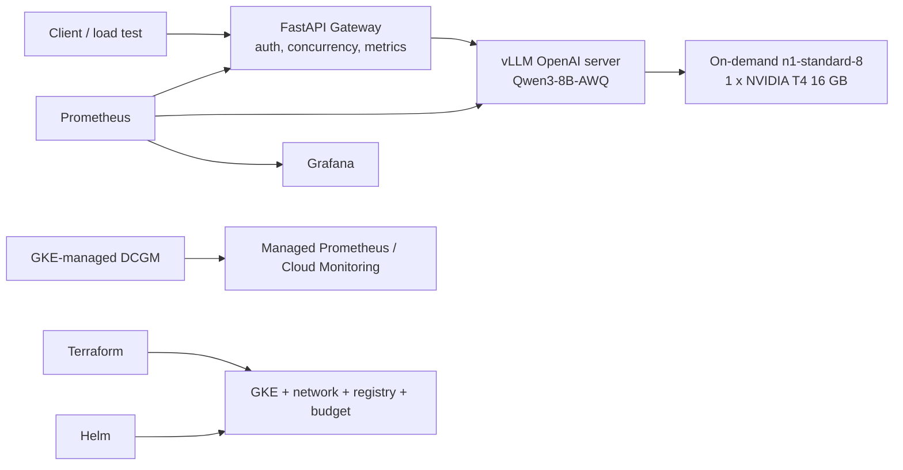

# Trade Balance LLM 平台 / Trade Balance LLM Platform

这是一个在 Google Kubernetes Engine 上运行开源权重 LLM 的生产风格、成本受控推理平台。当前目标在单张 NVIDIA T4 上通过 vLLM 服务 `Qwen/Qwen3-8B-AWQ`，并由 FastAPI Gateway 提供带 API Key 的 OpenAI-compatible 流式 API。

> 状态：基础设施、应用部署、模型加载和认证 SSE 冒烟测试已经真实完成；模型可以 scale to zero。并发 benchmark、冷启动记录、GKE-managed DCGM GPU 指标和最终费用验收仍待完成。在验收清单完成前，不采用简历草稿中的性能数字。

## 这个仓库包含什么

- Terraform：GKE Standard、private VPC、系统节点、`0..1` 按需 T4 节点池、Artifact Registry、GCS、IAM 和 Billing Budget。
- Helm：vLLM、Gateway、health probe、PVC、NetworkPolicy、ServiceMonitor 和 PrometheusRule。
- FastAPI Gateway：API Key、request ID、并发保护、SSE 透传、结构化日志和 Prometheus 指标。
- Prometheus/Grafana：Gateway 和 vLLM 的运行/延迟/吞吐/队列/KV cache dashboard。
- 负载测试：TTFT、总延迟、单请求和 aggregate tokens/s、RPS、失败率与并发阶梯。
- 部署、故障、成本、API/监控原理和面试学习文档。

## 架构



Terraform 管云基础设施；Helm 管 Kubernetes workload。当前访问方式是本地 `kubectl port-forward` 到 ClusterIP，不创建公网 Load Balancer。GPU 指标使用 GKE 官方 managed DCGM 路径；已经验证不兼容的通用自管 DCGM Helm release 不再属于部署主流程。

## 成本保护

- 单区而不是区域 GKE。
- GPU pool 按需（on-demand），autoscaling `0..1`。
- vLLM 默认安装为 `replicaCount: 0`。
- 不创建公网 LoadBalancer。
- Budget 只报警，不会硬性停止消费。
- 每次实验后执行 `bash scripts/model-session.sh down`，长期不用则 Terraform destroy。

## 从这里开始

完整文档已经按主题和顺序分组，统一入口是 [Documentation Index](docs/00-docs-index.md)。

推荐的项目操作顺序：

1. [Project Learning Objectives](docs/03-project-engineering-01-project-learning-objectives.md)
2. [Architecture](docs/03-project-engineering-02-architecture.md)
3. [Cost and Safety](docs/04-operations-02-cost.md)
4. [Deployment Runbook](docs/04-operations-03-runbook.md)
5. [Troubleshooting](docs/04-operations-05-troubleshooting.md)

AI学习主线从Machine Learning开始，依次学习Transformer、Generative AI/RAG和AI Agents；具体顺序见总索引。

## 仓库结构

```text
app/gateway/                  API gateway and tests
infra/terraform/              GCP infrastructure
platform/helm/                vLLM and gateway Helm chart
platform/monitoring/          Prometheus/Grafana configuration
platform/argocd/              optional GitOps application
loadtest/                     streaming performance test
scripts/                      operational helper scripts
docs/                         architecture, runbooks and learning material
```

## 本地检查（不创建云资源）

```bash
make test
make terraform-check
make helm-check
```

## 重要术语

- **Qwen3-8B-AWQ**：模型和 4-bit weight-only 量化权重。
- **vLLM**：GPU 推理/服务引擎，不是模型名称。
- **Gateway**：认证、限流、日志和转发入口。
- **OpenAI-compatible**：复用常见 OpenAI API 路径/JSON/SSE 约定；请求仍在本项目 vLLM 内执行。
- **LLM/VLM**：模型类别；本阶段只服务文本 LLM。
- **TensorRT-LLM**：可作为后续对比的 NVIDIA 推理 runtime，不是第一阶段必需项。
