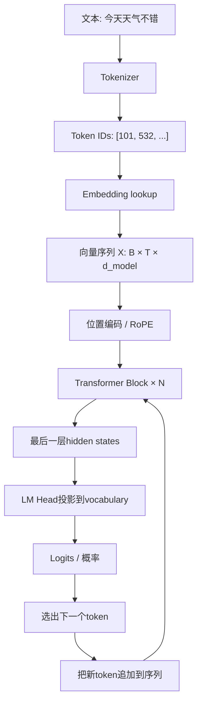
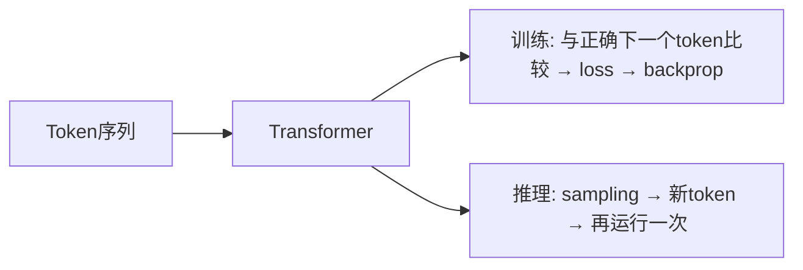
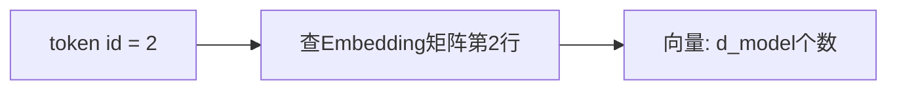
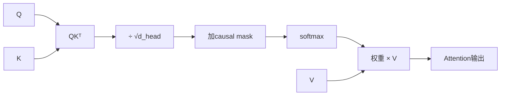
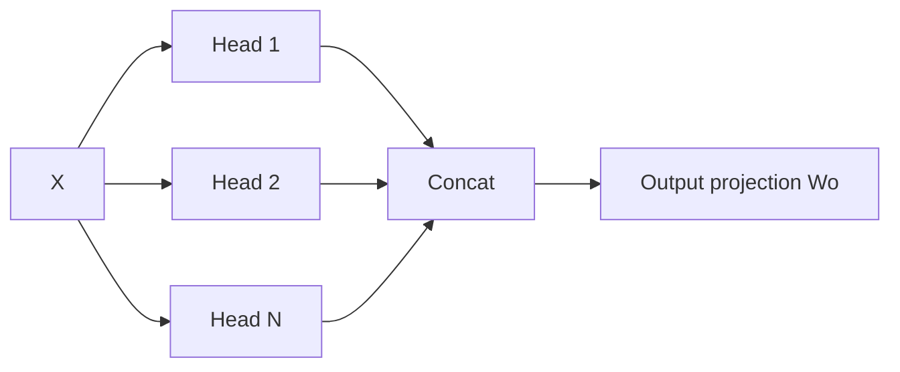
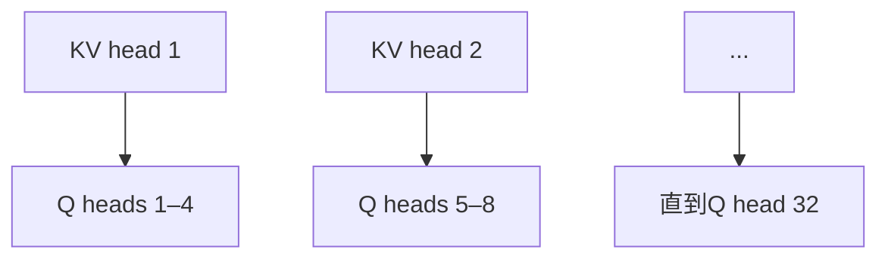
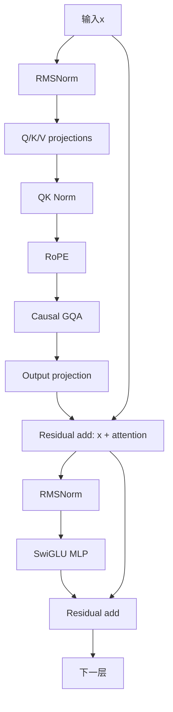
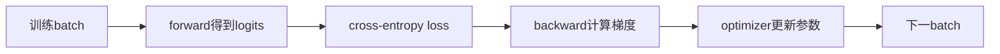
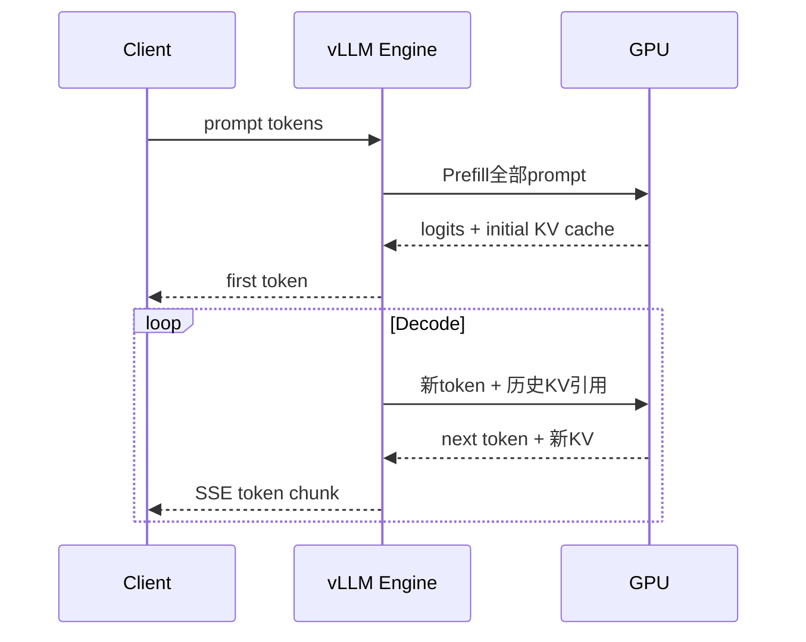
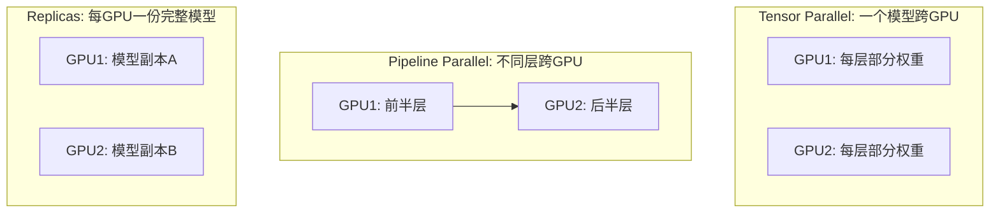

# Transformer从第一性原理到Qwen/vLLM

这是一份“重新建立理解并能长期复习”的中文教材。为了同时准备英文面试，关键概念第一次出现时会同时给出中文和英文，例如标量（scalar）、向量（vector）和点积（dot product）。目标是让你能够从token和向量一路推导到Attention、Transformer Block、训练、生成、KV cache和GPU推理，并能追踪每一步张量维度。

短版速查仍在[`02-llm-inference-01-transformer-inference-fundamentals.md`](02-llm-inference-01-transformer-inference-fundamentals.md)；本文用于深度复习。

如果你暂时看不懂Q/K/V、logits、`B/T/d_model`和KV cache公式，先读 [Qwen推理运维视角](02-llm-inference-00-qwen-inference-operations-walkthrough.md)。它用当前Qwen3-8B-AWQ的一次请求贯穿这些概念，再回到本文看数学细节。

## 0. 学完以后应该能做到什么

不要用“我看懂了视频”验收，而用下面五级能力验收：

| 级别 | 能力 |
|---|---|
| L1 词汇 | 能解释token、embedding、Q/K/V、attention、logits、loss。 |
| L2 维度 | 给定`B/T/d_model/heads`，能写出X、Q、K、V、attention和logits形状。 |
| L3 手算 | 能对2–3个二维token手算一次causal self-attention。 |
| L4 代码 | 能用PyTorch写一个最小decoder block并训练toy language model。 |
| L5 系统 | 能解释prefill/decode、KV cache、batching、量化和GPU容量。 |

### 0.1 英文面试核心术语（Core terminology for interviews）

| 中文 | 英文 | 面试中可以怎样说 |
|---|---|---|
| 标量 | scalar | A scalar is a single number. |
| 向量 | vector | A vector is an ordered list of numbers. |
| 矩阵 | matrix | A matrix is a two-dimensional array with rows and columns. |
| 张量 | tensor | A tensor is a multi-dimensional array; scalars, vectors, and matrices are lower-dimensional tensors. |
| 形状 | shape | The shape tells us the size of each axis. |
| 维度 | dimension | `d_model` is the number of components in each token representation. |
| 点积 | dot product / inner product | The dot product combines vector magnitude and directional alignment. |
| 余弦相似度 | cosine similarity | Cosine similarity compares directions without the effect of magnitude. |
| 矩阵乘法 | matrix multiplication | Linear projections are implemented with matrix multiplication. |
| 线性层 | linear layer / fully connected layer | A linear layer applies a learned affine transformation. |
| 权重、偏置 | weight, bias | The weight and bias are learned during training. |
| 词元 | token | A token is produced by the tokenizer; it is not necessarily a whole word. |
| 词元编号 | token ID | A token ID is an integer index in the vocabulary. |
| 词表 | vocabulary | The vocabulary maps tokens to integer IDs. |
| 嵌入向量 | embedding vector | An embedding lookup maps a token ID to a dense vector. |
| 隐藏状态 | hidden state | A contextual hidden state represents a token together with its context. |
| 注意力 | attention | Attention computes a weighted mixture of value vectors. |
| 查询、键、值 | query, key, value | Queries match keys; the resulting weights mix the values. |
| 掩码 | mask | A causal mask prevents a token from attending to future tokens. |
| 残差连接 | residual / skip connection | A residual connection adds the input back to a layer's output. |
| 归一化 | normalization | Normalization controls activation scale and stabilizes training. |
| 前向传播 | forward pass | The forward pass computes the model outputs and loss. |
| 反向传播 | backpropagation / backward pass | Backpropagation computes gradients. |
| 梯度 | gradient | A gradient tells the optimizer how a parameter affects the loss. |
| 损失函数 | loss function | The loss measures prediction error. |
| 推理 | inference | Inference generates outputs without updating model weights. |
| 位置编码 | positional encoding | Positional information lets the model distinguish token order. |
| 激活值 | activation | Activations are intermediate values produced during a forward pass. |
| Softmax | softmax | Softmax converts scores into a probability distribution. |
| 未归一化分数 | logits | Logits are the model's raw, unnormalized output scores. |
| 前馈网络 | feed-forward network / MLP | The MLP transforms each token position independently. |
| 优化器 | optimizer | The optimizer updates parameters using gradients. |
| 交叉熵损失 | cross-entropy loss | Cross-entropy penalizes low probability on the correct token. |
| 采样 | sampling | Sampling chooses the next token from the predicted distribution. |
| KV缓存 | KV cache | The KV cache stores past keys and values for autoregressive decoding. |
| 预填充 | prefill | Prefill processes all prompt tokens in parallel. |
| 解码 | decode | Decode generates new tokens one step at a time. |
| 连续批处理 | continuous batching | Continuous batching dynamically adds and removes active requests. |
| 量化 | quantization | Quantization represents weights or activations with lower precision. |

后文仍会在具体语境里再次标注英文。面试时不要只背缩写，应该能用右栏这样的完整英文句子解释。

## 1. 一张图看完整链路



训练和推理共享大部分模型计算，但使用方式不同：



## 2. 先补最少的向量和矩阵（Vectors and Matrices）

### 2.1 标量、向量、矩阵、张量（Scalar, Vector, Matrix, Tensor）

| 名称 | 英文 | 具体数据示例 | 形状（shape） |
|---|---|---|---|
| 标量 | scalar | 温度`0.7` | `[]` |
| 向量 | vector | `[0.2, -0.7, 1.1, 0.4]` | `[4]`，也可写成`[d_model]` |
| 矩阵 | matrix | 3个token的4维向量 | `[3, 4]`，也可写成`[T, d_model]` |
| 三维张量 | 3-D tensor | 一个batch的序列 | `[B, T, d_model]` |
| 四维张量 | 4-D tensor | 拆成attention heads | `[B, heads, T, head_dim]` |

这里的方括号表示**形状（shape）**，不是数据本身。标量`0.7`没有行、列或其他轴，所以它有0个轴，形状写成`[]`：

```text
数据             类型                 形状
0.7              标量 scalar          []
[0.7]            向量 vector          [1]
[[0.7]]          矩阵 matrix          [1, 1]
```

`d_model`也不是`[1, 2, 2, 3]`这样的数据。它是一个整数，表示一个token向量包含多少个数。例如：

```text
d_model = 4                              # 维度数量 dimension
x = [0.2, -0.7, 1.1, 0.4]               # 实际向量 vector
shape(x) = [4] = [d_model]               # 向量形状 shape
```

矩阵（matrix）确实有行和列。假设一共有`T=3`个token，且`d_model=4`：

```text
X = [
  [ 0.2, -0.7,  1.1,  0.4],   # 第1行：第1个token的向量
  [ 0.8,  0.1, -0.3,  0.9],   # 第2行：第2个token的向量
  [-0.5,  0.6,  0.2,  1.3]    # 第3行：第3个token的向量
]
shape(X) = [3, 4] = [T, d_model]
```

每一行的**长度必须相同**，否则不能组成规则矩阵；但每一行的**数值不需要相同**。在这个约定中：

- 行（row）对应token位置；
- 列（column）对应向量的分量或特征坐标；
- `T`是行数，即序列中的token数量；
- `d_model`是列数，即每个token表示包含的数字数量。

符号：

- `B`：批大小（batch size），一次并行处理多少条序列；
- `T`：序列长度（sequence length），一条序列有多少个token；
- `d_model`：模型维度（model dimension / hidden dimension），每个token表示有多少个分量；
- `h`：查询头数量（number of query heads）；
- `h_kv`：键/值头数量（number of key/value heads）；
- `d_head`：每个头的维度（head dimension）。

### 2.2 点积为什么可以表示相似性（Dot Product and Similarity）

两个向量：

```text
a = [a₁, a₂, ..., aₙ]
b = [b₁, b₂, ..., bₙ]

a · b = a₁b₁ + a₂b₂ + ... + aₙbₙ
```

更准确的关系是：

$$
\mathbf a\cdot\mathbf b=\|\mathbf a\|\,\|\mathbf b\|\cos\theta
$$

其中`||a||`和`||b||`是向量长度（vector magnitude/norm），`θ`是夹角（angle）。当两个向量长度固定或已经归一化（normalized）时，夹角越小，`cos θ`越大，因此点积越大。

二维单位向量可以直接证明这一点：

```text
a = [1, 0]
b = [cos θ, sin θ]
a · b = 1 × cos θ + 0 × sin θ = cos θ
```

但如果向量长度不同，“方向越像，点积越大”并不一定成立：

```text
a = [1, 0]
b = [0.1, 0]     # 与a方向完全相同，a·b = 0.1
c = [50, 50]     # 与a有45°夹角，但a·c = 50
```

所以准确说法是：**点积（dot product）同时受方向和长度影响**。只比较方向时，常使用余弦相似度（cosine similarity）：

$$
\cos\theta=\frac{\mathbf a\cdot\mathbf b}{\|\mathbf a\|\|\mathbf b\|}
$$

Attention使用查询（Query）和键（Key）的点积计算匹配分数（attention score），再通过训练、归一化和`√d_head`缩放控制数值。

### 2.3 线性层是什么（Linear Layer）

```text
y = xW + b
```

`W`是权重矩阵（weight matrix），`b`是偏置向量（bias vector）。工程中通常把它称为线性层（linear layer）或全连接层（fully connected layer）；严格地说，带偏置的形式是仿射变换（affine transformation）。这些不是程序员手写的规则，而是训练学到的参数（learned parameters）。

如果`x`的形状是`[d_in]`，`W`的形状是`[d_in, d_out]`，那么输出`y`的形状是`[d_out]`。Transformer中的Q/K/V投影（projection）、输出投影（output projection）、MLP和LM head都大量使用矩阵乘法（matrix multiplication）。Embedding通常通过查表实现，但它与one-hot向量乘embedding matrix在数学上等价。

## 3. Tokenization（分词）：文字怎样变成整数

模型不直接把原始文字当作连续数值来计算。分词器（tokenizer）按照确定的算法和词表（vocabulary）把文字切成token，再把每个token映射成整数编号（token ID）：

```text
原始文本 raw text:  "unbelievable"
token:              ["un", "believ", "able"]    # 仅作概念示例
token IDs:          [314, 9021, 771]
```

这个拆法不是所有模型通用的真实结果。具体如何拆取决于所使用的tokenizer及其版本；一旦tokenizer和词表固定，相同输入就会按照固定规则产生相同的token IDs。

token可能是：

- 一个常见单词；
- 单词的一部分；
- 一个或多个汉字；
- 标点或空格组合；
- 特殊控制符。

不同模型的tokenizer不同，所以“1000字等于多少token”没有固定答案。context window按token计数，不按字符或单词。

必须严格区分：

```text
原始文本（raw text）
    ↓ tokenizer切分
token（文本单位，不一定是完整单词）
    ↓ vocabulary lookup
token ID（词表中的整数索引）
    ↓ embedding lookup
embedding vector（供神经网络计算的稠密向量）
```

因此，token本身不是向量（vector），token ID也不是embedding。只有经过embedding lookup后，才得到形状为`[d_model]`的embedding vector。

## 4. One-hot和Embedding（独热编码与嵌入）

### 4.1 One-hot encoding（独热编码）为什么太大

假设词表只有5个token：

```text
猫  → [1,0,0,0,0]
狗  → [0,1,0,0,0]
跑  → [0,0,1,0,0]
```

one-hot只表示身份：猫和狗的距离与猫和跑相同，没有语义关系。真实Qwen词表约15万，直接使用15万维one-hot既稀疏又昂贵。

### 4.2 Embedding matrix（嵌入矩阵）

模型学习一个矩阵：

```text
E: [vocab_size, d_model]
```

token ID就是取矩阵E中的一行：

```text
embedding = E[token_id]
```

这与`one_hot(token_id) @ E`数学等价，但lookup更高效。



### 4.3 Embedding Semantics（嵌入语义）从哪里来

初始化时embedding通常没有人类语义。训练通过“预测下一个token”的误差修改embedding和其他权重；出现在相似上下文中的token逐渐形成可利用的几何关系。

需要区分：

- **Token embedding**：进入第一层前的基础向量；同一个token ID查到同一行。
- **Contextual hidden state**：经过Attention后，向量包含上下文；同一个“bank”在金融和河岸语境中会不同。

王木头的视频可以作为embedding直觉入口，但复习时必须能独立回答：one-hot为什么没有语义、lookup为什么等价于矩阵乘法、语义怎样通过loss学出来。

## 5. 为什么需要位置信息（Positional Information）

仅看embedding集合时：

```text
狗咬人
人咬狗
```

包含的token相同，但顺序不同。Attention本身若没有位置信息，对排列不敏感。

原始Transformer把sin/cos位置编码加到embedding。现代decoder模型常使用RoPE（Rotary Position Embedding）：在每个head中根据位置旋转Q和K，使Attention分数包含相对位置信息。

当前Qwen使用RoPE。可以先掌握直觉：

> token内容决定“是什么”，位置处理决定“在哪里以及相隔多远”。

不必先背RoPE复数公式；面试深入时再解释它把相对距离编码进Q/K点积。

## 6. 从X产生Q、K、V（Query, Key, Value Projections）

设输入hidden states：

```text
X: [B, T, d_model]
```

三个可训练投影：

```text
Q = XWq
K = XWk
V = XWv
```

为什么同一个X要变三次？因为同一个token在Attention中扮演三个角色：

- Q：我想找什么；
- K：别人怎样找到我；
- V：别人找到我以后，我提供什么内容。

Q、K、V不是token本身，也不是人工定义的标签，而是模型训练学到的不同表示。

## 7. Scaled Dot-Product Attention（缩放点积注意力）

核心公式：

$$
\mathrm{Attention}(Q,K,V)=\mathrm{softmax}\left(\frac{QK^T}{\sqrt{d_{head}}}+M\right)V
$$

逐步解释：

1. `QKᵀ`：每个query和所有key做点积；
2. 除以`√d_head`：避免维度大时分数过大、softmax饱和；
3. `+M`：加入causal/padding mask；
4. softmax：每一行转成和为1的权重；
5. 乘V：按权重混合信息。



## 8. 手算三个token的Attention（Worked Attention Example）

为了能手算，假设每个token只有二维向量，并暂时令`Wq/Wk/Wv`都是单位矩阵：

| Token | 向量 |
|---|---|
| `I` | `[1,0]` |
| `like` | `[0,1]` |
| `cats` | `[1,1]` |

因此`Q=K=V=X`，`d_head=2`。

### 8.1 原始分数（Raw Attention Scores）

$$
QK^T=
\begin{bmatrix}
1 & 0 & 1\\
0 & 1 & 1\\
1 & 1 & 2
\end{bmatrix}
$$

再除以`√2`。

### 8.2 Causal Mask（因果掩码）

生成模型不能偷看未来：

```text
I     只能看 I
like  可以看 I, like
cats  可以看 I, like, cats
```

```text
allowed mask
      I like cats
I     ✓  ✗    ✗
like  ✓  ✓    ✗
cats  ✓  ✓    ✓
```

被遮住的位置在softmax前设为`-∞`，概率变成0。

### 8.3 Softmax和加权Value（Weighted Sum of Values）

`like`对前两个位置的缩放分数约为`[0, 0.707]`，softmax约为：

```text
[0.33, 0.67]
```

于是输出：

```text
0.33 × V(I) + 0.67 × V(like)
= 0.33 × [1,0] + 0.67 × [0,1]
= [0.33, 0.67]
```

这只是展示算法；真实模型的向量有数千维，Wq/Wk/Wv由训练学习，并不等于单位矩阵。

## 9. Self-Attention、Cross-Attention和Causal Attention（自注意力、交叉注意力与因果注意力）

| 类型 | Q来自 | K/V来自 | 用途 |
|---|---|---|---|
| Self-Attention | 当前序列 | 同一序列 | token之间交换信息。 |
| Causal Self-Attention | 当前序列 | 同一序列的当前/过去 | GPT/Qwen逐token生成。 |
| Cross-Attention | decoder状态 | encoder输出或另一模态 | 原始翻译Transformer、多模态连接。 |

Qwen文本生成核心是decoder-only causal self-attention。

## 10. Multi-Head Attention（多头注意力）

一个attention head只在一个子空间中做匹配。Multi-head把hidden dimension拆成多个heads：

```text
d_model = num_heads × head_dim
```

每个head独立计算Attention，然后拼接并通过output projection：



不同head可能学习不同关系，但不要把它们强行解释成固定“语法head/情感head”；可解释性不是架构保证。

## 11. MHA、MQA和GQA（多头、多查询与分组查询注意力）

| 结构 | Query heads | KV heads | 特点 |
|---|---:|---:|---|
| MHA | 多 | 与Q相同 | 表达能力强，KV cache大。 |
| MQA | 多 | 1 | KV最省，但共享更多。 |
| GQA | 多 | 少于Q、多于1 | 性能与KV容量折中。 |

当前Qwen：

```text
query heads = 32
KV heads    = 8
每4个query heads共享一组K/V
```



GQA正是当前Qwen每token KV cache比“32个KV heads”小4倍的原因之一。

## 12. 当前Qwen张量维度追踪（Tensor Shape Tracking）

模型关键配置：

| 参数 | 值 |
|---|---:|
| vocabulary | 151,936 |
| layers | 36 |
| `d_model` | 4,096 |
| query heads | 32 |
| KV heads | 8 |
| head dimension | 128 |
| MLP intermediate | 12,288 |

对`B=2, T=100`：

| 张量 | 形状 |
|---|---|
| token IDs | `[2,100]` |
| X/embedding | `[2,100,4096]` |
| Q projection | `[2,100,4096]` |
| K projection | `[2,100,1024]` |
| V projection | `[2,100,1024]` |
| Q split heads | `[2,32,100,128]` |
| K/V split heads | `[2,8,100,128]` |
| attention output合并后 | `[2,100,4096]` |
| logits | `[2,100,151936]` |

维度检查是调试Transformer代码最有用的基本功之一。

## 13. 一个现代Decoder Block（现代解码器块）

当前Qwen Block可以用下面的概念图理解：



### 13.1 Residual Connection（残差连接）

```text
y = x + F(x)
```

模型学习“在原信息上加什么”，帮助深层网络保存信息和传播梯度。

### 13.2 RMSNorm（均方根归一化）

RMSNorm控制向量整体尺度，使深层训练更稳定。它不像LayerNorm那样减去均值，计算更简单。Qwen使用pre-norm：先normalize，再进入attention/MLP。

### 13.3 SwiGLU MLP（前馈网络）

概念形式：

```text
MLP(x) = Wdown( SiLU(Wgate x) ⊙ (Wup x) )
```

Attention负责token之间交换信息；MLP对每个位置独立进行更宽的非线性变换。二者缺一不可，Transformer不等于只有Attention。

## 14. 从Hidden State（隐藏状态）到下一个token

最后一层输出经过final norm和LM head：

```text
hidden: [B,T,4096]
LM head weight: [4096,151936]
logits: [B,T,151936]
```

logits是未归一化分数。softmax可转成词表概率；推理时通常只需要最后一个位置的logits。

### Sampling Parameters（采样参数）

| 参数 | 作用 |
|---|---|
| temperature | 缩放logits；低值更集中，高值更随机。 |
| top-k | 只保留概率最高的k个token。 |
| top-p | 保留累计概率达到p的最小集合。 |
| greedy | 每次选最高分，近似temperature 0的常用行为。 |

Sampling改变输出选择，不改变模型权重。

## 15. 模型怎样训练（Training）

### 15.1 Next-token Prediction（下一词元预测）

序列：

```text
[BOS, 我, 喜欢, 猫, EOS]
```

训练输入与目标错开一位：

| 位置 | 输入 | 目标 |
|---:|---|---|
| 1 | BOS | 我 |
| 2 | 我 | 喜欢 |
| 3 | 喜欢 | 猫 |
| 4 | 猫 | EOS |

一次forward可以并行计算所有位置，因为causal mask阻止偷看未来。这叫teacher forcing：训练时每个位置看到真实历史，而不是模型自己之前可能生成错的token。

### 15.2 Cross-Entropy Loss（交叉熵损失）

若正确token是`猫`，loss惩罚模型给`猫`的概率过低：

$$
L=-\log p(\text{correct token})
$$

batch中所有有效位置取平均。

### 15.3 Backpropagation（反向传播）



梯度沿LM head、每层MLP/Attention、embedding反向传播。Optimizer如AdamW根据梯度更新数十亿参数。

### 15.4 训练数据并不是“存进模型的数据库”（Parameters Are Not a Database）

训练让参数统计性地适应模式；它不保证逐字保存、准确检索或知道来源。事实查询、最新数据和审计通常仍需要搜索/RAG/工具。

## 16. 训练（Training）和推理（Inference）对比

| 方面 | 训练 | 在线推理 |
|---|---|---|
| 输入 | 大batch、完整序列 | 用户prompt和逐token输出 |
| 目标 | 计算loss并更新权重 | 生成回答，不更新权重 |
| 并行 | 同一序列所有位置并行 | prefill并行，decode顺序循环 |
| 内存 | 参数、梯度、optimizer、activation | 参数、activation、KV cache |
| 常见精度 | BF16/FP16混合训练 | BF16、FP8、AWQ等 |
| 主要指标 | loss、tokens/s、收敛 | TTFT、TPOT、吞吐、成本 |

推理比训练少梯度和optimizer state，但新增了服务并发、KV cache、排队和SLO问题。

## 17. Prefill（预填充）、Decode（解码）和KV Cache



历史token的K/V在decode中不会改变，所以缓存后不必重复投影全部历史。每个新token仍需用Q与历史K比较，并混合历史V；context越长，单步attention读取的数据越多。

KV cache减少重复计算，但没有让长上下文免费。

## 18. KV Cache容量推导（Capacity Calculation）

每token：

```text
KV bytes/token
= layers × KV heads × head_dim × 2(K和V) × dtype bytes
```

当前Qwen：

```text
36 × 8 × 128 × 2 × 2 bytes
= 147,456 bytes
= 144 KiB/token
```

所以单序列8192 tokens约1.125 GiB，8条满序列约9 GiB。AWQ只主要压缩权重，不自动把KV cache变成4-bit。

详细显存布局见[`02-llm-inference-02-vllm-memory-guide.md`](02-llm-inference-02-vllm-memory-guide.md)。

## 19. Attention为什么在长上下文昂贵（Long-Context Cost）

完整Attention score矩阵形状大致为`[T,T]`，所以朴素计算随序列长度近似`O(T²)`增长。长度翻倍，score pair数量约4倍。

FlashAttention等kernel避免把完整巨大矩阵反复写入显存，显著改善memory IO和实际速度，但不会神奇地把所有full attention算术变成`O(T)`。

长上下文系统还可能使用：

- GQA/MQA减少KV heads；
- FP8 KV减少每个数值字节；
- paged/block KV管理；
- prefix caching；
- sliding-window或sparse attention；
- KV offload；
- context/sequence parallelism；
- prompt compaction/RAG减少实际输入。

## 20. Continuous Batching（连续批处理）和Paged KV（分页KV）

Continuous batching是服务调度，不是Transformer层：

```text
step 1: A B C
step 2: A完成，B C继续，D加入
step 3: B C D
```

Paged KV把KV pool切成blocks，请求不必获得一整块连续显存。这样减少碎片，并允许不同长度序列动态进出batch。

吞吐提高不等于每个用户都更快：更多序列共享GPU，aggregate tokens/s可能提高，但TTFT/TPOT也可能因竞争上升。

## 21. 量化（Quantization）到底量化什么

| 格式 | 常见含义 | 主要影响 |
|---|---|---|
| BF16 | 16-bit浮点权重/计算 | 质量稳、显存大。 |
| FP8 | 8-bit浮点，需硬件/kernel支持 | 显存/吞吐潜力好，需校准验证。 |
| AWQ | 常见为4-bit weight-only | 权重小；activation/KV不一定4-bit。 |
| GPTQ | post-training weight quantization | 权重小；kernel和质量取舍不同。 |

文件小不代表一定更快：量化kernel、解包、batch size和GPU架构都会影响性能。

## 22. 多GPU到底怎么分（Multi-GPU Parallelism）



- 模型单卡放不下：优先考虑TP/PP；
- 模型能单卡放下、用户容量不足：通常增加replicas；
- 单个超长context放不下：可能需要context/sequence parallel；
- 多GPU通信有成本，不是显卡越多单用户必然越快。

## 23. 最小PyTorch Attention骨架（Minimal PyTorch Attention）

下面用于学习维度，不是替代vLLM的生产实现：

```python
import torch
import torch.nn as nn
import torch.nn.functional as F


class CausalSelfAttention(nn.Module):
    def __init__(self, d_model: int, num_heads: int):
        super().__init__()
        assert d_model % num_heads == 0
        self.num_heads = num_heads
        self.head_dim = d_model // num_heads
        self.qkv = nn.Linear(d_model, 3 * d_model, bias=False)
        self.out = nn.Linear(d_model, d_model, bias=False)

    def forward(self, x: torch.Tensor) -> torch.Tensor:
        batch, seq, d_model = x.shape
        q, k, v = self.qkv(x).chunk(3, dim=-1)

        def split_heads(t: torch.Tensor) -> torch.Tensor:
            return t.view(batch, seq, self.num_heads, self.head_dim).transpose(1, 2)

        q, k, v = map(split_heads, (q, k, v))
        # q/k/v: [batch, heads, seq, head_dim]
        y = F.scaled_dot_product_attention(q, k, v, is_causal=True)
        y = y.transpose(1, 2).contiguous().view(batch, seq, d_model)
        return self.out(y)
```

PyTorch会根据输入和硬件尝试选择FlashAttention、memory-efficient或math backend。实际Qwen还包含GQA、RoPE、QK Norm、RMSNorm、SwiGLU和KV cache等。

## 24. 最小Decoder Block骨架（Minimal Decoder Block）

```python
class RMSNorm(nn.Module):
    def __init__(self, dim: int, eps: float = 1e-6):
        super().__init__()
        self.weight = nn.Parameter(torch.ones(dim))
        self.eps = eps

    def forward(self, x: torch.Tensor) -> torch.Tensor:
        rms = x.pow(2).mean(dim=-1, keepdim=True)
        return self.weight * x * torch.rsqrt(rms + self.eps)


class MLP(nn.Module):
    def __init__(self, d_model: int, hidden: int):
        super().__init__()
        self.gate = nn.Linear(d_model, hidden, bias=False)
        self.up = nn.Linear(d_model, hidden, bias=False)
        self.down = nn.Linear(hidden, d_model, bias=False)

    def forward(self, x: torch.Tensor) -> torch.Tensor:
        return self.down(F.silu(self.gate(x)) * self.up(x))


class DecoderBlock(nn.Module):
    def __init__(self, d_model: int, heads: int, hidden: int):
        super().__init__()
        self.attn_norm = RMSNorm(d_model)
        self.attn = CausalSelfAttention(d_model, heads)
        self.mlp_norm = RMSNorm(d_model)
        self.mlp = MLP(d_model, hidden)

    def forward(self, x: torch.Tensor) -> torch.Tensor:
        x = x + self.attn(self.attn_norm(x))
        x = x + self.mlp(self.mlp_norm(x))
        return x
```

能解释每行张量形状比抄下代码更重要。

## 25. 常见误区（Common Misconceptions）

| 误区 | 正确理解 |
|---|---|
| Embedding是人工写好的词义 | 它是通过训练loss学习的参数。 |
| Transformer就是Attention | Block还包含norm、residual、MLP等。 |
| KV cache是模型权重 | 它是每个活跃序列的运行时状态。 |
| AWQ模型所有数据都是4-bit | 通常主要是weight-only，KV/activation不是全部4-bit。 |
| context window越大模型就越聪明 | 上限大不保证能有效利用全部信息。 |
| 有24GB显存就能全给KV | 还要权重、runtime、activation、graph和workspace。 |
| 8个序列等于稳定支持8个用户 | 需要按prompt/output分布和SLO压测。 |
| 多GPU一定让单请求更快 | 通信和同步可能抵消收益。 |

## 26. 主动回忆题（Active Recall Questions）

合上文档回答：

1. one-hot乘embedding matrix为什么等于embedding lookup？
2. 基础token embedding和contextual hidden state有什么区别？
3. 如果没有位置信息，“人咬狗”和“狗咬人”会出现什么问题？
4. Q、K、V为什么是三个不同投影？
5. `QKᵀ`的每个元素表示什么？
6. 为什么除以`√d_head`？
7. causal mask放在softmax前还是后？为什么？
8. MHA、MQA、GQA怎样影响KV cache？
9. 当前Qwen中Q/K/V的head形状是什么？
10. Residual、RMSNorm和MLP分别做什么？
11. 训练时为什么所有位置可以并行，而生成时不能一次生成全部答案？
12. teacher forcing是什么？
13. cross-entropy怎样推动正确token概率升高？
14. prefill和decode有什么不同？
15. KV cache节省了什么，又没有节省什么？
16. 为什么FlashAttention不等于长上下文免费？
17. Tensor Parallel和replicas各解决什么问题？
18. 为什么模型权重6GB仍可能需要24GB显卡？

## 27. 七天恢复计划

每天60–90分钟，不要求重新看完所有课程：

| 天 | 内容 | 必须输出 |
|---:|---|---|
| 1 | token、向量、矩阵、embedding | 不看资料画出one-hot→embedding并手写维度。 |
| 2 | Q/K/V、scaled attention、mask | 手算本文三个token例子。 |
| 3 | multi-head、GQA、RoPE | 写出Qwen Q/K/V形状和每token KV公式。 |
| 4 | residual、RMSNorm、SwiGLU、block | 凭记忆画完整decoder block。 |
| 5 | logits、loss、backprop、训练 | 用四个token写input/target shift。 |
| 6 | prefill、decode、KV、continuous batching | 结合当前vLLM解释一次请求。 |
| 7 | PyTorch骨架和口头讲解 | 不看文档写伪代码并录5分钟讲解。 |

第1、7、30天再做主动回忆题。复习时先答题再看文档；直接重读很容易产生“又看懂了”的熟悉感，却没有训练提取能力。

## 28. 参考资料

- 你提供的王木头视频：https://www.youtube.com/watch?v=GGLr-TtKguA
- 原始论文Attention Is All You Need：https://arxiv.org/abs/1706.03762
- PyTorch scaled dot-product attention：https://docs.pytorch.org/docs/main/generated/torch.nn.functional.scaled_dot_product_attention.html
- 当前Qwen固定revision配置：https://huggingface.co/Qwen/Qwen3-8B-AWQ/blob/cb7d6a337aadb4d2082ed0dcef1032e4f8645194/config.json

说明：当前环境无法直接取得该YouTube页面的完整字幕；本文没有冒充逐句总结视频，而是把视频涉及的embedding入口放进完整Transformer知识链。
