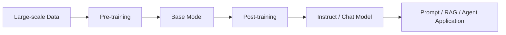
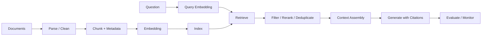

# Generative AI and RAG from First Principles：生成式AI与RAG第一性原理

这是一份独立的Generative AI（生成式AI）与Retrieval-Augmented Generation（检索增强生成，RAG）教材，整理自GitBook仓库的`gai/`目录，并补充纠错、工程边界和英文面试术语。

本文与另外三份教材分开：

- [Machine Learning from First Principles](01-ai-learning-01-machine-learning-from-first-principles.md)：传统ML、神经网络训练基础与MLOps；
- [Transformer from First Principles](01-ai-learning-02-transformer-from-first-principles.md)：tokenization、embedding、attention和Transformer内部原理；
- [AI Agents from First Principles](01-ai-learning-04-ai-agents-from-first-principles.md)：tool use、state、memory、agent loop与multi-agent；
- 本文关注怎样使用foundation model构建、评估和部署生成式AI/RAG应用。

## 0. 学完以后应该能做到什么

| 级别 | 能力 |
|---|---|
| L1 术语 | 用中英文解释foundation model、base model、instruct model、prompt、context、embedding和RAG。 |
| L2 训练 | 说明pre-training、SFT、preference optimization和inference的区别。 |
| L3 选择 | 判断应该用prompting、RAG还是fine-tuning。 |
| L4 RAG | 设计ingestion、chunking、indexing、retrieval、reranking和generation链路。 |
| L5 评估 | 分开评估retrieval、answer、safety、latency和cost。 |
| L6 工程 | 说明从prototype到production所需的数据治理、监控、权限和fallback。 |

### 0.1 英文面试核心术语（Core Interview Terminology）

| 中文 | 英文 | 简短英文解释 |
|---|---|---|
| 生成式AI | generative AI | Models generate new content conditioned on an input. |
| 基础模型 | foundation model | A broadly trained model that can be adapted to many tasks. |
| 基座模型 | base model | A pretrained model before instruction or preference post-training. |
| 指令模型 | instruct model | A model post-trained to follow user instructions. |
| 预训练 | pre-training | Training on large-scale data, often with self-supervised objectives. |
| 后训练 | post-training | Adapting behavior after pre-training through SFT or preference methods. |
| 监督微调 | supervised fine-tuning, SFT | Training on high-quality input-response demonstrations. |
| 偏好优化 | preference optimization | Improving behavior using preference or reward signals. |
| 推理 | inference | Running a trained model to generate an output. |
| 提示词 | prompt | Instructions and input supplied to the model. |
| 上下文 | context | All information available to the model for the current inference call. |
| 上下文窗口 | context window | The maximum token budget the model can attend to in one request. |
| 嵌入 | embedding | A vector representation used for similarity, clustering or retrieval. |
| 向量数据库 | vector database | A system that indexes vectors and supports similarity search. |
| 检索增强生成 | retrieval-augmented generation, RAG | Retrieval supplies external evidence before generation. |
| 切块 | chunking | Splitting source content into retrievable units. |
| 混合检索 | hybrid search | Combining lexical and vector retrieval. |
| 重排序 | reranking | Scoring retrieved candidates with a more precise model. |
| 忠实度 | faithfulness / groundedness | Whether answer claims are supported by supplied evidence. |
| 幻觉 | hallucination | A fluent claim that is unsupported or incorrect. |
| 多模态 | multimodal | Processing or generating more than one modality. |

## 1. Generative AI到底是什么

传统discriminative model常学习：

```text
input → label / score
```

Generative model学习数据分布或条件分布，并产生新内容：

```text
instruction + context → text / image / audio / code
```

“生成”不代表模型从数据库里找出原句，也不保证输出为真。语言模型在给定上下文下预测token分布，再按decoding策略逐步产生token。

需要避免三个过度简化：

- Generative AI不只等于LLM；diffusion model和音频生成模型也属于生成式AI。
- Generative AI不一定都是“超大模型”；规模不是定义本身。
- 模型生成看似原创的内容，不代表不存在memorization、copyright或privacy风险。

## 2. Foundation Model、LLM与应用的关系



| 层 | 它是什么 | 它不是什么 |
|---|---|---|
| Foundation model | 可适配多任务的广泛预训练模型 | 一个完整业务应用 |
| LLM | 以语言token为主要输入输出的大模型 | 自动查询最新数据库的系统 |
| RAG application | 检索系统加生成模型 | 重新训练LLM |
| Agent application | 模型能够动态决定步骤和工具调用 | 仅仅一个长prompt |

## 3. Pre-training、Post-training与Inference

### 3.1 Pre-training

自回归语言模型的典型目标是next-token prediction：

$$
L=-sum_t log P(x_tmid x_{<t})
$$

训练通过backpropagation更新模型参数。它让模型学习语言结构、模式与部分世界知识，但不会自动得到可靠的instruction following、事实保证或工具权限。

### 3.2 Supervised Fine-Tuning（SFT）

SFT使用高质量的instruction-response demonstrations继续训练模型。它主要教模型：

- 怎样响应指令；
- 怎样遵循对话格式；
- 某个任务或领域的示范行为。

SFT不是“把PDF上传给模型”的同义词，也不保证模型能准确记住所有事实。

### 3.3 Preference Optimization

RLHF、DPO及其他preference methods使用preferred/rejected response、reward model或可验证奖励改善行为。不同方法的优化机制并不相同，不应统称为“reinforcement fine-tuning”。

Reasoning能力也不能简单归因于单一训练阶段；它受到pre-training数据、模型能力、post-training、inference策略、工具和任务设计共同影响。

### 3.4 Inference

Inference不更新模型weights。一次请求的输出受以下因素影响：

- system/developer/user instructions；
- 当前messages和retrieved context；
- model version；
- temperature、top-p、max tokens等decoding配置；
- tool outputs和应用代码。

API通常不会凭空记住上一次调用；应用若需要对话连续性，必须重新提供历史或由服务端会话机制保存。不能把“模型本身无状态”和“整个应用系统无状态”混为一谈。

## 4. Prompt、Context与Structured Output

一个可维护的prompt至少明确：

```text
Role / Scope
Task
Input context
Constraints
Output schema
Failure behavior
Examples when necessary
```

System instruction定义稳定规则；user message提供当前任务；context提供事实材料。Embedding不是context：embedding用于找到材料，真正送进生成模型的是文本、图像或其他可读内容。

若输出还要交给程序，应使用structured output或schema validation。仅要求“返回JSON”不等于一定获得合法、满足业务约束的JSON。

不要要求模型公开隐藏的chain of thought作为可靠性保证。更适合要求：

- 简洁结论；
- 可检查的关键依据；
- 引用或tool evidence；
- 明确的assumptions；
- 可验证的中间产物。

## 5. Prompting、RAG还是Fine-Tuning

| 需求 | 首选方法 | 原因 |
|---|---|---|
| 改变格式、语气或任务说明 | Prompting | 不改weights，迭代最快 |
| 使用经常更新或私有的事实 | RAG / tools | 外部知识可更新、可引用 |
| 教稳定的输出行为或领域风格 | SFT | 改变模型行为分布 |
| 教非常专门且可重复的技能 | SFT或preference optimization | 需要足够高质量训练与评估数据 |
| 执行实时计算或业务操作 | Tool calling | 事实和副作用由外部系统处理 |
| 降低模型体积或推理成本 | Quantization、distillation等compression | 这是效率问题，不是知识检索问题 |

常见错误是：看到回答不准确就立刻fine-tune。若错误来源是缺少最新事实，RAG或工具通常比微调更合适。

## 6. RAG端到端系统



离线ingestion和在线query path应分开设计。这样更新文档、重建index或更换embedding model时，不需要把整个应用重新编写。

## 7. Chunking与Metadata

### 7.1 Chunking不是越小越好

- 太大：一个vector混合多个主题，检索不精确且占用context；
- 太小：语义不完整，必须拼接更多片段；
- overlap可保护边界信息，但会增加重复与成本；
- 优先按标题、段落、表格、代码块和语义结构切分，再设置token上限。

`chunk_size`必须注明单位：character、word还是token。不同embedding model也可能有不同输入上限。

### 7.2 Metadata

典型metadata包括：

```json
{
  "document_id": "policy-2026-08",
  "source": "security-policy.pdf",
  "section": "Access Control",
  "chunk_index": 12,
  "version": "2026-08-01",
  "tenant_id": "tenant-a",
  "access_level": "internal"
}
```

Metadata可用于filter、citation、versioning、deduplication和access control。权限过滤必须在检索或数据访问层强制执行，不能只在prompt里写“不要泄露”。

## 8. Retrieval、Hybrid Search与Reranking

### 8.1 Vector Search

把query转换为embedding，与chunk vectors计算cosine similarity、dot product或其他距离。它擅长语义近似，但对精确编号、罕见实体、代码符号和否定关系可能不稳定。

### 8.2 Lexical Search与Hybrid Search

BM25等lexical retrieval擅长关键词和稀有实体。Hybrid search结合lexical与dense retrieval，再进行score fusion或rank fusion。

### 8.3 Reranking

常见两阶段检索：

```text
large candidate set → reranker → small evidence set
```

Bi-encoder embedding适合快速召回；cross-encoder或专门reranker对query-document pair做更精细评分。不是固定先取20再留5；候选数应通过evaluation确定。

### 8.4 Query Transformation

Multi-query、query expansion、decomposition和HyDE可能提高recall，但也会增加latency、cost和错误检索。只有评估证明收益时才采用。

## 9. Context Engineering与Generation

Context assembly需要：

1. 权限过滤；
2. reranking与threshold；
3. 去重；
4. 相邻片段合并；
5. token budget控制；
6. source与section标记；
7. 明确无证据时的abstention行为。

“请只依据context”能降低但不能消除hallucination。更可靠的做法是让每条重要claim携带citation，并在生成后验证citation是否真的支持claim。

## 10. RAG Evaluation

RAG必须分层评估，不能只看最终回答“感觉不错”。

| 层 | 典型问题 | 指标示例 |
|---|---|---|
| Retrieval | 正确证据有没有被找到？ | Recall@K、MRR、NDCG、precision@K |
| Context | 送给模型的证据是否相关、完整、无权限问题？ | context relevance、coverage、access violations |
| Answer | 是否正确回答且被证据支持？ | correctness、faithfulness、citation precision/recall |
| System | 是否可生产运行？ | latency、cost、error rate、empty retrieval rate |
| Business | 是否改善用户任务？ | resolution rate、human escalation、task completion |

LLM-as-a-judge可扩展，但会有bias、position effect、model drift和prompt sensitivity。应通过明确rubric、校准样本、人工抽检和版本固定降低风险。

代码生成可使用unit tests和Pass@k；有唯一答案的任务可使用exact match；摘要可参考ROUGE，但词汇重叠不能单独代表事实正确。

## 11. Multimodal Generative AI

Multimodal system可能接收或生成text、image、audio和video。需要额外关注：

- 每种模态的预处理和tokenization不同；
- OCR、ASR或vision extraction错误会传递到后续生成；
- 图片或音频也可能包含prompt injection和敏感信息；
- 评估必须覆盖模态对齐、内容质量、latency与安全；
- 不要把“支持图片输入”等同于可靠理解所有图表、空间关系或细小文字。

## 12. Safety、Privacy与Production Readiness

至少考虑：

- prompt injection与retrieved document injection；
- PII、secret和tenant isolation；
- copyrighted or licensed content；
- harmful output与policy enforcement；
- model/version变化造成的evaluation regression；
- rate limit、timeout、retry、fallback和caching；
- observability：记录版本、retrieval IDs、latency和cost，但避免把敏感prompt完整写进日志。

## 13. 原GitBook需要纠正的地方

| 原笔记表述 | 更准确的理解 |
|---|---|
| Generative AI是使用海量foundation model的deep learning子集 | Generative AI按生成能力定义；不要求每个模型都“海量”。 |
| Fine-tuning主要分SFT和reinforcement fine-tuning | Post-training方法更多；RLHF、DPO与可验证奖励的机制不同。 |
| Reasoning由这些阶段结合后涌现 | Reasoning来源复杂，不能归因于一个固定配方。 |
| LLM inference是stateless | 模型调用通常依赖显式context；应用或API会话可以保存状态。 |
| top-k通常先20–50再留5–10 | 这是候选配置示例，不是通用标准，必须用评估选择。 |
| Prompt能让模型严格只根据context | Prompt只能降低风险，仍需citation、验证与fallback。 |

## 14. 英文面试回答模板

### What is the difference between RAG and fine-tuning?

> RAG retrieves external evidence at inference time, which is useful for current, private, or citable knowledge. Fine-tuning changes model parameters and is better suited to teaching stable behavior or specialized skills. They solve different problems and can be combined.

### How would you evaluate a RAG system?

> I would evaluate retrieval recall and ranking separately from answer correctness and faithfulness. I would also track citation quality, latency, cost, failure rate, and business task completion.

### Why use hybrid retrieval?

> Dense retrieval captures semantic similarity, while lexical retrieval is strong for exact terms, identifiers, and rare entities. Hybrid retrieval can improve coverage, but its value must be validated on a representative query set.

## 15. 主动回忆题

1. Generative AI、foundation model和LLM是什么关系？
2. base model与instruct model有什么区别？
3. pre-training、SFT、preference optimization和inference分别是否更新weights？
4. prompt、context和embedding有什么区别？
5. 什么情况下RAG比fine-tuning合适？
6. chunk太大和太小分别有什么问题？
7. metadata为什么不只是“附加说明”？
8. vector search和BM25各自擅长什么？
9. reranker为什么通常放在retrieval之后？
10. data ingestion和online query path为什么要解耦？
11. retrieval recall高为什么不保证answer faithful？
12. LLM-as-a-judge有什么风险？
13. multimodal RAG会增加哪些新的错误来源？
14. 怎样防止不同tenant检索到彼此文档？
15. 怎样证明一次RAG优化真的有效？

## 16. 原始笔记映射

- `gai/README.md`：Generative AI、foundation model、pre/post-training、evaluation和adaptation；
- `gai/llm-and-rag.md`：prompting、embedding、model selection和RAG全流程；
- `gai/rag-application.md`：chunking、metadata、hybrid retrieval、reranking、context engineering和evaluation；
- `gai/multimodal-ai-applications.md`：当前主要是标题，本文补充了必要的multimodal边界。

原始页面继续作为课程记录；本文作为系统复习和英文面试的canonical guide。
