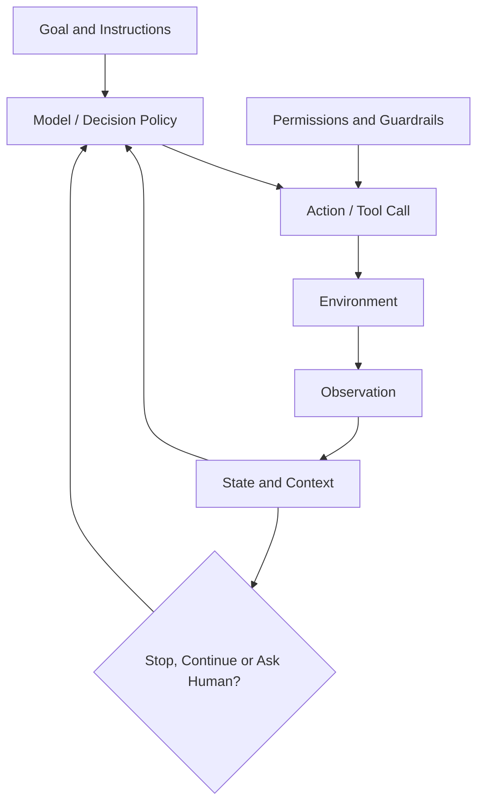
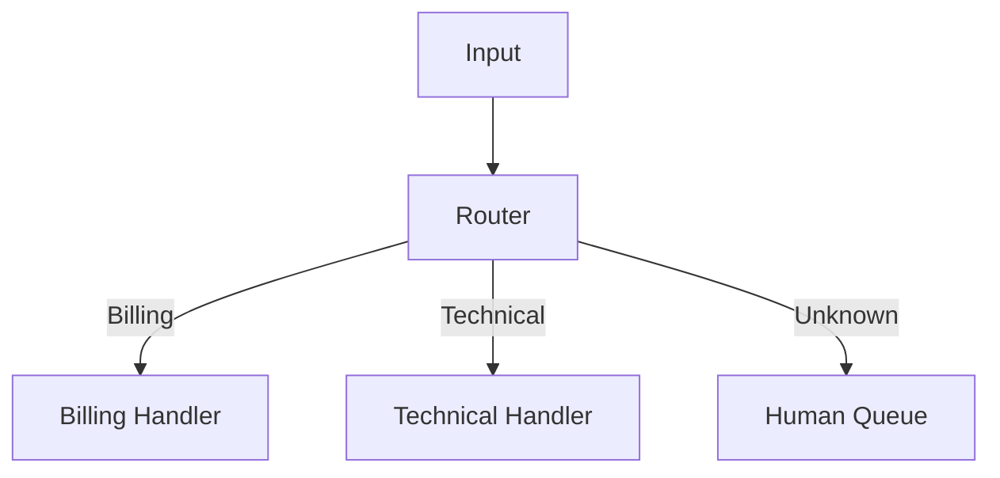
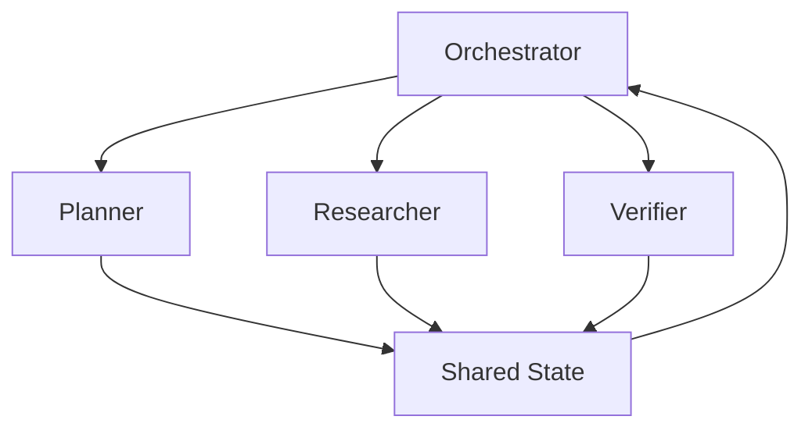

# AI Agents from First Principles：AI Agent第一性原理

这是一份独立的AI Agent、Agentic Workflow和Multi-Agent Systems教材，整理自GitBook仓库的`agent/`目录，并对重复内容和概念混淆进行纠正。

先明确边界：

- Transformer解释模型内部怎样处理token；
- Generative AI/RAG解释怎样用模型和外部知识生成可靠回答；
- Agent解释模型怎样在目标、工具、观察和约束之间动态决定下一步；
- Multi-agent解释多个agent怎样分工、通信、共享状态和停止。

## 0. 学完以后应该能做到什么

| 级别 | 能力 |
|---|---|
| L1 定义 | 区分chatbot、workflow、agent、tool和multi-agent system。 |
| L2 循环 | 解释plan/decide → act → observe → update → stop。 |
| L3 工程 | 设计tool schema、structured output、state、memory、retry和approval。 |
| L4 架构 | 选择prompt chain、routing、parallel、evaluator或orchestrator-workers。 |
| L5 安全 | 处理prompt injection、least privilege、side effects和human-in-the-loop。 |
| L6 评估 | 用task success、trajectory、tool accuracy、safety、latency和cost评估agent。 |

### 0.1 英文面试核心术语

| 中文 | 英文 | 简短英文解释 |
|---|---|---|
| 智能体 | agent | A model-driven system that dynamically chooses steps or tools to pursue a goal. |
| 智能体工作流 | agentic workflow | A system combining models, tools and control flow, possibly with predefined paths. |
| 工具调用 | tool calling | The model selects a typed external operation and its arguments. |
| 观察 | observation | A tool result or environment response returned to the control loop. |
| 编排器 | orchestrator | Code or a model that coordinates tasks, workers and stopping conditions. |
| 路由 | routing | Selecting the next handler based on the current input or state. |
| 状态 | state | Task information required to continue execution correctly. |
| 短期记忆 | short-term memory | Task- or session-scoped retained information. |
| 长期记忆 | long-term memory | Persisted information available across sessions. |
| 轨迹 | trajectory | The sequence of decisions, tool calls and observations. |
| 护栏 | guardrail | A control that constrains input, output or actions. |
| 人工介入 | human-in-the-loop | A person reviews, approves or redirects consequential actions. |
| 幂等性 | idempotency | Repeating an operation has no additional unintended effect. |
| 最小权限 | least privilege | Give an agent only the access needed for the current task. |
| 多智能体系统 | multi-agent system | Multiple agent roles coordinate to accomplish a larger task. |
| MCP | Model Context Protocol | A protocol connecting model applications to tools, resources and prompts. |

## 1. 什么才算Agent

一个普通LLM调用：

```text
prompt → response
```

一个固定workflow：

```text
input → summarize → classify → store
```

一个agent loop：

```text
goal → decide next action → call tool → observe → update state
          ↑                                      ↓
          └──────── continue / stop / ask human ─┘
```

最关键的区别不是“是否用了Python class”，也不是“是否保存memory”，而是系统是否让模型在约束内动态决定怎样完成目标。

Agenticness是连续程度，不是二元标签。固定router可能只有少量动态决策；能自行选择工具、调整计划并判断停止的系统agenticness更高。

## 2. Agent的核心组成



| 组件 | 作用 | 常见失败 |
|---|---|---|
| Goal/instructions | 定义成功条件与边界 | 目标模糊、互相冲突 |
| Model/policy | 选择下一步 | 错误规划、过度自主 |
| Tools | 读取数据或执行操作 | 参数错误、权限过大 |
| State/context | 保存当前任务事实 | stale state、context overflow |
| Guardrails | 限制输入、输出和动作 | 只靠prompt、可绕过 |
| Stop condition | 控制循环结束 | infinite loop、过早停止 |
| Evaluation | 判断是否真的完成 | 只相信模型自报成功 |

## 3. Prompting不是Agent本身

Role、task、context、constraints、output format和examples能改善模型行为，但prompt本身不会：

- 真正执行API；
- 保证权限控制；
- 自动保存可靠memory；
- 自动验证工具副作用；
- 自动证明任务成功。

“让模型展示完整chain of thought”也不是可靠性或可观测性的必要条件。生产系统更应该记录可审计的actions、tool arguments、observations、citations、state transitions和validation results，同时只要求模型给出必要的简短rationale。

## 4. Tool Calling：Decision与Execution分离

```text
LLM proposes typed action
        ↓
application validates permission and arguments
        ↓
tool executes
        ↓
result returns as observation
```

Tool definition至少包含：

- 清楚的name与description；
- typed parameters与required fields；
- 参数范围和枚举；
- timeout与error contract；
- 是否read-only；
- 是否有side effect；
- 是否需要human approval。

模型选择工具不等于模型直接获得底层凭证。Credential应由受控tool/runtime持有，不能放进prompt。

### 4.1 简化控制循环

```python
state = initialize(goal)
for step in range(MAX_STEPS):
    decision = model.decide(state, available_tools)

    if decision.type == "final":
        return validate_final(decision.output, state)

    action = validate_action(
        decision.action,
        permissions=state.permissions,
    )
    observation = execute_with_timeout(action)
    state = update_state(state, action, observation)

raise StepBudgetExceeded()
```

真实系统还要处理retry policy、idempotency key、rate limit、cancellation、audit log和approval。

## 5. Structured Output与Validation

Structured output是agent和程序之间的API contract。例如：

```json
{
  "action": "create_ticket",
  "arguments": {
    "severity": "high",
    "summary": "Database connection failures"
  }
}
```

Schema validation只能证明结构合法，不能证明：

- severity判断正确；
- ticket内容有事实依据；
- 用户授权创建ticket；
- 重试不会创建重复ticket。

所以还需要semantic validation、authorization和business rules。

## 6. State、Context与Memory

| 概念 | 含义 | 例子 |
|---|---|---|
| State | 完成当前任务所需的结构化事实 | current_step、approved_plan、tool_results |
| Context | 当前模型调用能看到的信息 | messages、instructions、retrieved evidence |
| Short-term memory | 当前session或task保留的信息 | conversation summary、recent actions |
| Long-term memory | 跨session持久化的信息 | user preference、historical task record |
| External knowledge | 不应称为个人记忆的外部事实 | policy documents、product catalog |

“stateless就是function，stateful才是agent”不成立。Agent可以在一次调用中完成简单工具任务；普通workflow也可以保存大量state。

Memory write必须有规则：写什么、何时写、保存多久、谁能读取、怎样更正和删除。把所有对话自动写进vector database会引入privacy、staleness和错误记忆。

## 7. Workflow Patterns

### 7.1 Prompt Chaining

```text
extract → validate → transform → summarize
```

适合步骤固定、依赖清楚的任务。优点是可测试；缺点是遇到开放问题缺少适应性。

### 7.2 Routing



Router可以是规则、classifier或LLM。若类别固定且规则足够，没必要为了“agent”而使用LLM。

### 7.3 Parallelization

多个独立分析并行执行，再由确定性代码或synthesizer汇总。必须定义冲突处理、timeout和partial failure策略。

### 7.4 Evaluator–Optimizer

Generator产生draft，evaluator基于rubric给feedback，再有限次数修改。Evaluator也会犯错，因此需要max retries和独立的success check。

### 7.5 Orchestrator–Workers

Orchestrator动态分解任务并分配workers，适合子任务数量或类型无法预先确定的开放任务。它比固定chain成本更高，也更难调试。

## 8. Workflow还是Agent

| 问题特征 | 更合适的设计 |
|---|---|
| 步骤稳定、规则明确 | Deterministic workflow |
| 只有一个分类决策 | Rule/classifier/router |
| 需要动态选择工具和步骤 | Single agent |
| 开放任务可分解为未知子任务 | Orchestrator-workers |
| 多个真正独立领域且可并行 | Multi-agent候选 |
| 高风险副作用 | Workflow + explicit approval，减少自主性 |

原则：从能满足需求的最简单架构开始。更多agent通常意味着更多token、latency、failure modes和observability难度。

## 9. RAG、Web Search与Agentic RAG

- Web search是retrieval tool，不自动等于完整RAG；RAG还包括evidence assembly和grounded generation。
- Traditional RAG按固定流程每次检索。
- Agentic RAG让模型决定是否检索、查询什么、选择哪个数据源、是否继续检索。
- Multi-agent RAG把planning、retrieval、verification或synthesis分给不同角色。

Agentic RAG不是必然更好。简单question-answering若固定RAG已经稳定，增加agent loop可能只会增加成本和不确定性。

## 10. Multi-Agent Systems

多个prompt不自动构成multi-agent system。每个agent至少应有清楚的responsibility、inputs、outputs、permissions和coordination contract。



### 10.1 常见架构

- Supervisor / workers：中央协调，容易治理但有单点瓶颈；
- Peer-to-peer：agent互相委派，灵活但难追踪；
- Blackboard / shared state：通过共享任务板协作，需处理并发和ownership；
- Debate / reviewer：生成者与批评者交互，必须限制循环并防止共同偏差。

### 10.2 什么时候不该使用Multi-Agent

- 一个agent加两个tools已经能解决；
- agents没有真正不同的知识、工具或权限；
- 任务不可安全并行；
- 汇总质量难以验证；
- 额外调用成本超过业务收益。

“每个agent都是peer”也不是定义要求；hierarchical multi-agent架构同样常见。Orchestrator可以是确定性代码、LLM agent或两者混合。

## 11. Shared State与Concurrency

Multi-agent共享状态必须定义：

- 谁拥有哪个field；
- read/write权限；
- optimistic locking或version；
- duplicate work怎样去重；
- partial result怎样标记；
- cancellation怎样传播；
- 最终答案由谁提交。

Race condition不是抽象概念。例如两个agents同时执行“退款”，若没有idempotency key和transaction boundary，可能发生双重退款。

## 12. MCP在Agent系统中的位置

MCP（Model Context Protocol）使用host-client-server架构，通过JSON-RPC和capability negotiation让model application连接外部能力。

Server常暴露三类primitive：

| Primitive | 主要控制者 | 用途 |
|---|---|---|
| Tools | Model-controlled | 调用函数、执行动作或获取信息 |
| Resources | Application-controlled | 提供文件、schema等context |
| Prompts | User-controlled | 提供可选择的模板或workflow入口 |

MCP解决的是integration protocol，不是完整agent runtime。它本身不会自动提供：

- planner或orchestrator；
- long-term memory策略；
- business authorization；
- retry与idempotency；
- agent evaluation；
- 多agent协调。

官方参考：[MCP Architecture](https://modelcontextprotocol.io/specification/2025-06-18/architecture) 与 [Server Primitives](https://modelcontextprotocol.io/specification/2025-06-18/server/index)。

## 13. Safety与Human-in-the-Loop

Agent比普通chat风险更高，因为它可能产生side effect。

### 13.1 主要风险

- prompt injection诱导agent泄露数据或调用危险tool；
- confused deputy：agent借用户身份执行用户无权执行的操作；
- excessive agency：权限、范围或持续时间过大；
- hallucinated parameters；
- retry造成重复付款、重复邮件或重复删除；
- tool output含恶意instructions；
- agent loop消耗失控。

### 13.2 控制方法

- least privilege和task-scoped credentials；
- read与write tools分离；
- 高风险动作preview + human approval；
- allowlist、schema和semantic validation；
- timeout、step/token/cost budget；
- sandbox与network boundary；
- idempotency key和transaction；
- immutable audit trail；
- external content按untrusted data处理，不当作system instruction。

Human approval应该展示准确动作、目标、参数和影响，而不是只问“继续吗？”

## 14. Agent Evaluation

| 层 | 评估内容 | 示例 |
|---|---|---|
| Final outcome | 是否完成用户目标 | task success、correctness |
| Trajectory | 是否走了合理路径 | unnecessary calls、loop count |
| Tool use | 工具和参数是否正确 | tool selection accuracy、argument validity |
| Safety | 是否越权或触发副作用 | policy violations、approval bypass |
| Robustness | 工具失败时是否恢复 | retry success、fallback rate |
| Efficiency | 是否值得 | latency、tokens、tool cost |
| Human experience | 是否正确请求澄清或审批 | escalation quality |

不能只让同一个agent说“任务已完成”。应使用可验证external state，例如测试通过、文件存在、数据库记录匹配或人工rubric。

## 15. 原GitBook需要纠正的地方

| 原笔记表述 | 更准确的理解 |
|---|---|
| Prompting = instruction design | Prompting是instruction design的一部分；agent还需要tools、runtime、state和controls。 |
| Force structured reasoning / CoT | 不需要索取隐藏推理；要求可验证证据、简短rationale和结构化结果。 |
| Bad output → adjust prompt, not model | 还可能是data、retrieval、model capability、tool、schema或evaluation问题。 |
| Stateless → function；Stateful → agent | State不是agent定义条件，普通程序同样可以stateful。 |
| Search = simplest form of RAG | Search只是retrieval；RAG还需要把证据用于grounded generation。 |
| MCP标准化tools、context、memory和structured I/O | MCP主要标准化host/client/server之间的tools、resources、prompts等协议能力，不定义完整memory或agent runtime。 |
| Multi-agent中的agents必须是peers | 可以是peer，也可以hierarchical或由central orchestrator控制。 |
| Orchestrator通常不是LLM | Orchestrator可以是代码、LLM或混合设计，应按可预测性和任务动态性选择。 |
| Routing通常是LLM classification | 规则、传统classifier或LLM都可以；优先选择足够可靠的简单方案。 |

## 16. 英文面试回答模板

### What is the difference between a workflow and an agent?

> A workflow follows predefined code paths, while an agent dynamically selects steps and tools based on its goal and observations. I prefer a deterministic workflow when the task is stable because it is easier to test and control.

### How do you make tool use safe?

> I separate model decisions from tool execution, validate typed arguments, enforce least privilege, require approval for consequential actions, use idempotency keys, and verify external state after execution.

### When would you use multiple agents?

> I would use multiple agents only when the task has genuinely distinct roles, tools, permissions, or parallelizable work. Otherwise, a single agent or deterministic workflow is usually cheaper and easier to evaluate.

### What does MCP provide?

> MCP is an integration protocol that lets model applications discover and use tools, resources, and prompts through a host-client-server architecture. It does not replace orchestration, authorization, memory design, or evaluation.

## 17. 主动回忆题

1. Chatbot、workflow和agent有什么区别？
2. Agent定义为什么不取决于Python class或memory？
3. tool schema合法为什么不等于action正确？
4. state、context、short-term memory和long-term memory有什么区别？
5. 五种workflow patterns分别适合什么任务？
6. 什么时候用规则router而不是LLM router？
7. evaluator-optimizer怎样避免无限循环？
8. agentic RAG与固定RAG有什么区别？
9. 什么情况下multi-agent反而更差？
10. hierarchical multi-agent为什么仍然是multi-agent？
11. shared state怎样避免race condition？
12. MCP的host、client和server分别做什么？
13. MCP的tools、resources和prompts分别由谁控制？
14. 为什么MCP不等于agent runtime？
15. prompt injection怎样通过tool output攻击agent？
16. 为什么write action需要idempotency？
17. human approval界面应该展示什么？
18. 怎样用external state验证agent真正完成任务？
19. trajectory evaluation与final-answer evaluation有什么区别？
20. 怎样为agent设置step、token和cost budget？

## 18. 原始笔记映射

- `agent/README.md`：prompt design、role prompting、prompt chaining和ReAct；
- `agent/agentic-workflows.md`：workflow/agent区别和五类workflow patterns；
- `agent/building-agents.md`：tools、structured output、state、memory、APIs、RAG、evaluation和MCP；
- `agent/multi-agent-systems.md`：architecture、orchestration、routing、shared state和multi-agent RAG。

原始笔记里存在重复标题和课程完成语句，本文已按概念依赖重新组织，并作为系统复习和英文面试的canonical guide。
