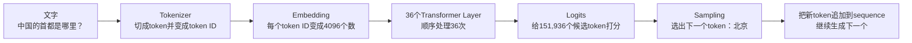
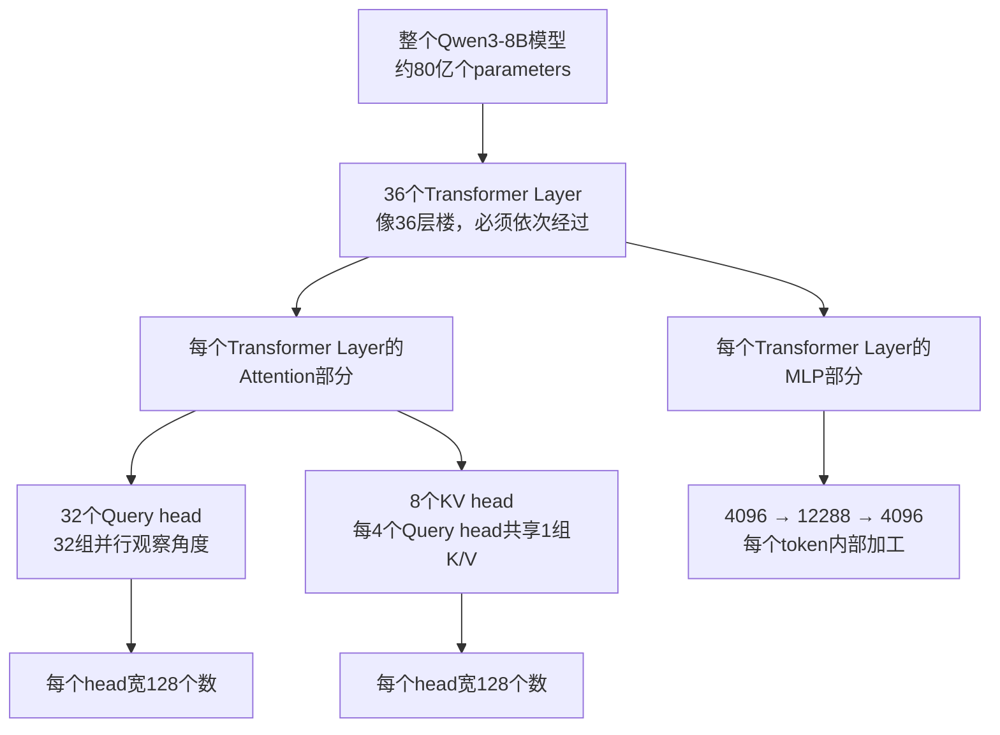
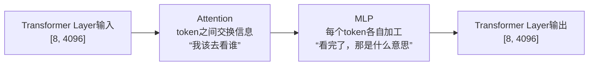
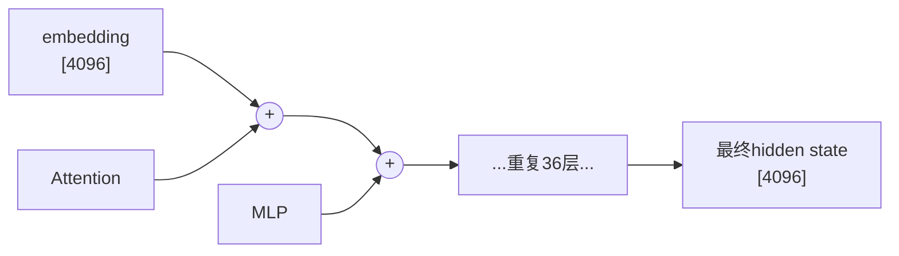
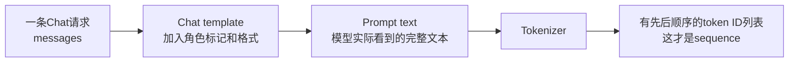
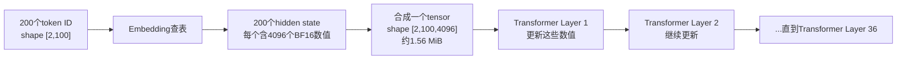
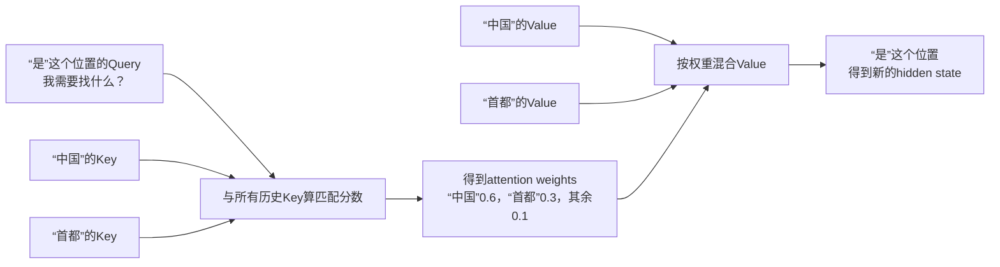
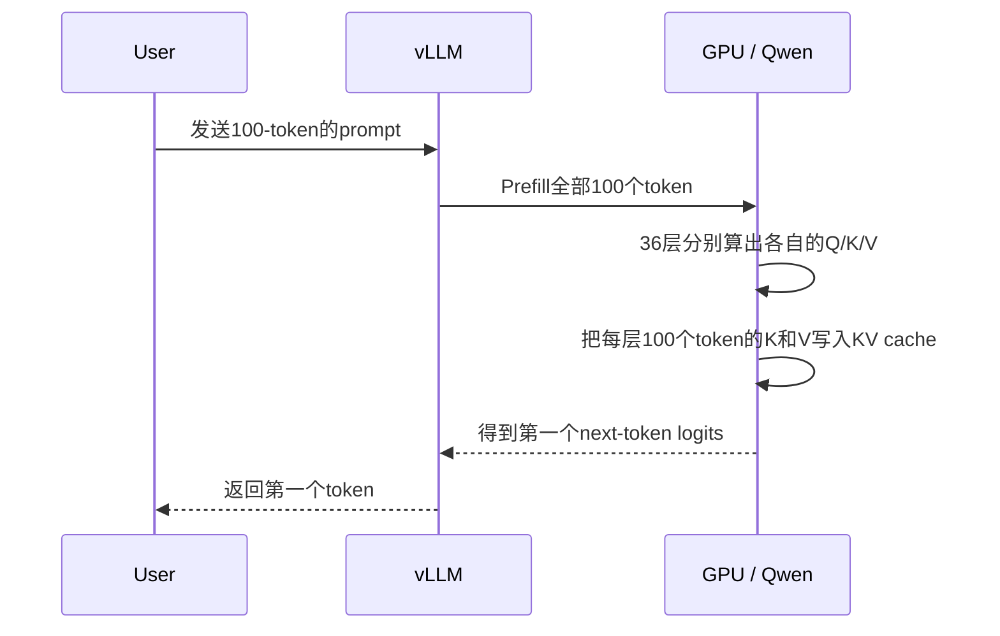
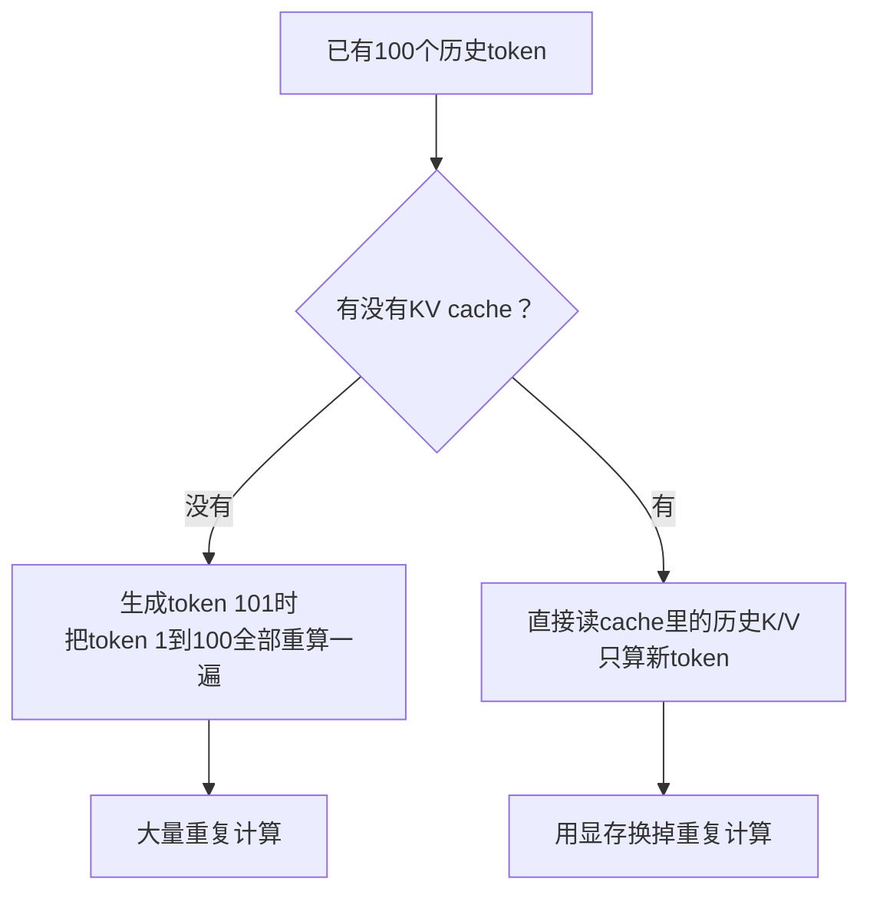
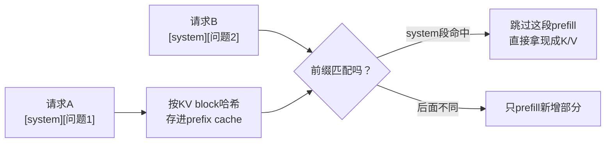

# Qwen推理运维视角：先看懂一次请求，再理解KV Cache

这份文档按“用户发出一句话以后，服务器里发生什么”来解释Transformer推理。

**阅读规则：**第一次只读标有“运维必须理解”的部分。数学附录看不懂可以跳过，不影响先理解vLLM、显存和延迟。

**本文的写法约定：**

1. 每个概念先给**一句话定义**，再给**具体例子**，最后说**它的维度是多少、这个维度在干什么**。
2. 术语一律使用**统一的英文名**（例如始终写`hidden state`，不写“隐藏向量/激活值”）。同一个东西在其他资料里的不同叫法，集中放在文末的**第16节 术语表**，卡住随时去查。
3. 全文使用**同一个例子**：用户输入`中国的首都是哪里？`，模型回答`北京`。所有概念都在这个例子上解释一遍。

## 0. 运维到底需要理解到什么程度

| 内容 | 运维是否必须理解 | 原因 |
|---|---|---|
| token、sequence、context length | 必须 | 决定输入长度和KV cache增长 |
| parameters（模型weights）与quantization | 必须 | 决定模型能否放进GPU |
| prefill、decode、KV cache | 必须 | 决定TTFT、TPOT、吞吐和并发 |
| Transformer Layer、KV head、head width | 理解配置含义 | KV cache公式要用 |
| hidden state | 必须 | 它是activation显存的来源 |
| logits | 理解它是“下一个token的候选分数” | 才知道模型怎样输出文字 |
| Q/K/V的完整矩阵推导 | 暂时不必熟练 | 只需先理解为什么缓存K/V |
| causal mask矩阵 | 暂时不必手算 | 只需知道模型生成时只能看过去 |
| RoPE、RMSNorm公式 | 可以后学 | 不直接用于第一轮容量计算 |
| MLP内部公式 | 可以后学 | 知道它消耗parameters和compute即可 |
| backpropagation | 推理运维可暂时跳过 | 它属于训练过程 |

这里的context length就是一条sequence当前一共有多少个token，通常包括prompt和已经生成的内容。

> **术语纪律：**模型中重复36次的计算单元，本文统一称为**Transformer Layer**。有些代码或资料把同一个东西叫`decoder layer`、`Transformer block`或`decoder block`，本文不再混用。特别注意：vLLM的**KV block**是分配KV cache显存的“小内存块”，和Transformer Layer毫无关系。

## 1. 先看一条完整请求

用户输入：

```text
中国的首都是哪里？
```

服务器不是把整句话交给“一个智能黑盒”，而是依次做这几件事：



先记住这条主线，后面每一节都是在放大这条线上的某一段：

```text
文字 → token ID → hidden state → 36个Transformer Layer → logits → 下一个token
```

KV cache发生在“36个Transformer Layer”内部，不在这条线的外面。

### 1.1 先说清楚：方括号 `[...]` 写的是shape，不是值

这是最容易卡住的一个记号问题。**方括号在本文里被用来表示两种不同的东西**，看清楚是哪一种：

```text
shape（形状）： [8]
                 ↑ 说的是“这里有8个格子”，不是“这个数是8”

value（值）：   [5832, 9014, 3021, 77, 5832, 610, 88, 12]
                 ↑ 真正装进那8个格子的内容
```

所以`token ID的shape是[8]`并**不是**说“一个token ID是8维的”。一个token ID确实就是一个整数，比如`5832`。`[8]`说的是：这句话被切成了8个token，于是有8个整数排成一排。

**按维数（方括号里有几个数字）叫法不同：**

| shape | 维数 | 统一叫法 | 本文中的例子 |
|---|---:|---|---|
| `[]` | 0维 | scalar（标量） | 一个token ID，如`5832` |
| `[8]` | 1维 | vector（向量），也叫一维数组 | 一句话的8个token ID |
| `[8, 4096]` | 2维 | matrix（矩阵） | 8个token各自的hidden state |
| `[2, 100, 4096]` | 3维 | tensor（张量） | 2条sequence的hidden state |

严格说**tensor是统称**——0维、1维、2维都算tensor，PyTorch里一律叫`tensor`。口语中1维习惯叫向量、2维叫矩阵、3维及以上才特意说张量。

**它有顺序吗？有，而且顺序是核心。**

```text
[5832, 9014]  →  "中国的"
[9014, 5832]  →  "的中国"
```

两者是完全不同的句子。所以它是**有序数组**，不是数学上的集合（集合才没有顺序）。这正是第5节要说的：很多token ID**按顺序**排在一起，才叫一条**sequence**——`[8]`这个一维数组，就是一条长度为8的sequence。

顺序重要到什么程度？模型内部要专门加位置编码（RoPE）来告诉自己“这是第几个token”，否则Attention看到的只是一堆无序的向量。

### 1.2 这条线上每一步的维度

这张表是全文的地图。看到一个shape就能对上它处在哪一步。

| 步骤 | 数据的统一叫法 | 例子中的shape | 里面装的是什么 |
|---|---|---|---|
| 1 | 文字 | — | `中国的首都是哪里？` |
| 2 | token ID | `[8]` | 8个整数编号，值形如`[5832, 9014, ...]` |
| 3 | hidden state（embedding之后） | `[8, 4096]` | 8个token位置，**每个位置**4096个数 |
| 4 | hidden state（每层更新后shape不变） | `[8, 4096]` | 同样8×4096个数，但数值被刷新了36次 |
| 5 | logits | `[151936]` | 词表中每个候选token的一个分数 |
| 6 | 下一个token ID | `[1]` | 一个整数，例如“北京”的编号 |

两个关键观察：

1. **第2步到第3步，多出来的那个`4096`，就是从“编号”变成“理解”的地方。**在第2步，一个token只是一个整数；到第3步，它变成了4096个数。
2. **第3步到第4步，shape一直不变，变的只是里面的数值。**这是理解Transformer最省事的一句话。

## 2. Token、Vocabulary和Logits

### 2.1 Token：模型认识的最小文字片段

**一句话：**token是tokenizer把文字切开以后得到的一个片段，不一定等于一个汉字或一个英文单词。

例子：

```text
输入：Hello，中国！

可能切成：["Hello", "，", "中国", "！"]   → 4个token
```

同一句话里，一个token可能是：

- 一个完整英文单词（`Hello`）；
- 英文单词的一部分（`un` + `believ` + `able`）；
- 一个或几个中文字符（`中国`）；
- 标点符号（`！`）；
- 代码片段（`def`）；
- 更小的字符或byte单位。

所以Qwen的词表既不是“只有英文”，也不是“把全世界的句子都存进去”，它是一份多语言的token片段清单。

> 上面的切法只是帮助理解。真实切法由当前Qwen tokenizer决定，可以用`tokenizer.encode()`实测。

### 2.2 Token ID与Vocabulary：编号和字典

**一句话：**vocabulary是模型认识的全部token片段清单；token ID是某个片段在这份清单里的整数编号。

当前模型：

```text
vocab_size = 151,936
```

可以想象成一本有151,936条的字典：

```text
token ID 0      → 某个token片段
token ID 1      → 某个token片段
...
token ID 151935 → 某个token片段
```

**维度含义：**`151936`这个数字唯一的作用，就是决定模型每一步要给多少个候选打分（见2.3），以及embedding表有多大（见3.1）。

### 2.3 Logits：这一步对全部候选token的打分表

**一句话：**logits是模型在当前这一步，给词表里每一个候选token打的原始分数。

例子（模型已经读完`中国的首都是哪里？`，准备输出第一个字）：

```text
候选token       logit（原始分数）
--------------------------------
"北京"             12.3
"上海"              7.1
"。"                3.4
"London"           -2.0
...其余151,932项...
```

合起来就是：

```text
next-token logits: shape [151936]
```

**维度含义：**长度等于`vocab_size`，因为每个候选都要有一个分数，一个不能少。

logit不是字符、不是概率、也不是模型parameter，它只是当前这一步的临时分数。之后：

```text
logits [151936]
  → softmax → probabilities [151936]（总和为1）
  → sampling → 一个token ID，例如“北京”的编号
  → 转回文字
```

> **一句话记法：**vocabulary是候选名单，logits是这一次对候选名单的打分表。

## 3. Qwen3-8B里的几个数字分别属于什么

`36`、`32`、`8`、`128`、`4096`、`8B`这几个数字属于完全不同的层级，不要混在一起。



### 3.1 Parameters：8B到底是什么、每层用多少、MoE又是怎么回事

#### parameter就是线性方程里的系数

**一句话：**parameter就是训练时被调出来、推理时固定不变的那些数字，本质上和线性方程里的系数是同一回事。

```text
y = w1·x1 + w2·x2 + ... + w4096·x4096 + b

x  是输入（当前token的hidden state）
w  和 b 就是 parameters
```

模型里这些系数不是零散存放的，而是按**weight matrix（权重矩阵）**成批存放。举一个真实的例子——MLP的第一步要把4096个数变成12288个数：

```text
输入 [4096]  ×  weight matrix [4096, 12288]  =  输出 [12288]

这一个矩阵含 4096 × 12288 = 50,331,648 个parameters
```

**光是这一个矩阵就有5033万个参数。**8B就是这样一个矩阵一个矩阵堆出来的。

#### 8B是全模型加起来的总数，不是每层都有8B

这是最容易误解的一点。**不是每层8B，是36层加起来才8B。**每层大约2亿：

| 位置 | 矩阵 | shape | parameter数 |
|---|---|---|---:|
| Attention | q_proj | `[4096, 4096]` | 16.8M |
| Attention | k_proj | `[4096, 1024]` | 4.2M |
| Attention | v_proj | `[4096, 1024]` | 4.2M |
| Attention | o_proj | `[4096, 4096]` | 16.8M |
| MLP | gate_proj | `[4096, 12288]` | 50.3M |
| MLP | up_proj | `[4096, 12288]` | 50.3M |
| MLP | down_proj | `[12288, 4096]` | 50.3M |
| | **每层合计** | | **≈ 193M** |

（`k_proj`和`v_proj`的输出是1024而不是4096，因为只有8个KV head：`8 × 128 = 1024`。这正是GQA省显存的地方，见3.6。）

整个模型：

```text
36层 × 193M          ≈ 6.95B
embedding表 151936 × 4096  ≈ 0.62B
输出层 lm_head              ≈ 0.62B
------------------------------------
合计                        ≈ 8.2B  → 对外称 8B
```

三个必须记住的结论：

1. **每层有自己独立的一套parameters，层与层之间不共享。**第1层的`q_proj`和第2层的`q_proj`是两个完全不同的矩阵，只是shape相同。
2. **8B不表示**一句话有80亿个token，也不表示一个token是80亿维，更不表示每个用户复制一份80亿参数。
3. **weights加载到GPU后由所有请求共享。**10个并发用户和1个用户，weights占的显存是一样的——随并发增长的是KV cache，不是weights。

#### weights不是只有MLP才有——Attention同样有

看到上表里MLP占78%，很容易误以为“模型的权重就是MLP”。**不是。**weights分布在模型的每一个部位：

```text
embedding表          0.62B    ← 也是weights（一张151936×4096的查表矩阵）
每层 Attention       42M ×36 = 1.51B   ← q/k/v/o_proj 四个矩阵，全是weights
每层 MLP            151M ×36 = 5.44B   ← gate/up/down_proj 三个矩阵
lm_head              0.62B    ← 也是weights
──────────────────────────────
合计                 ≈ 8.2B
```

Attention占1.51B，接近整个模型的1/5——**绝对不是“不涉及weights”**。MLP只是占比最大的那一块，不是唯一的一块。

第4.5节还会讲到：`q_proj`这些矩阵和MLP的矩阵是同一种东西，都是训练出来的、都参与矩阵乘法。“MLP是神经网络、Attention不是”这个划分是错的。

#### 陷阱：“权重”这个词在Attention里有两个完全不同的意思

这大概是全文最容易踩的一个术语坑，务必分清：

| 名字 | 是什么 | 哪来的 | 算不算在8B里 | 生命周期 |
|---|---|---|---|---|
| **weight matrix**<br/>（权重矩阵） | `q_proj`、`k_proj`、`gate_proj`这些矩阵 | **训练**出来的 | **算**，就是8B本身 | 加载后长期驻留，所有请求共享 |
| **attention weights**<br/>（注意力权重） | “该看‘中国’60%、看‘首都’30%”这组比例 | 推理时**现算**的（Q·K再softmax） | **不算**，它不是parameter | 这一步用完就扔 |

```text
weight matrix    ：训练冻结下来的知识        → 决定显存占多少
attention weights：这句话里谁该看谁的临时打分 → 决定这次输出什么
```

两者中文都叫“权重”，但一个是**模型的一部分**，一个是**计算的中间结果**。看到“权重”两个字，先问是哪一种。本文一律写全称：`weight matrix`指前者，`attention weights`指后者。

#### 一个token到底“用到”多少parameters

Qwen3-8B是**dense model（稠密模型）**：每生成一个token，全部约8B个parameters都要参与计算、都要从显存里读一遍。

```text
dense model：total parameters = active parameters = 约8B
```

这直接决定decode速度——每吐一个token，GPU至少要把8B个weights读一遍，所以显存带宽往往比算力更先成为瓶颈。

#### MoE与“激活参数”：DeepSeek说的是什么

**一句话：**MoE（Mixture of Experts，混合专家）把每层的MLP换成N个并列的小MLP（每个叫一个**expert**），外加一个**router**决定每个token只走其中几个expert，其余的这次不算。

```text
dense（Qwen3-8B）：
  token → 这一层唯一的MLP → 输出        每个token都用同一套MLP参数

MoE（例如DeepSeek-V3）：
  token → router打分 → 只挑中k个expert → 只算这k个 → 输出
                        其余expert这次一个乘法都不做
```

于是出现两个必须区分的数字：

| 名称 | 含义 | DeepSeek-V3的例子 |
|---|---|---:|
| total parameters | 模型一共有多少参数 | 约671B |
| active parameters | 生成一个token实际参与计算的参数 | 约37B |

**运维含义（这才是重点）：**

```text
显存占用     → 按 total parameters 算（所有expert都得放进显存待命）
计算量/带宽  → 按 active parameters 算（这次只读被选中的那几个）
```

所以MoE的特点是**“占显存像大模型，算得像小模型”**。671B的模型要几百GB显存才装得下，但每个token的计算量只相当于一个37B的dense模型。

补充两点：

- Attention部分通常**不**做MoE，每个token都要完整走一遍，所以KV cache的算法不受MoE影响。
- Qwen3系列也有MoE版本（例如Qwen3-30B-A3B，`A3B`就是active 3B的意思）。但**本文用的Qwen3-8B是dense的，没有expert，也没有active/total之分。**

回到最初的问题，直接回答：

```text
Q: 一个token到底用多少参数？
A: Qwen3-8B（dense）  → 约8B，全部都用
   DeepSeek-V3（MoE） → 约37B（总共671B，其余这次不算）
```

### 3.2 Transformer Layer = 36：顺序经过36次处理

**一句话：**Transformer Layer是模型里重复36次的那个计算单元，同一批hidden state要依次穿过全部36层。

```text
输入hidden state [8, 4096]
  → Transformer Layer 1   → [8, 4096]
  → Transformer Layer 2   → [8, 4096]
  → ...
  → Transformer Layer 36  → [8, 4096]
最终hidden state
```

**维度含义：**`36`不改变shape，它只决定这组数被反复加工多少轮。层数越多，模型对上下文的理解越深，但延迟也线性增加——36层就是36次串行计算，不能并行。

36层结构相同，但如3.1所说，每层有自己独立的weights。第1层的输出就是第2层的输入。

### 3.3 d_model = 4096：每个token的hidden state有多宽

**一句话：**`d_model`（也叫hidden size）是每个token在层与层之间用多少个数来表示，当前是4096。

```text
token ID: 5832
      ↓ embedding查表
hidden state: [0.12, -0.44, ..., 0.08]
              ← 一共4096个数 →
```

**hidden state到底是什么（这是全文最重要的一个概念）：**

> hidden state就是**模型此刻对这个token的理解**，用4096个数写下来。

这4096个数**不是固定的**。它每穿过一层就被刷新一次：

```text
"天气"这个token刚embedding出来时：
    [0.31, -0.02, ..., 0.55]   ← 只是“天气”这个词本身的通用含义

经过第1层（Attention让它看到了前面的"北京"）：
    [0.28,  0.14, ..., 0.41]   ← 现在含义里带上了“北京的”

经过第36层：
    [-0.07, 0.33, ..., 0.19]   ← 完整语境下的理解，可以拿去预测下一个词了
```

shape始终是`[4096]`，变的只有数值。所以它叫hidden **state**（状态）而不是embedding——embedding只是它在第0步的初始值。

**维度含义：**4096决定了模型"想事情"的信息带宽。这个数一变，几乎所有其他数字都要跟着变：weight matrix大小、activation显存、head宽度（4096÷32=128）。

### 3.4 Layer和head的区别：一个纵向一个横向

用大楼类比：

- **36个Transformer Layer**：像36层楼，hidden state必须先过第1层再过第2层，最后到第36层。它们是**纵向顺序的**。
- **32个Query head**：在每一层楼的Attention房间里，有32个小组同时从不同角度读取上下文。它们是**同一层内部横向并行的**。

```text
36 Transformer Layer = 纵向串行计算36次（有先后顺序，不能并行）
32 head              = 每一层Attention内部横向分成32组（同时算，可以并行）
```

### 3.5 head width = 128：一个head分到多少个数

4096个数被平均分给32个Query head：

```text
4096 ÷ 32 = 128
32 head × 128 values/head = 4096 values
```

`128`是一个head的“视野宽度”。head不是新的一层，它只是把一次大的attention计算切成32份，各算各的，算完再拼回4096。

#### 为什么要切成32份？不是为了算得快

这是最容易误会的一点。**切成多个head的真正目的，是让模型同时看多种不同的关系**，并行只是顺带的好处。

想一想：如果不切，整层只做一次attention，模型就只能得到**一组**attention weights——也就是对“我该看前面哪个token”这个问题，只有一个答案。

切成32份之后，就有32组各自独立的attention weights。用本文的例子（模型正在处理`中国的首都是`最后那个“是”）：

```text
head 3  → 主要看“首都”      （语法：这句话的主语名词是什么）
head 17 → 主要看“中国”      （语义：在说哪个实体）
head 25 → 主要看紧挨着的“的” （局部：处理近邻词序）
...32组各看各的
```

这32个视角最后拼接起来，一起送进MLP。**如果只有1个head，上面这几种关注只能被平均成一个模糊的结果，信息就丢了。**

#### 为什么每份是128，不是别的数

`128 = 4096 ÷ 32`，是被head数量除出来的。真正的取舍在这里：

```text
head多、每个窄  →  能同时看的关系种类多，但每个head表达能力弱
head少、每个宽  →  每个head看得细，但同时能关注的关系种类少
```

head宽度决定了这个head的query能有多“具体”——只有16个数的话，一个head很难精确描述“我要找的是句子的主语名词”这种细致的检索条件。业界实测下来`64`或`128`是甜点区，GPT-3、LLaMA、Qwen基本都落在这个范围。

> 附带一点：attention算分时要除以`sqrt(head_dim)`来稳定数值，这里就是`sqrt(128)`。不用记，知道128会出现在这个位置就行。

### 3.6 KV head = 8：K和V到底存的是什么，为什么是8不是2

#### 先说清楚K和V是什么东西

**一句话：**K和V不是文字，也不是token ID，就是**从这个token的hidden state乘出来的两组数**。

在每一层里，每个token的hidden state会被三个weight matrix各乘一次（就是3.1表里的`q_proj`/`k_proj`/`v_proj`）：

```text
这个token的hidden state [4096]
   │
   ├── × k_proj [4096, 1024]  →  K  [1024]  = 8个KV head × 128
   ├── × v_proj [4096, 1024]  →  V  [1024]  = 8个KV head × 128
   └── × q_proj [4096, 4096]  →  Q  [4096]  = 32个Query head × 128
```

**这1024个数就是要被存进KV cache的东西。**它们的职责：

| | 装的是什么 | 打个比方 |
|---|---|---|
| **K**（Key） | 这个token**对外挂出来的检索标签** | 图书馆里这本书的索引卡：“我是国家名 / 地理实体 / 话题词” |
| **V**（Value） | 这个token**被匹配到之后交出去的内容** | 这本书正文里真正被抄走的那段 |

再具体一点，`中国`这个token在第5层：

```text
K [1024]：一组数，编码“我这里可以被当成一个国家实体来匹配”
V [1024]：一组数，编码“如果匹配到我，把‘中国’这个概念的语义内容拿走”
```

它们**不可读、不可解释**——就是1024个浮点数，人看不出含义，只有模型自己用。

#### 为什么它们必须被存起来

因为causal（8.2节）：`中国`这个token在第5层的K和V，**算出来之后就再也不会变了**。它看不到后面新生成的token，所以它的表示是固定的。

```text
生成第101个token时：
  新token的Q  →  要和 token 1~100 的全部 K 比一遍
                 再按匹配度读取 token 1~100 的 V

  而 token 1~100 的 K/V 和上一步一模一样
  → 不存下来的话，每生成一个字都要把前100个token重算一遍
```

存下来 = KV cache。这就是它存在的全部理由。

#### 32个Query head和8个KV head是什么关系

每个Query head产出一个128维的query；每个KV head产出一个128维的K和一个128维的V。三种搭配方式：

```text
MHA（经典多头）：32个Q head ↔ 32个K/V head    一一配对
GQA（Qwen现在） ：32个Q head ↔  8个K/V head    每4个Q共享1组
MQA（最极端）   ：32个Q head ↔  1个K/V head    全部共享1组
```

“共享”具体是什么意思：

```text
Q head 0 ─┐
Q head 1 ─┤
Q head 2 ─┼──→ 都拿去和 KV head 0 的 K 比对、读 KV head 0 的 V
Q head 3 ─┘

Q head 4 ─┐
Q head 5 ─┤
Q head 6 ─┼──→ 都用 KV head 1
Q head 7 ─┘
...共8组
```

**分组是固定写死在模型结构里的，不是运行时动态分配的：**

```text
Q head 0,1,2,3     → 永远用 KV head 0
Q head 4,5,6,7     → 永远用 KV head 1
...
Q head 28,29,30,31 → 永远用 KV head 7
```

#### 32个视角，8套K/V怎么够用

这是最值得想清楚的一点。关键是把“视角”拆成**两侧**：

```text
提问侧（Q）：我要找什么          → 32个，各不相同，一个没少
被查侧（K/V）：每个历史token挂出的标签和内容 → 只有8套，被共享
```

**视角的差异主要来自提问侧。**即使Q head 0~3 查的是同一套索引卡，因为它们的检索词完全不同，算出来的attention weights和读回来的结果也完全不同：

```text
Q head 0：“谁是这句话的主语名词？”  → 查KV head 0的卡 → 匹配到“首都”
Q head 1：“在说哪个地理实体？”      → 查同一套卡      → 匹配到“中国”
Q head 2：“紧挨着我的是什么？”      → 查同一套卡      → 匹配到“是”
Q head 3：“有没有疑问标记？”        → 查同一套卡      → 匹配到“哪里”
```

比方：4个研究员共用同一套图书馆索引系统，但各自的检索词不一样，查出来的书单当然不一样。

**代价确实存在**——同组内4个Q head被迫共用一套K，能区分的细微差别比MHA少一点。这就是GQA拿质量换显存的地方，只是实测这个损失很小（见下）。

#### 那为什么不干脆用2个、用1个？

这正是GQA设计时的核心取舍。两个理由。

**理由一：省下来的越来越少，损失的越来越多。**

```text
KV head数   每token每层        相比32head省了
32          32×128×2×2 = 16 KiB      —
 8           8×128×2×2 =  4 KiB      省75%      ← Qwen在这里
 2           2×128×2×2 =  1 KiB      省94%（只比8多省19%）
 1           1×128×2×2 = 0.5 KiB     省97%（只比8多省22%）
```

从32降到8，一刀砍掉75%。再从8降到2，**只多省19个百分点**，收益已经很小了。

**理由二：K是“被查的那一侧”，压太狠会真的变笨。**

回到图书馆的比方：

```text
8个KV head  = 每本书有8套不同角度的索引卡
              语法组的query查语法卡，语义组的query查语义卡，各得其所

1个KV head  = 每本书只有1张卡
              32个问题完全不同的读者，全都只能查这同一张卡
              这张卡只好写得又笼统又中庸 → 谁都匹配不准
```

实测也是这个结论：MQA（1个KV head）质量下降明显、训练也不稳；GQA论文发现**分成8组时质量几乎追平MHA，同时拿到了MQA绝大部分的加速**。所以`8`成了行业默认值——LLaMA-2 70B、LLaMA-3、Mistral、Qwen清一色是8。

**理由三（运维会碰到的实际约束）：**tensor parallelism要求KV head能被GPU数整除。

```text
num_kv_heads = 8，TP=2/4/8 都能整除 → 每张卡至少分到1个KV head
num_kv_heads = 2，TP=8            → 分不了，要么复制要么报错
```

所以8也是为了给多卡部署留余地。**改这个值属于改模型架构、要重新训练，不是运维能调的参数**——但你需要知道它为什么长这样，以及在容量公式里它占什么位置。

#### 回到KV cache公式

```text
若32个KV head：每token每层 32 × 128 × 2(K和V) × 2 bytes = 16 KiB
实际 8个KV head：每token每层  8 × 128 × 2(K和V) × 2 bytes =  4 KiB   ← 省了4倍
```

拆开看这四个因子分别是谁：

```text
 8      KV head数量          ← 本节讲的，配置项 num_key_value_heads
 128    每个head的宽度        ← 3.5节讲的，head_dim
 2      K和V两套都要存        ← 本节讲的，Q不用存（9.4节）
 2 byte 每个数占几个字节      ← BF16精度，见11节
```

所以`num_key_value_heads=8`是做容量规划时必须先查的一项。

## 4. MLP：Transformer里不属于Attention的另一半

### 4.1 MLP这三个字母是什么意思

**MLP = Multi-Layer Perceptron，多层感知机。**

它是神经网络里最古老、最基础的结构，比Transformer早几十年就有了。“perceptron（感知机）”是1950年代提出的最简单的神经网络单元：

```text
一层perceptron： y = f(W·x + b)
                     ↑ 乘一个weight matrix，加个偏置，再过一个非线性函数f
```

把这样的层叠两层以上，就叫**Multi-Layer** Perceptron。所以MLP的全部内容就是一句话：

> **一个向量 → 乘个矩阵 → 过一个非线性函数 → 再乘个矩阵 → 出来一个向量。**

Transformer没有发明MLP，只是把这个老结构塞进了每一层，放在Attention后面。

> 在Transformer的论文和代码里，同一个东西也常被叫作**FFN（Feed-Forward Network，前馈网络）**。本文统一叫MLP。

### 4.2 它在Transformer里负责什么

**一句话：**Attention负责token之间**交换**信息，MLP负责交换完之后每个token各自**加工**信息。



用本文的例子走一遍。模型正在处理`中国的首都是`里最后那个“是”的位置：

```text
Attention之后：
  “是”这个位置的hidden state里，
   已经混进了“中国”和“首都”的信息
   ——但这只是一堆原料的加权平均，还不是答案

MLP之后：
  这个向量被加工成了一个“指向北京”的表示
  ——下一步算logits时，“北京”才会拿到12.3的高分
```

**“中国的首都是北京”这条事实知识，就存在MLP的weight matrix里。**这也解释了3.1那张表里的比例——MLP吃掉每层约78%的parameters（151M / 193M），因为模型的事实性知识主要靠它存。

| | Attention | MLP |
|---|---|---|
| 回答的问题 | “这个token该从前面哪些token读信息？” | “读完之后，这些信息合起来是什么意思？” |
| 作用范围 | 跨token（位置之间） | 单个token内部（各算各的，互不影响） |
| 存的东西 | 关联关系 | 事实知识 |
| 是否产生KV cache | 是 | **否** |
| 占parameters比例 | 每层约22% | 每层约78% |

“作用范围”那一行值得记：**MLP对每个token位置是完全独立计算的。**8个token走MLP，等于同一套weights跑了8遍，彼此之间没有任何信息往来。跨token的信息交换只发生在Attention里。

### 4.3 内部到底做了什么

维度变化：

```text
[4096] → 摊开到 [12288] → 非线性加工 → 压回 [4096]
```

Qwen用的是SwiGLU结构，比经典MLP多一个矩阵，一共三个（对应3.1表里的`gate_proj`/`up_proj`/`down_proj`）：

```text
输入 x                     [4096]

gate = x × W_gate          [12288]     ← “开关”：决定哪些信息该放行
up   = x × W_up            [12288]     ← “内容”：实际要传的信息
h    = SiLU(gate) × up     [12288]     ← 非线性就在这里，逐元素相乘
输出 = h × W_down          [4096]      ← 压回原来的宽度
```

**中间那个`12288`（intermediate size，是4096的3倍）是临时的“草稿纸”**——先摊开到更宽的空间里做非线性变换，加工完再压缩回4096。它是临时的，不会离开这一层，也不改变Transformer Layer的输入输出shape。

### 4.4 为什么非要有那个非线性函数

这是MLP存在的技术理由，也是理解“为什么36层不等于1层”的关键。

假设去掉非线性，只是连续乘矩阵：

```text
(x × A) × B = x × (A·B)
              ↑ A和B可以先乘起来，变成一个矩阵
```

两个矩阵能合并成一个，那三个、三十六个也能合并成一个。**没有非线性的话，36层Transformer在数学上完全等价于1层**，堆再多也白堆。

中间插一个非线性函数（Qwen用SiLU），矩阵就再也合并不了了。层数这才真正产生作用：第1层学到的东西和第36层学到的东西可以完全不同。

```text
无非线性：  36层  ≡  1层        （白堆）
有非线性：  36层  =  36次真正不同的加工
```

运维不需要手算SiLU的公式，但需要记住结论：**MLP不产生KV cache，却占掉大部分parameters和GPU计算时间**。所以它影响的是模型体积和decode速度，不影响KV cache容量规划。

### 4.5 把Attention和MLP拼起来：一层里到底发生了什么

学到这里很容易形成一个错误的整体图：**“Transformer前半段是Attention，后半段是传统神经网络。”**这个理解要纠正。

#### 不是前后两段，是每层交替，一共72次

```text
❌ 错误的图：
   [Attention 一大段]  →  [MLP 一大段]

✅ 实际结构：
   Layer 1 :  Attention → MLP
   Layer 2 :  Attention → MLP
   Layer 3 :  Attention → MLP
   ...
   Layer 36:  Attention → MLP
```

每一层都是“先互相看一眼，再各自消化”，然后进下一层重来一遍，一共交替72次。没有哪一段是纯Attention或纯MLP。

#### Attention也是神经网络，区分它俩的不是这个

`q_proj`、`k_proj`、`v_proj`、`o_proj`同样是训练出来的weight matrix，同样是矩阵乘法。所以**不能说“MLP是神经网络、Attention不是”**。真正的区分轴是方向：

```text
Attention  →  横向：token 之间混合信息       “我该看谁”
MLP        →  纵向：每个 token 各自加工      “看完了，那是什么意思”
```

那Attention新在哪？新在**它的权重是当场算出来的**：

| | Attention | MLP |
|---|---|---|
| weight matrix（训练来的） | 有，`q/k/v/o_proj` | 有，`gate/up/down_proj` |
| 是否随输入内容变化 | **会**——attention weights由当前这批token现算 | 不会，同一套weights对所有输入一视同仁 |
| 方向 | 跨token | 单token内部 |

“同一个词在不同句子里被关注的对象不同”，这个能力来自Attention；“中国的首都是北京”这条固定知识，存在MLP里。

#### residual stream：为什么说是“逐渐修改同一组数”

每层实际做的不是替换，而是**加法**：

```text
x = x + Attention(x)      ← 在原来的数上追加一笔修正
x = x + MLP(x)            ← 再追加一笔
```

所以那4096个数像一条从头贯穿到尾的**主干道**（业内叫**residual stream，残差流**），36层每层往上加两笔。



这解释了两件之前说过的事：

1. **shape为什么从头到尾不变**——因为是往同一条主干道上加，不是换一条路。
2. **hidden state为什么“越走含义越丰富”**——初始的embedding一直在里面，只是被叠加了72笔修正。

> **一句话总结整个Transformer：**不是“前Attention后神经网络”，而是**横向混合 + 纵向加工，交替36轮，每轮都往同一组4096个数上追加两笔修正**。

## 5. Sequence、B和T

### 5.1 一条请求怎样变成一条sequence

**一句话：**在本文的简化场景中，一个正在推理的聊天请求 = 一条正在增长的sequence。

但HTTP请求刚到服务器时，里面是`messages`，还不是sequence：

```json
{
  "messages": [
    {"role": "system", "content": "你是一个问答助手。"},
    {"role": "user", "content": "中国的首都是哪里？"}
  ]
}
```

服务器要做两步转换：



具体走一遍：

```text
Request A
  → chat template生成完整prompt
  → tokenizer输出 [101, 582, 7341, ..., 903]
  → 一共100个token ID
  → 这100个有先后顺序的token ID，构成一条sequence
```

**一个token ID只是一个整数；很多token ID按顺序排在一起，才叫一条sequence。**

模型开始回答后，sequence会继续增长：

```text
当前sequence = prompt tokens + 已经生成的tokens

开始生成前：       100个token       context length = 100
生成20个token后：  100 + 20 = 120   context length = 120
```

所以sequence既不是“只有prompt”，也不是“一个token”，而是这条请求目前的完整token历史。

> 第一遍按“一条请求 = 一条sequence”理解就够了。如果一次请求要多个候选答案或用beam search，内部可能展开成多条sequence，这不是入门重点。

### 5.2 B = batch size：同一次GPU计算里有几条sequence

假设vLLM调度器此刻把两个请求放进同一次GPU计算：

```text
Sequence A：请求A当前有100个token
Sequence B：请求B当前有100个token
```

画成表：

```text
                 T = 100 个token位置
          ┌──────────────────────────────────┐
B = 2     │ A1 A2 A3 .................. A100 │ 请求A
sequences │ B1 B2 B3 .................. B100 │ 请求B
          └──────────────────────────────────┘
```

```text
B = 2      这一次GPU计算里有2条sequence
T = 100    教学例子中每条sequence当前有100个token位置
```

**维度含义：**`B`是吞吐的来源——一次算2条比分2次算快得多，因为weights只需要读一遍。`T`是长度，直接决定KV cache大小。

#### `B=2`不是“最多并发2个用户”

这是很容易误会的一点，必须澄清：

| 说法 | 对不对 |
|---|---|
| “B=2表示服务器最多同时接2个用户” | **不对**，那是`--max-num-seqs`这个配置项的事 |
| “B=2是某一次GPU forward pass里，恰好一起算了2条sequence” | 对 |

`B`是**调度器每一步动态决定**的，不是上限。真实vLLM里它每一步都在变（这个机制叫continuous batching，连续批处理）：

```text
第 1 步：B=5   （5条请求在跑）
第 2 步：B=5
第 3 步：B=4   （有一条生成完了，退出）
第 4 步：B=7   （新来3条，调度进来）
...
```

**`B`和KV cache的关系：**KV cache总量看的是**全部活跃sequence的token总和**，和这一步的`B`不完全等同——一条请求可能因为显存不够被暂时挂起（preempted），它的KV可能还在、也可能被换出。第一轮按“正在跑的sequence都占着自己那份KV”理解即可。

```text
KV cache总量 ≈ (所有活跃sequence的token数相加) × 144 KiB
                └──────── 和 B 相关，但不等于 B ────────┘
```

`B=2`和`T=100`**都不是Qwen模型的固定配置**。真实vLLM里请求动态加入和离开，每条sequence长度也各不相同；这里故意用两个等长请求，只是为了把shape讲清楚。

### 5.3 `[2, 100]`：token ID阶段

```text
shape = [B, T] = [2, 100]
```

2行、每行100个整数token ID，一共200个整数。这里存的是**编号**，还不是4096维的数。

### 5.4 `[2, 100, 4096]`：hidden state阶段

Embedding把每个token ID查表变成4096个数以后：

```text
shape = [B, T, d_model] = [2, 100, 4096]

2条sequence
  × 每条100个token位置
    × 每个位置用4096个数表示它当前的hidden state
```

**这时装的已经不是token ID，而是hidden state。**多加的那一个维度`4096`，就是从“编号”变成“理解”的地方。

## 6. 1.56 MiB到底装了什么

先把四种最容易混淆的数据分开：

| 数据 | 例子中的shape | 实际装的内容 | 是不是那1.56 MiB |
|---|---|---|---|
| token ID | `[2, 100]` | 200个整数编号 | 不是 |
| **hidden state** | `[2, 100, 4096]` | 200个token位置各自的4096个BF16数值 | **是，理论约1.56 MiB** |
| KV cache | 200 tokens × 36层 × K/V × 8 head × 128 | 每层每个历史token的K和V | 不是，该例约28.125 MiB |
| model weights | 约8B parameters | 训练得到、所有请求共享 | 不是 |

### 6.1 从200个token ID到200个hidden state



所以这1.56 MiB装的是：

> 在前向计算的某一个位置上，200个token位置各自当前的4096维理解。

它**不是**200个token本身，也**不是**200个token ID。token ID只是`5832`这样一个整数；hidden state是模型为了表达“这个token在当前上下文里是什么意思”而使用的4096个数。

### 6.2 为什么是1.56 MiB

```text
B × T = 2 × 100 = 200个token位置
200 × 4096 = 819,200个BF16数值
819,200 × 2 bytes = 1,638,400 bytes
1,638,400 ÷ 1,048,576 = 1.5625 MiB
```

`MiB`是二进制内存单位，`1 MiB = 1,048,576 bytes`。

### 6.3 这里的“装”不是“永久保存”

“装”只是说：GPU在这一小段前向计算期间，需要在显存里临时持有这个tensor。Transformer Layer 1读入一组hidden state，输出同样shape的新数据，Layer 2接着处理。推理引擎可以复用或释放中间buffer，**并不是说36层各自的1.56 MiB全部留着不放**。

它也不是KV cache。两者的区别值得单独记：

| | hidden state | KV cache |
|---|---|---|
| 是什么 | 当前这一步的工作数据 | 历史token的K和V |
| 生命周期 | 算完就可以扔 | 整条sequence期间一直留着 |
| 随什么增长 | batch里这一步的token数 | 这条sequence的累计长度 |
| 本例大小 | 1.56 MiB | 28.125 MiB |

真实推理还有其他临时tensor、kernel workspace和buffer，所以不能拿1.56 MiB去估算整个GPU显存。容量规划首先看model weights和KV cache；1.56 MiB这个例子只是帮你理解`B`、`T`、`d_model`和activation大小的关系。

## 7. Query、Key、Value：先当成“查资料”来理解

**一句话：**Attention要让当前token从前面的token里取信息，Q是它要问的问题，K是每个历史token的标签，V是被取走的内容。

沿用本文的例子，假设当前sequence是：

```text
["中国", "的", "首都", "是"]
```

模型正在处理最后那个“是”的位置，它要预测下一个词。

| 统一叫法 | 类比 | 在做什么 |
|---|---|---|
| Query（Q） | 我提出的检索问题 | “为了理解当前位置，我需要找什么信息？” |
| Key（K） | 每个历史token的标签 | “我这里有什么类型的信息可被匹配？” |
| Value（V） | 每个历史token可被读取的内容 | “如果匹配到我，应该取回什么？” |



结果就是：“是”这个位置的hidden state里，现在同时含有“中国”和“首都”的信息，模型才能推出下一个词是“北京”。

**维度含义：**

```text
每个token在每一层里：
  Q: 32 head × 128 = 4096个数
  K:  8 head × 128 = 1024个数    ← 只有8个KV head，所以比Q窄
  V:  8 head × 128 = 1024个数
```

Q、K、V在真实模型里都不是文字，而是从hidden state乘上`q_proj`/`k_proj`/`v_proj`三个weight matrix算出来的数值向量。上面的中文只是解释职责。

### 7.1 Q/K/V是谁定的：哪部分是人、哪部分是训练、哪部分是实时算的

这三样东西经常被笼统说成“自动生成的”，但要拆成三层看，因为**运维能碰的只有第一层，而且是只读**：

| 层次 | 具体是什么 | 谁决定的 | 运维能改吗 |
|---|---|---|---|
| **架构超参数** | 32个Q head、8个KV head、head width 128、36层 | 模型设计者拍板，写死在`config.json` | 只能查，改了等于换模型、要重训 |
| **weight matrix** | `q_proj`/`k_proj`/`v_proj`三个矩阵里的具体数值 | 训练时backpropagation学出来的 | 不能，人没手写过其中任何一个数 |
| **Q/K/V向量** | 这个token这一步实际算出的那1024/4096个数 | 推理时实时算：`hidden state × 对应矩阵` | 不能，它是确定性的计算结果 |

```text
人定的：      “切成32个Q head、8个KV head”这个结构
训练学的：    q_proj / k_proj / v_proj 里的每一个数
推理算的：    Q = hidden state × q_proj    ← 每个token每一层都现算一遍
```

所以“和人有没有关系”——**结构是人定的，数值是训练出来的，运行时的向量是算出来的**。这和“模型有多少层”是同一类东西：都属于架构超参数，部署时只能读取和据此做容量规划。

### 7.2 QKV不是为了KV cache发明的

即使完全不用cache，Attention本身也需要Q、K、V来决定token之间怎样交换信息。

KV cache是后来才发现的一个优化：在自回归生成里，历史token的K和V下一步还会原封不动地再用一次，那就存起来别重算。

## 8. Multi-Head和Causal：只需记住两个结论

不需要手算矩阵，但运维必须知道这两件事。

### 8.1 GQA为什么和显存直接相关

KV cache公式里明摆着用到这两个数：

```text
KV head数量 × 每个head的宽度 = 8 × 128 = 1024
```

所以必须知道当前模型是**8个KV head、每个宽128**。至于32个Query head各自学到了什么，运维不需要解释得那么细。

### 8.2 Causal只需记住“不能看未来”

**一句话：**生成时，当前位置只能读取已经存在的token，读不到还没生成的。

```text
已经存在：[token1, token2, token3]
正在生成：token4
允许读取：token1, token2, token3
读不到：  token5, token6（还不存在）
```

这就解释了为什么decode要不断把新token追加到历史后面，也解释了KV cache为什么只增不减。第一轮不需要手画causal mask矩阵。

## 9. Prefill与Decode：KV Cache真正出场的地方

**一句话：**prefill是一次性读完整个prompt，decode是之后一个一个往外吐token。

假设prompt已经被切成100个token。

### 9.1 Prefill：一次读完100个token



Prefill结束时，KV cache里已经装好了prompt的历史K/V。**这一段的耗时就是TTFT的主体。**

#### 为什么叫“pre-fill”：填的是cache，不是prompt

这个名字很容易读错。“预填充”里被填的宾语**不是用户的prompt**——prompt本来就是完整的，不需要谁去填它。

```text
❌ 误读：“预先读取用户的输入”
✅ 实际：“在开始生成之前，先把 KV cache 填满”

    pre-  = 相对于 decode（生成阶段）而言的“之前”
    fill  = 往空的 KV cache 里灌数据
```

服务器刚收到请求时，这条sequence的KV cache是**空的**。要开始逐字生成，必须先有历史K/V可查。所以第一步就是把prompt那100个token、36层、每层8组K/V**全部算出来灌进去**——这就是prefill。

```text
请求到达      → KV cache: 空的
prefill结束   → KV cache: 装着100个token × 36层的K/V   ← “填满了”
decode每一步  → 往末尾追加1个token的K/V
```

所以两个阶段的分界不在“读没读完输入”，而在**KV cache是批量灌入还是逐个追加**：

| | prefill | decode |
|---|---|---|
| 一次处理几个token | 100个（整个prompt） | 1个 |
| 对KV cache做什么 | **批量写入**100个token的K/V | 追加1个，然后全量读 |
| 计算特点 | 算力密集（大矩阵乘法） | 带宽密集（要把weights和cache都读一遍） |
| 决定哪个指标 | TTFT | TPOT |

### 9.2 Decode：每次只加一个新token

```text
已有100 token
  → 生成token 101
  → 生成token 102
  → 生成token 103
```

每个decode step，在每一层里：

1. 只为**新的那一个token**算Q、K、V；
2. 把新的K和V追加进KV cache；
3. 新Q和cache里**全部**历史K比一遍，得到attention weights；
4. 按权重读取历史V；
5. 产生新的hidden state，最终得到next-token logits。

**这里是理解性能的关键：**第1步的计算量恒定（只有1个token），但第3步要扫过全部历史。所以context越长，decode越慢。

#### Q属于谁：一个token、一层、一个head

“为这个token创建Q”这句话要读准，它有三重限定：

```text
Q 是「某一个 token」在「某一层」里「某一个 head」的检索向量

token「首都」在 Layer 5 的 Q head 3  → 一个128维向量
同一个「首都」在 Layer 6 的 Q head 3  → 完全不同的另一个向量
```

所以严格说，`中国的首都是`这6个token，在36层×32个head里，一共会产生`6 × 36 × 32`个Q向量。只是**decode时只有新token那一个需要算**（历史token的Q以后再也用不到，见9.4）。

#### 不是“查表”，是“全部扫一遍算分”

这是另一个容易误会的地方。“用Q去找K”听起来像数据库索引查找，**其实不是**：

```text
❌ 想象中：拿Q去索引里定位 → 直接跳到匹配的那个token
✅ 实际上：拿Q和历史里每一个K都做一次点积 → 得到100个分数 → softmax
```

没有索引、没有跳转、没有提前退出。**100个历史token就老老实实算100次点积**，一个都不能省。

```text
新token的Q  ·  token 1 的K  → 分数 2.1
新token的Q  ·  token 2 的K  → 分数 0.3
...
新token的Q  ·  token 100的K → 分数 5.7
              ↓ softmax
attention weights：[0.02, 0.01, ..., 0.61]
              ↓ 按这组比例加权求和
读取 token 1~100 的 V，混合成一个向量
```

**这就是“context越长decode越慢”的机械原因**——历史多一倍，点积就多一倍，要从显存读的K/V也多一倍。也解释了9.5说的“KV cache没有让计算变成零”。

### 9.3 有cache和没cache的差别



### 9.4 为什么只缓存K和V，不缓存Q

**一句话：因为Q用一次就废，K/V要被反复读。**

#### 先看每一步到底谁在"提问"

```text
生成token 101：只有token 101有Q  → 拿去和 K₁...K₁₀₀ 比一遍
生成token 102：只有token 102有Q  → 拿去和 K₁...K₁₀₁ 比一遍
生成token 103：只有token 103有Q  → 拿去和 K₁...K₁₀₂ 比一遍
```

盯住这三行看，两个事实很明显：

```text
K₁ 被读了 100+ 次，而且以后每生成一个token还要再被读一次
Q₁ 只在处理token 1那一刻用过一次，之后再也没出现过
```

**存东西的唯一理由是"以后还要用"。K/V以后一直要用，Q以后一次都不用。**

#### 为什么历史token不会再提问

这是很多人卡住的地方：token 50不能再问一次吗？

**不能，因为causal（8.2节）。**token 50这辈子只能看到token 1~49，这个范围**永远不会变**——后面新生成的token 101、102它一个都看不到。所以：

```text
token 50 的问题在处理它的那一刻就问完了，答案也拿到了
它面对的历史再也不会变 → 再问一次结果完全一样 → 没有意义
```

反过来，K和V是"被查的资料"，**后面每来一个新token都要来查一次**，所以必须一直挂着。

#### 一个比方：会议室

```text
每个人进门时做一次自我介绍     → 这就是 K（我是谁）和 V（我知道什么）
                                这段介绍要一直写在白板上，给后来的每个人看

每个人只在进门那一刻提一个问题 → 这就是 Q
                                问完就得到答案了，不会再问第二遍
```

白板上的自我介绍（K/V）要留着，问过的问题（Q）不用记。

#### 所以

| | 以后还会被用吗 | 存不存 |
|---|---|---|
| 历史token的 **K** | 会，每个新token都要来比一次 | **存** |
| 历史token的 **V** | 会，每次匹配到就要被读走 | **存** |
| 历史token的 **Q** | 不会，它的提问已经结束 | **不存** |

这就是名字叫**KV** cache而不是QKV cache的原因。顺便也解释了3.1那张表里为什么`k_proj`/`v_proj`只有1024宽而`q_proj`是4096宽——省显存只需要省被存下来的那两个。

### 9.5 KV cache没有把计算变成零

新Query仍然要和全部历史Key比较、再读取历史Value。所以context越长：

- KV cache占的显存越大；
- 每个decode step要读的数据越多；
- TPOT通常也会变差。

KV cache省掉的是“把整段历史重新跑一遍”，不是让长context变免费。

## 10. 当前Qwen的KV Cache怎么算

### 10.0 先看清楚：KV cache里到底躺着什么

公式之前，先把这个盒子打开看一眼。**KV cache就是一个四层嵌套的抽屉柜。**

```text
KV cache（整个柜子）
│
├── Layer 1 这一层的抽屉
│   ├── token 1「中国」
│   │     ├── KV head 0 → K: 128个数   V: 128个数
│   │     ├── KV head 1 → K: 128个数   V: 128个数
│   │     ├── ...
│   │     └── KV head 7 → K: 128个数   V: 128个数
│   │        小计：8 × 128 × 2(K和V) = 2048个数
│   ├── token 2「的」    ← 同样2048个数
│   ├── token 3「首都」  ← 同样2048个数
│   └── ... 一直到 token 100
│
├── Layer 2 的抽屉  ← 结构完全一样，但里面的数值不同
├── Layer 3 的抽屉
├── ...
└── Layer 36 的抽屉
```

**最底下那格里装的是什么？**就是一串浮点数，长这样：

```text
Layer 5 → token「中国」→ KV head 0：

  K = [ 0.31, -0.72,  0.05,  0.88, ..., 0.44]   ← 128个BF16数
  V = [-0.11,  0.28,  0.91, -0.36, ..., 0.03]   ← 128个BF16数
```

这些数**人看不懂，也不需要看懂**。它们是`中国`这个token的hidden state乘上`k_proj`/`v_proj`算出来的结果（见3.6）。你只需要知道：**它们已经算好了、以后不会变、下一步还要用，所以存着别扔。**

**一层一个token = 4 KiB，怎么来的：**

```text
        8 个KV head
      × 128 个数/head
      ×   2 （K一套、V一套）
      ─────────────────
        2048 个数
      ×   2 bytes（BF16，见下）
      ─────────────────
        4096 bytes = 4 KiB
```

#### BF16和“2 bytes”是什么意思

`BF16 = Brain Float 16`，就是**用16个二进制位来存一个小数**。

```text
8 bit = 1 byte
16 bit = 2 bytes        ← 所以说“每个数占2 bytes”
```

注意：**2 bytes是存一个数的成本，不是存一个token的成本。**上面那个`0.31`占2 bytes，`-0.72`再占2 bytes，128个数就是256 bytes。

常见精度对照：

| 精度 | 每个数占 | 相对BF16 | 用在哪 |
|---|---:|---|---|
| FP32 | 4 bytes | ×2 | 训练，推理很少用 |
| **BF16 / FP16** | **2 bytes** | ×1 | 当前KV cache和activation |
| FP8 | 1 byte | ÷2 | 可选的KV cache压缩（11.2节） |
| INT4 | 0.5 byte | ÷4 | AWQ压缩后的weights（11.1节） |

所以第11节说的“AWQ是4-bit”，指的是**weights**每个数只占0.5 byte；而KV cache仍然是BF16的2 bytes。这两件事互不相干。

### 10.1 一个token在一层里占多少

```text
K: 8 head × 128 = 1024个数
V: 8 head × 128 = 1024个数

K + V = 2048个数
2048 × 2 bytes = 4096 bytes = 4 KiB
```

### 10.2 一个token走完36层

```text
4 KiB/层 × 36层 = 144 KiB/token
```

所以当前模型的简化公式就是一行：

```text
KV cache ≈ 全部活跃token数 × 144 KiB
```

**这一行是运维最该背下来的公式。**

### 10.3 回到B=2、T=100的例子

```text
活跃token数 = 2 × 100 = 200
KV cache   = 200 × 144 KiB = 28,800 KiB = 28.125 MiB
```

注意区分：

- 6.2节的1.56 MiB是**一个hidden state tensor**的大小；
- 这里的28.125 MiB是**200个token跨36层的K/V**；
- 两者是不同种类的数据，不能加起来当成GPU总占用。

### 10.4 为什么8个8192-token的用户约占9 GiB

```text
一个用户：8192 × 144 KiB = 1,179,648 KiB ≈ 1.125 GiB
八个用户：8 × 1.125 GiB = 9 GiB
```

每个用户的token数包括：

```text
prompt tokens + 已经生成的tokens
```

**所以并发数和context长度是乘法关系，不是加法关系。**容量规划出问题，通常出在这里。

### 10.5 context上限1M，是不是必须按1M预留？

**不必须。KV cache是用多少长多少，不是按上限预分配。**

```text
一条sequence现在有100个token  →  这条占 100 × 144 KiB = 14 MiB
生成到500个token时            →  这条占 500 × 144 KiB = 70 MiB
                                  （中间是逐块增长的，不是一开始就按上限占）
```

这正是vLLM的**PagedAttention**在解决的问题。它把KV cache切成固定大小的**KV block**（比如每块16个token），按需一块一块分配：

```text
传统做法：一条请求进来，按 max_model_len 一次性划一整片显存
          → 用户只问了10个字，也占着1M的位置，浪费到离谱

PagedAttention：切成小块，写满一块再要下一块
          → 用多少给多少，剩下的给别的请求用
```

**但这里有个必须分清的地方，也是13节那条“GPU显存高但KV usage低”的来源：**

| 概念 | 什么时候确定 | 是不是固定 |
|---|---|---|
| **KV block pool（池子总大小）** | vLLM**启动时**就按`--gpu-memory-utilization`一次性圈定 | **固定**，看起来显存一直占着 |
| **已用的KV block（池子里用了多少）** | 运行时随活跃token动态涨落 | 动态 |

```text
nvidia-smi 看到：显存占用 22 GiB     ← 池子已经圈好了，一直是这么大
vLLM metrics 看到：KV usage 8%       ← 池子里实际只用了8%

这两个不矛盾，说的是两件事。
```

至于`--max-model-len`（比如设成1M），它决定的是**单条sequence最长能长到多少**，是一个上限校验，**不是每条都预留这么多**。但它有个隐含影响：设得太大，vLLM在启动时的显存profiling会更保守，可能反而减少能同时跑的请求数。

### 10.6 KV cache属于谁、活多久

**一句话：**KV cache的归属单位是**一条正在处理的请求（sequence）**，不是“一个用户”，也不是“一个会话”。

```text
一条正在推理的请求  →  一份自己的KV cache
请求结束返回结果    →  这份KV cache被释放，显存还给pool
```

几个常见误解，逐个澄清：

| 说法 | 对不对 | 说明 |
|---|---|---|
| “每个用户有一份KV cache” | 不准确 | 一个用户同时开两个对话窗口 = 两条sequence = 两份 |
| “会话期间KV cache一直留着” | **不对** | 用户在看回答、还没发下一条时，请求早就结束了，KV cache已被释放。显存太贵，不会为闲置会话长期占着 |
| “只有decode阶段才有KV cache” | 不对 | prefill就在写了，见下 |
| “一条sequence的KV只有它自己能读” | **对**（有一个例外） | 例外是prefix caching：相同前缀的block可以被多条请求**只读共享**，见10.7 |

**prefill和decode对KV cache做的事不同：**

```text
prefill：一次性把100个token的K/V全部算出来，批量写进cache
decode ：每步只算1个新token的K/V，追加到cache末尾，
         然后把整份cache读一遍（新Q要和全部历史K比对）
```

所以不是“逐字往外蹦的时候才有KV cache”，而是**prefill批量写、decode增量追加+全量读**。

### 10.7 多轮对话与prefix caching：为什么system prompt很关键

你的直觉是对的，这里正好是vLLM一个重要优化的立足点。

**先看多轮对话默认会发生什么。**第二轮请求时，客户端会把整段历史重新发一遍：

```text
第1轮请求：[system prompt] + [用户问题1]
第2轮请求：[system prompt] + [用户问题1] + [模型回答1] + [用户问题2]
                └──────────── 这一大段和第1轮完全相同 ────────────┘
```

第2轮在服务器看来只是一个**更长的全新prompt**，默认要从头prefill一遍。前面那一大段重复内容的K/V要重算——纯浪费。

**prefix caching就是解决这个的。**它能成立，靠的是causal（8.2节）这个性质：

> 一个token的K/V只取决于它**前面**的内容。后面接什么，都不会改变它。

所以只要两个请求的**开头一段完全相同**，那段的K/V就一定一模一样，可以直接复用。



两类最容易命中的场景，正好都是你说的那种：

1. **共享的system prompt**——所有请求开头都是同一段。这段越长，省得越多。
2. **多轮对话**——第N轮的前缀就是第N-1轮的全部内容，可以整段复用。

在vLLM里用`--enable-prefix-caching`开启。收益主要体现在**TTFT下降**和**prefill计算量下降**；代价是这些被保留的block会占住KV pool，pool满了按LRU淘汰。

> 所以“把system prompt写长一点没关系”这个判断，**只有在开了prefix caching的前提下才成立**。没开的话，每个请求都要为这段重复内容付一次完整的prefill。

### 10.8 API账单上的“cache hit”和这个是同一回事吗

**本质上是，但要分清两个差别。**

商业API（Anthropic的prompt caching、OpenAI的cached input等）底层做的就是10.7说的事：把输入前缀的K/V存起来复用。区别在工程细节：

| | 自己部署vLLM | 商业API |
|---|---|---|
| 存在哪 | GPU显存里的KV block pool | 厂商自己的缓存层 |
| 活多久 | pool满了按LRU淘汰，进程重启即失效 | 有明确TTL（常见5分钟量级），可续期 |
| 怎么触发 | 前缀自动匹配 | 有的自动，有的要显式标记缓存断点 |
| 影响什么 | TTFT、吞吐 | **账单**（命中部分的input token打折） |

**你问的关键问题：命中是按每生成一个字算，还是整次请求算一次？**

答案是：**只在prefill那一下命中，一次请求算一次，和你生成多少个输出token完全无关。**

原因很直接——缓存的是**输入前缀**的K/V，而输入前缀只在prefill阶段被处理一次。decode阶段每生成一个新token，它的K/V是刚刚才算出来的，本来就不存在“能不能命中”的问题。

所以计费上是这样分的：

```text
input tokens 中，命中缓存的那部分   → 打折（各家不同，常见1折量级）
input tokens 中，没命中的部分       → 全价
output tokens（生成的每一个字）     → 全价，和缓存完全无关
```

这也解释了一个常见现象：**长system prompt + 短问题 + 短回答**这种用法，开缓存后账单降幅最明显；反过来**短输入 + 长输出**的场景，缓存基本帮不上忙。

## 11. Precision与Quantization：分清是哪一种数据被压缩了

不要只说“模型是4-bit”，要问清楚**哪一类数据**是4-bit。

| 数据 | 当前大致情况 | 生命周期 |
|---|---|---|
| weights | AWQ，主要是4-bit | 启动后长期驻留，所有请求共享 |
| activation / hidden state | 通常FP16/BF16 | 计算过程中的临时数据 |
| KV cache | 当前按BF16、2 bytes估算 | 每条活跃sequence各自增长 |

### 11.0 “4-bit”不是说数值最大只到16

这是个非常合理的疑问：4个bit只能表示16个不同的值，权重怎么可能只有16种？

**答案：4-bit存的不是权重本身，是“第几档”。**AWQ用的是**分组量化（group-wise quantization）**——每128个权重分成一组，每组自己带一个缩放系数：

```text
一组（128个权重）的真实取值范围，假设是 [-0.08, +0.08]

把这个范围切成16档：
  档位 0  → -0.08
  档位 1  → -0.0693
  ...
  档位 15 → +0.08

每个权重只存「它是第几档」→ 0~15，正好4个bit
另外每组存一个 scale（FP16）和一个 zero point，用来还原真实值
```

还原时：

```text
真实权重 ≈ scale × (档位 - zero)
```

所以：

- **不是**“所有权重都只能是0~15这16个整数”；
- **而是**“每128个权重共享一个缩放尺度，组内分16个档位”；
- 不同组的scale不同，所以整个模型仍然能表达很宽的数值范围。

代价是精度损失（原本连续的值被归到16档里，有舍入误差），以及每组额外要存scale和zero，所以**实际不是纯4 bit/权重，大约4.25 bit**。这就是为什么AWQ模型文件通常比“8.2B × 0.5 byte = 4.1 GiB”稍大一些。

### 11.1 AWQ为什么没顺便把KV cache也变成4-bit

AWQ是**weight-only quantization（只量化权重）**，它压的是weight matrix。

```text
AWQ weights   ≈ 4-bit
KV cache      ≠ 自动4-bit
activation    ≠ 自动4-bit
```

所以模型文件变小，**不代表**每个用户的KV cache也按0.5 byte/value计算。这是容量估算里最常见的一个错。

### 11.2 FP8 KV意味着什么

如果明确配置、且软件、GPU和kernel都支持FP8 KV：

```text
BF16 KV：约2 bytes/value → 144 KiB/token
FP8  KV：约1 byte/value  → 理论约72 KiB/token
```

容量直接减半，但必须重新验证质量、速度和兼容性，不能只看理论数字。

## 12. TTFT、TPOT和Throughput：用用户等待时间理解

### 12.1 一条用户时间线

```text
用户点击发送
│
├── 排队 + tokenization + prefill
│
├── 第一个token出现          ← TTFT
│
├── token 2出现
│      ↑ 两个输出token之间的间隔 = TPOT
├── token 3出现
│      ↑ TPOT
└── 整个回答完成             ← E2E latency
```

### 12.2 每个缩写到底是什么

| 统一叫法 | 全称 | 用户感受 | 主要受什么影响 |
|---|---|---|---|
| TTFT | Time To First Token | 点发送后多久看到第一个字 | 排队、prompt长度、prefill速度 |
| TPOT | Time Per Output Token | 开始输出后，后续每个token等多久 | decode速度、batch、context长度、GPU |
| E2E latency | End-to-End Latency | 从发送到完整回答结束 | TTFT + 整个decode过程 |
| Throughput | tokens per second | 整台服务单位时间产出多少token | batch效率、GPU利用率、调度 |

“字”只是界面上看到的结果。模型实际按token输出，一个token不一定正好是一个汉字。

### 12.3 为什么TTFT和TPOT必须分开看

一个服务可能出现这几种情况：

- TTFT很慢，但开始输出后很流畅（→ 排队或prefill有问题）；
- TTFT很快，但后续token蹦得很慢（→ decode或context长度有问题）；
- 整体throughput很高，但单个用户体验很差（→ batch开太大）。

所以只报一个“tokens/s”是不够的。

## 13. 看到指标以后怎样对应回模型

| 现象 | 先用人话理解 | 应该检查什么 |
|---|---|---|
| TTFT升高 | 用户很久看不到第一个token | queue深度、prompt token数、prefill耗时 |
| TPOT升高 | 回答开始了但一个字一个字往外蹦 | 正在跑的sequence数、context长度、decode速度 |
| KV cache usage高 | 活跃请求的历史token太多 | 活跃token总数、最大context、并发数 |
| 启动时OOM（Out of Memory，显存不足） | weights和运行时还没装下 | weights大小、CUDA、memory profiling、KV pool配置 |
| 负载时OOM | batch或activation峰值超了 | max batched tokens、并发sequence数、日志 |
| GPU显存高但KV usage低 | vLLM可能已经预留了KV block pool | 分清allocated VRAM和used KV block |
| throughput高但用户投诉慢 | 总体效率高≠单用户快 | TTFT/TPOT的p50、p95、p99 |

`p50`是中位用户，`p95`表示95%的请求不超过这个值，`p99`盯的是最慢的约1%尾部请求。线上体验不能只看平均值。

### 13.1 “慢”到底以什么为准

上表一直说“TTFT升高”“TPOT升高”，但**升到多少算有问题？没有放之四海的绝对数字。**判断依据有两层。

#### 第一层：用户场景决定可接受范围

下面是数量级参考，**不是SLA，只是让你有个坐标**：

| 场景 | TTFT大致可接受 | TPOT大致可接受 | 理由 |
|---|---|---|---|
| 交互式聊天（人在等） | < 1 s，最好 < 500 ms | < 50 ms/token（约20 tok/s） | 人的阅读速度约5~10 token/s，20 tok/s就看着流畅了 |
| 语音对话 | < 300 ms | < 30 ms/token | 对话停顿超过300ms人就会觉得卡 |
| 后台批处理 | 几秒也无所谓 | 无所谓 | 只看总throughput和成本 |
| Agent多步调用 | 每步都要低 | 中等即可 | 延迟会跨步累加，10步就放大10倍 |

注意TPOT有个天花板效应：**做到20 tok/s之后再快，用户其实感觉不出来**（因为人读不了那么快）。这时候把资源投到提高并发上更划算。

#### 第二层（更重要）：和自己的基线比

绝对值没有意义，**偏离基线才有意义**。正确做法是：

```text
1. 上线前压测，记录基线
   例：并发8、prompt 1k、输出200 token 时
       TTFT p95 = 420 ms，TPOT p95 = 28 ms

2. 把基线写进告警阈值
   例：TTFT p95 > 2× 基线 持续5分钟 → 告警

3. 出问题时，比的是“今天 vs 上周”，不是“我们 vs 某篇博客”
```

因为TTFT/TPOT受GPU型号、模型、量化方式、prompt长度、并发数全部影响，换任何一个变量，别人的数字对你都不适用。

### 13.2 默认配置就会有问题吗：该调哪几个参数

默认配置**能跑起来，但通常不是最优**。vLLM第一轮真正需要动的就四五个：

| 参数 | 作用 | 调它的后果 |
|---|---|---|
| `--max-model-len` | 单条sequence最长多少token | 调大：单条能处理更长输入；但启动profiling更保守，并发数可能下降 |
| `--max-num-seqs` | 同时最多跑几条sequence | 调大：throughput上升，TPOT变差；调小：反之 |
| `--gpu-memory-utilization` | 圈多大比例显存给vLLM（含KV pool） | 调大：KV pool更大、能撑更多并发；调太大：启动OOM或运行时没余量 |
| `--enable-prefix-caching` | 开启前缀复用（10.7节） | 有共享system prompt或多轮对话时，TTFT明显下降 |
| `--max-num-batched-tokens` | 一批最多处理多少token | 影响prefill和decode怎么抢资源，调不好会让TTFT或TPOT其中之一恶化 |

#### 一个完整的容量推算：24 GiB卡跑Qwen3-8B-AWQ

这是把全文数字串起来的地方。假设一张24 GiB的GPU：

> **先破一个常见陷阱：`8B` ≠ `8 GiB`。**`8B`数的是**参数个数**（80亿个），`GiB`量的是**显存字节数**。中间隔着“每个参数占几个byte”，而这个数完全由精度决定：
>
> ```text
> 同样是8.2B parameters：
>   FP32  × 4 bytes   ≈ 30.5 GiB    ← 24 GiB的卡装不下
>   BF16  × 2 bytes   ≈ 15.3 GiB    ← 装得下，但KV pool就没多少了
>   AWQ 4-bit × 0.5   ≈  3.8 GiB    ← 本项目，省出大量空间给KV cache
> ```
>
> **这就是为什么要量化**——不是为了让模型变小好看，是为了把省下来的显存换成KV cache容量，也就是换成并发用户数。

```text
第1步：算weights占多少
  8.2B parameters × 0.5 byte（AWQ 4-bit）≈ 3.8 GiB
  加上量化的scale/zero等开销，按 ≈ 4.5 GiB 估

第2步：算能给vLLM多少
  24 GiB × 0.90（gpu-memory-utilization）= 21.6 GiB

第3步：扣掉weights和运行时余量
  21.6 − 4.5（weights）− 2.0（activation、CUDA graph、临时buffer）
  ≈ 15 GiB  → 这就是 KV block pool

第4步：换算成能装多少token
  15 GiB ÷ 144 KiB/token ≈ 109,000 个token

第5步：反推并发能力
  max_model_len = 8192 → 109,000 ÷ 8192 ≈ 13 条满长度请求
  max_model_len = 4096 → 约 26 条
  max_model_len = 2048 → 约 53 条
```

**从这个推算能直接读出三条运维结论：**

1. **`max_model_len`和并发数是此消彼长的。**同一张卡，把上限从8k降到4k，能同时服务的用户数翻倍。所以别无脑往大了设——按业务真实需要的长度设。
2. **上面算的是“每条都用满上限”的最坏情况。**实际请求长度参差不齐，真实并发通常远高于13。所以`--max-num-seqs`可以设得比这个数大，靠调度器动态调节。
3. **如果TTFT主要花在排队上，答案往往不是换卡，是开prefix caching或降低`max_model_len`。**先看指标指向哪一段，再动参数。

> 这个推算里的每一个数字，前面章节都解释过来源：8.2B见3.1，0.5 byte见11.0，144 KiB/token见10.2。能自己走完这五步，说明第1—11节真的读懂了。

## 14. 可选附录：两个数字不是两个token

之前的二维玩具例子容易被误读。明确一下：

```text
q = [1, 2]
k = [3, 4]
```

这里：

- `q`代表**一个token在一个head里的Query向量**；
- `[1, 2]`是这个向量的两个feature值；
- 它**不是**两个token；
- 真实Qwen每个head不是2维，而是128维。

点积：

```text
q · k = 1×3 + 2×4 = 11
```

### 14.1 两根竖线是什么

```text
||q|| = sqrt(1² + 2²) = sqrt(5)
```

`||q||`是一个向量的长度（norm）。

```text
|x|      一个scalar的绝对值
||q||    一个vector的长度（norm）
q · k    两个vector对应位置相乘再相加
```

它们的关系是：

```text
q · k = ||q|| × ||k|| × cos(θ)
```

也就是说点积不是“把两个长度直接相乘”，还要乘上夹角的`cos θ`。夹角越小（两个向量方向越接近），点积越大——这正是attention用它来衡量“匹配程度”的原因。实际实现里直接做分量乘加，不需要先算出角度。

## 15. 现在只需要记住的十句话

1. 一条活跃请求对应一条正在增长的sequence，它由prompt tokens加已生成tokens组成。
2. `B=2`是这次GPU计算里有两条sequence；`T=100`是教学例子中每条当前有100个token位置。
3. `d_model=4096`是每个token用4096个数表示它的hidden state；hidden state就是模型此刻对这个token的理解，穿过一层就被刷新一次，shape始终不变。
4. 当前模型有36个Transformer Layer，hidden state按顺序穿过这36层；每层有自己独立的parameters，36层加起来才是8B。
5. 32个Query head是每层Attention内部的32个并行小组；layer是纵向串行，head是横向并行。
6. 只有8个KV head，每4个Query head共享一组K/V，这让KV cache省了4倍。
7. Attention和MLP在每层里交替出现（共72次），不是前后两段；两者都有训练来的weight matrix，区别在Attention跨token混合、MLP单token加工，每层都往同一条residual stream上追加修正。MLP（Multi-Layer Perceptron，多层感知机）是其中对单个token做加工的那一半：向量→摊开到12288→非线性→压回4096。事实知识存在它的weights里，吃掉每层约78%的parameters，但不产生KV cache。
8. Logits是对151,936个词表token的下一步候选打分，softmax转成概率后再sampling选出一个。
9. KV cache保存每层历史token的K和V，用显存换掉重复计算；当前模型约144 KiB/token。
10. TTFT看第一个token等多久（prefill），TPOT看后续token出得快不快（decode）。

## 16. 术语表：统一叫法与常见别名

本文对每个概念只用第一列的名字。第五列列出你在其他资料、论文或代码里可能遇到的其他叫法——**指的是同一个东西**。

### 16.1 数据类

| 本文统一叫法 | 中文 | 典型shape / 值 | 一句话是什么 | 其他常见叫法 |
|---|---|---|---|---|
| shape | 形状 | `[2, 100, 4096]` | 描述一个tensor有几个维度、每维多长；**写的是格子数，不是值** | 维度、dim、size |
| scalar | 标量 | `[]` | 单独一个数 | 数、单值 |
| vector | 向量 | `[8]` | 一维有序数组 | 1-D array、一维数组、数组 |
| matrix | 矩阵 | `[8, 4096]` | 二维数组 | 2-D array、二维表 |
| tensor | 张量 | 任意维 | 多维数组的统称，0/1/2维也算 | 多维数组、ndarray、torch.Tensor |
| token | token | — | tokenizer切出来的一个文字片段 | 词元、子词、subword、piece |
| token ID | token ID | 一个整数 | 这个片段在vocabulary里的编号 | input_ids、token index |
| vocabulary | 词表 | `vocab_size=151936` | 模型认识的全部token片段清单 | vocab、词汇表 |
| embedding | embedding | `[151936, 4096]`表 | 把token ID查成4096个数的那张表 | word embedding、embedding matrix、词向量表 |
| **hidden state** | 隐藏状态 | `[B, T, 4096]` | 模型此刻对每个token的理解，用4096个数表示，每层刷新一次 | hidden vector、activation、隐藏向量、representation、residual stream |
| logits | logits | `[151936]` | 这一步对每个候选token的原始分数 | 未归一化分数、scores |
| probabilities | 概率 | `[151936]` | logits过softmax后，总和为1 | probs、softmax输出 |
| KV cache | KV缓存 | 见第10节 | 每层历史token的K和V | key-value cache、past_key_values、KV存储 |
| parameters | 参数 | 约8B | 训练得到、推理时固定不变的数字 | weights、权重、模型参数 |
| weight matrix | 权重矩阵 | 如`[4096, 12288]` | 成批存放的parameters，**训练**来的，算在8B里。Attention和MLP都有 | 权重、W、投影矩阵、projection |
| attention weights | 注意力权重 | `[T]`每个历史token一个 | 这一步“该看谁多少比例”的临时打分，推理时**现算**，**不**算在8B里 | attention scores、注意力分数、softmax权重 |
| residual stream | 残差流 | `[4096]` | 贯穿36层的那条主干道；每层往上加两笔修正而不是替换 | residual connection、skip connection、残差连接、主干 |

### 16.2 结构类

| 本文统一叫法 | 中文 | 典型值 | 一句话是什么 | 其他常见叫法 |
|---|---|---:|---|---|
| **Transformer Layer** | Transformer层 | 36 | 重复36次的那个计算单元，纵向串行 | decoder layer、Transformer block、decoder block、层 |
| Attention | 注意力 | 每层1个 | 让不同token之间交换信息的部分 | self-attention、自注意力、MHA/GQA |
| MLP | 多层感知机 | 每层1个 | Multi-Layer Perceptron：向量→乘矩阵→非线性→再乘矩阵。对每个token各自加工，事实知识存在这里 | FFN、feed-forward network、前馈网络、MLP block |
| SwiGLU | SwiGLU | Qwen的MLP用它 | 一种MLP变体，用3个矩阵（gate/up/down）而非经典的2个 | SwiGLU FFN、gated MLP |
| activation function | 激活函数 | Qwen用SiLU | MLP里的那个非线性函数；没有它36层等价于1层 | 非线性、SiLU、Swish、GELU、ReLU |
| head | head | Query 32 / KV 8 | 把一次大attention切成的并行小组 | attention head、注意力头 |
| head width | head宽度 | 128 | 一个head分到多少个数 | head_dim、head size、d_head |
| d_model | 隐藏维度 | 4096 | 每个token的hidden state有多宽 | hidden size、hidden_size、model dimension、embedding dim |
| intermediate size | MLP中间维度 | 12288 | MLP临时摊开到多宽 | ffn_dim、d_ff、MLP hidden |
| Query / Key / Value | 查询/键/值 | Q:4096 K:1024 V:1024 | 检索问题 / 标签 / 内容 | Q、K、V、q_proj/k_proj/v_proj的输出 |
| GQA | 分组查询注意力 | 32Q / 8KV | 多个Query head共享一组K/V | Grouped-Query Attention、grouped attention |
| MoE | 混合专家 | 本模型无 | 每层多个expert，每个token只走其中几个 | Mixture of Experts、稀疏模型、sparse model |
| expert | expert | 本模型无 | MoE里并列的一个小MLP | 专家 |
| dense model | 稠密模型 | Qwen3-8B就是 | 每个token都用上全部参数 | 非MoE模型、稠密 |
| total parameters | 总参数 | Qwen3-8B约8B | 模型一共有多少参数（决定显存） | 总参数量 |
| active parameters | 激活参数 | dense模型下=总参数 | 生成一个token实际参与计算的参数（决定速度） | 活跃参数、每token激活参数、`A3B`里的A |

### 16.3 运行时与运维类

| 本文统一叫法 | 中文 | 一句话是什么 | 其他常见叫法 |
|---|---|---|---|
| sequence | 序列 | 一条请求当前的完整token历史 | seq、请求序列 |
| context length | 上下文长度 | 这条sequence现在有多少token | seq_len、上下文窗口、context window（指上限时） |
| B / batch size | 批大小 | 这次GPU计算里有几条sequence | batch、并发批 |
| T | 序列长度 | 每条sequence当前有多少token位置 | seq_len、S、L |
| prefill | 预填充 | 一次性读完整个prompt的阶段 | prompt phase、encoding阶段 |
| decode | 解码 | 之后一个一个往外吐token的阶段 | generation phase、autoregressive decoding、增量生成 |
| sampling | 采样 | 从probabilities里挑出下一个token | 解码策略、greedy/top-p/temperature |
| KV block | KV块 | vLLM分配KV cache显存的小内存块 | block、page、PagedAttention的页 |
| prefix caching | 前缀缓存 | 把相同开头（如system prompt、对话历史）的K/V存下来跨请求复用，只在prefill阶段生效 | prompt caching、cached input、前缀复用、APC |
| quantization | 量化 | 用更少bit表示数值；4-bit指“组内分16档位”，不是“最大值16” | 量化、压缩精度 |
| BF16 | 脑浮点16 | 用16个bit（=2 bytes）存一个小数；当前KV cache和activation的精度 | Brain Float 16、bfloat16 |
| PagedAttention | 分页注意力 | vLLM把KV cache切成小block按需分配的机制，让KV“用多少长多少” | 分页KV、block manager |
| continuous batching | 连续批处理 | 请求随时加入/退出batch，B每一步都在变 | in-flight batching、动态批处理 |
| AWQ | AWQ | 一种weight-only量化方法 | Activation-aware Weight Quantization |
| activation | 激活值 | 计算过程中的临时tensor（含hidden state） | 中间结果、临时张量 |
| TTFT | 首token延迟 | 点发送到看见第一个token的时间 | Time To First Token、首字延迟 |
| TPOT | 出字间隔 | 后续每个输出token之间的平均间隔 | Time Per Output Token、ITL、inter-token latency |
| E2E latency | 端到端延迟 | 从发送到完整回答结束 | end-to-end latency、总延迟 |
| throughput | 吞吐 | 整台服务每秒产出多少token | tokens/s、TPS、吞吐量 |
| OOM | 显存不足 | Out of Memory | 爆显存、显存溢出 |

### 16.4 最容易混淆的六组

| 别搞混 | 区别 |
|---|---|
| weight matrix **vs** attention weights | 中文都叫“权重”。前者是训练来的模型本体（算在8B里）；后者是推理时现算的临时打分（不算） |
| Attention **vs** MLP | 不是“前后两段”，是每层交替共72次；也不是“一个是神经网络一个不是”，区别在横向跨token还是纵向单token |
| shape **vs** value | `[8]`是形状（有8个格子）；`[5832, 9014, ...]`才是值。同样是方括号，含义完全不同 |
| token ID **vs** hidden state | 前者是一个整数编号；后者是4096个数，表示模型对它的理解 |
| hidden state **vs** KV cache | 前者算完可扔，随本步token数增长；后者整条sequence留着，随累计长度增长 |
| Transformer Layer **vs** head | 前者纵向串行36次；后者是每层内部横向并行的32/8组 |
| B **vs** max-num-seqs | 前者是某一步实际批了几条（动态）；后者是配置的并发上限（固定） |
| KV block pool **vs** 已用KV block | 前者启动时圈定、显存一直占着；后者随活跃token涨落。nvidia-smi高而KV usage低就是这个原因 |
| Transformer Layer **vs** KV block | 前者是模型结构；后者是vLLM的显存分配单位，两者毫无关系 |
| total parameters **vs** active parameters | 前者决定显存占多少；后者决定算得多快。dense模型两者相等，MoE模型差很多 |

## 17. 推荐阅读顺序

按下面顺序读，不要一次读完整套文档：

1. 本文第1—6节：先理解请求流程、token、模型里的几个数字、sequence、B/T和hidden state；
2. 本文第7—10节：再理解QKV、prefill/decode和KV cache容量；
3. 本文第11—13节：最后把量化和运维指标连起来，重点是13.2那个24 GiB卡的容量推算——能自己走完那五步，说明前面真读懂了；
4. 数学暂时只看第14节；
5. 卡住的术语随时查第16节；
6. 能用自己的话讲出第15节的十句话之后，再去读[Transformer完整原理](01-ai-learning-02-transformer-from-first-principles.md)。

进一步资料：

- [Transformer推理与扩容基础](02-llm-inference-01-transformer-inference-fundamentals.md)
- [vLLM内存与容量](02-llm-inference-02-vllm-memory-guide.md)
- [Deliveroo面试准备](05-career-02-deliveroo-interview-guide.md)

> 本文的`36 Transformer Layer / d_model 4096 / 32 Query head / 8 KV head / head width 128 / intermediate 12288 / vocab 151936`只适用于当前这个版本的Qwen3-8B-AWQ。换模型后必须重新查一遍model config，所有数字都要重算。

## 18. 自测：面试前必须能张口就答的10题

这10题只覆盖本文范围，对应`05-career-01-job-requirements-map.md`里的`Inference engine`、`Quantisation/memory`、`Latency/throughput optimisation`三项。

**用法：**先合上文档，用自己的话讲一遍再对答案。**能背出结论不算过关，要能讲出“为什么”。**面试官追问的永远是第二层。

---

### Q1. 用户发一句话，到看见第一个字，服务器做了哪几步？

<details><summary>参考答案</summary>

```text
messages → chat template → prompt text → tokenizer → token IDs
→ embedding → 36个Transformer Layer → logits [151936] → softmax → sampling → 第一个token
```

**追问准备：**这一整段的耗时就是TTFT；其中最重的是prefill（36层把整个prompt算一遍）。

对应正文：第1节。
</details>

---

### Q2. hidden state是什么？和token ID、embedding什么关系？

<details><summary>参考答案</summary>

hidden state是**模型此刻对某个token的理解**，用4096个数表示。

- token ID是整数编号（`5832`），embedding是它查表得到的**初始**hidden state；
- 之后每穿过一层就被刷新一次，**shape始终`[4096]`不变，变的只是数值**；
- 每层做的是加法（`x = x + Attention(x)`；`x = x + MLP(x)`），所以叫residual stream。

**追问准备：**hidden state不是KV cache——前者算完可扔，后者整条sequence留着。

对应正文：3.3、4.5、6.3。
</details>

---

### Q3. KV cache里存的具体是什么？为什么只存K和V不存Q？

<details><summary>参考答案</summary>

存的是**每一层、每一个历史token的K向量和V向量**，就是一堆BF16浮点数。结构是`36层 × token数 × 8个KV head × 128`。

不存Q的原因：

- 历史的K以后还会被新Query匹配 → 存；
- 历史的V以后还会被读取 → 存；
- 历史的Q只服务它当时那一个位置，以后再也用不到 → 不存。

**追问准备：**这些K/V之所以能复用，靠的是causal——一个token的K/V只取决于它前面的内容，后面接什么都不改变它。

对应正文：10.0、9.4、8.2。
</details>

---

### Q4. 当前模型每个token的KV cache占多少？推一遍。

<details><summary>参考答案</summary>

```text
8 KV head × 128 head width × 2 (K和V) × 2 bytes (BF16) = 4 KiB   ← 一层
4 KiB × 36 Transformer Layer                          = 144 KiB  ← 一个token
```

所以：`KV cache ≈ 活跃token总数 × 144 KiB`。

**追问准备：**四个因子分别来自`num_key_value_heads=8`、`head_dim=128`、K/V两套、BF16精度。换模型必须重查config重算。

对应正文：10.1、10.2。
</details>

---

### Q5. prefill和decode有什么区别？分别决定哪个指标？

<details><summary>参考答案</summary>

| | prefill | decode |
|---|---|---|
| 一次处理 | 整个prompt（如100个token） | 1个token |
| 对KV cache | **批量写入** | 追加1个 + 全量读 |
| 瓶颈 | 算力（大矩阵乘法） | 显存带宽 |
| 决定 | **TTFT** | **TPOT** |

**追问准备：**“prefill”填的宾语是**KV cache**不是prompt——请求刚到时cache是空的，得先灌满才能开始生成。

对应正文：9.1、9.2。
</details>

---

### Q6. 为什么context越长，decode越慢？KV cache不是已经省掉重算了吗？

<details><summary>参考答案</summary>

KV cache省掉的是“把整段历史重跑一遍”，**不是让长context免费**。

每个decode step，新Query仍要和cache里**全部**历史K逐个做点积——没有索引、没有跳转、100个历史就算100次：

```text
新Q · K₁ → 分数    新Q · K₂ → 分数    ...    新Q · K₁₀₀ → 分数
→ softmax → 按权重加权读取全部V
```

历史多一倍，点积多一倍，从显存读的K/V也多一倍。

**追问准备：**所以TPOT随context增长而变差是结构性的，只能靠限制`max_model_len`或换attention实现来缓解。

对应正文：9.2、9.5。
</details>

---

### Q7. AWQ是4-bit，那KV cache是不是也变成4-bit了？

<details><summary>参考答案</summary>

**不是。**AWQ是weight-only quantization，只压weight matrix。

```text
weights     → 约4 bit（实际约4.25，含每组的scale/zero）
KV cache    → 仍是BF16，2 bytes/value
activation  → 仍是BF16
```

**追问准备（两个）：**

1. “4-bit”不是说数值最大到16——是每128个权重一组，组内分16个**档位**，配一个FP16的scale还原：`真实值 ≈ scale × (档位 − zero)`。
2. 想压KV要单独配FP8 KV，能把144 KiB/token降到约72，但必须重新验证质量和兼容性。

对应正文：11.0、11.1、11.2。
</details>

---

### Q8. 一张24 GiB的卡跑Qwen3-8B-AWQ，能支持多少并发？

<details><summary>参考答案</summary>

```text
1. weights：8.2B × 0.5 byte ≈ 3.8 GiB，含量化开销按 4.5 GiB
2. 给vLLM：24 × 0.90 = 21.6 GiB
3. KV pool：21.6 − 4.5 − 2.0（activation/CUDA graph）≈ 15 GiB
4. 换算：15 GiB ÷ 144 KiB ≈ 109,000 token
5. 反推：max_model_len=8192 → 约13条满长度；4096 → 约26条；2048 → 约53条
```

**追问准备（这是最容易加分的一句）：**`max_model_len`和并发数此消彼长——上限砍半，能服务的用户数翻倍。而且第5步算的是最坏情况，真实请求长短不一，实际并发通常远高于13。

对应正文：13.2。
</details>

---

### Q9. `nvidia-smi`显示显存占了22 GiB，但vLLM的KV cache usage只有8%。矛盾吗？

<details><summary>参考答案</summary>

**不矛盾，这是两件事。**

- **KV block pool**：vLLM启动时按`--gpu-memory-utilization`一次性圈定，之后显存一直占着，不会还给系统；
- **已用的KV block**：池子里实际用了多少，随活跃token动态涨落。

所以`nvidia-smi`看到的是“池子多大”，vLLM metrics看到的是“池子里装了多少”。

**追问准备：**KV是**用多少长多少**（PagedAttention按block按需分配），不是按`max_model_len`给每条请求预留。

对应正文：10.5、13节表格。
</details>

---

### Q10. TTFT升高了，你怎么排查？另外，多慢才算慢？

<details><summary>参考答案</summary>

**排查顺序**（沿着prefill这条链走）：

```text
1. queue深度      → 是不是在排队？（并发超了/max-num-seqs太小）
2. prompt token数 → 输入是不是变长了？
3. prefill耗时    → GPU本身是不是慢了/被decode抢了资源
4. prefix cache命中率 → 共享前缀有没有被复用
```

**“多慢算慢”——这题的正确答案是反问场景：**

- 没有绝对阈值。交互式聊天TTFT大致`<1s`可接受、TPOT`<50ms/token`就流畅（人阅读才5~10 token/s，20 tok/s之后用户已感觉不出差别）；语音场景要严得多；批处理无所谓。
- **真正该做的是压出自己的基线，按偏离基线告警**。TTFT受GPU型号、量化方式、prompt长度、并发全部影响，别人的数字对你不适用。

**追问准备：**如果TTFT主要花在排队上，答案往往不是换卡，是开prefix caching或降`max_model_len`——先看指标指向哪一段，再动参数。

对应正文：13.1、13.2、10.7。
</details>

---

### 自评标准

| 答对 | 说明 |
|---|---|
| 8~10题且能讲“为什么” | 本文档已过关，可以进`05-career-02-deliveroo-interview-guide.md`的中级题 |
| 5~7题 | 回看对应正文小节，重点补Q3/Q4/Q6这条KV主线 |
| < 5题 | 按第17节的顺序重读一遍，先别急着背题 |

> **一条面试建议：**Q4和Q8这两道推算题，要能在白板上**边写边讲**。面试官考的不是记住144这个数，是看你能不能把`config.json`里的参数和显存占用连起来推——这正是`Quantisation/memory`那一项想要的证据。
