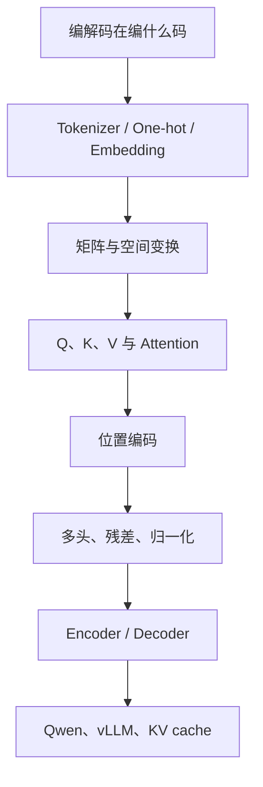
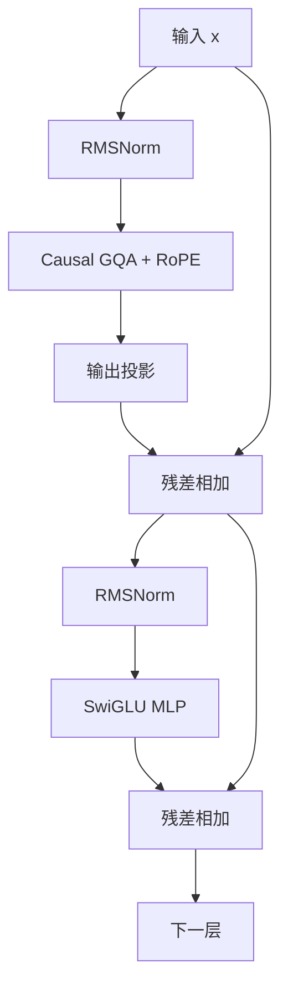
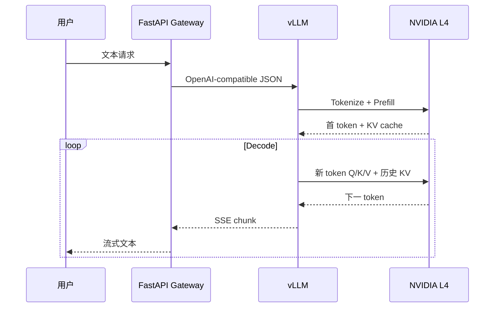

# 王木头 Transformer 视频：高中数学起步的完整原理教程

> **请优先打开[完整渲染阅读版](02-llm-inference-03-wangmutou-transformer-video-guide.html)。**
>
> 当前文件是 Markdown 源文件。如果使用的编辑器没有启用数学公式和
> Mermaid 预览，就会直接显示数学标记、反斜杠和图表代码；这不是最终阅读
> 效果。
>
> 对应视频：[《从编解码和词嵌入开始，一步一步理解 Transformer》](https://www.youtube.com/watch?v=GGLr-TtKguA)（王木头学科学，约 1 小时 45 分）。
>
> 这不是逐字稿，而是按视频论证路线重写的完整中文教材：覆盖编解码、语义空间、One-hot、Embedding、矩阵变换、Q/K/V、Attention、位置编码、多头、残差和归一化；补齐口头讲解略过的数学步骤，并结合本仓库的 `Qwen3-8B-AWQ + vLLM + NVIDIA L4` 说明工程意义。

## 0. 阅读方法和路线

| 标记 | 需要的知识 | 中文补课 |
|---|---|---|
| `[高中]` | 代数、指数、三角函数、求和 | 本文逐步展开 |
| `[大学·线代]` | 向量、矩阵、基、秩 | [线性代数](https://zh.d2l.ai/chapter_preliminaries/linear-algebra.html) |
| `[大学·微积分]` | 导数、偏导、链式法则 | [微积分](https://zh.d2l.ai/chapter_preliminaries/calculus.html) |
| `[大学·概率]` | 期望、方差、概率分布 | [概率](https://zh.d2l.ai/chapter_preliminaries/probability.html) |

第一次读直觉和手算；第二次拿纸重算；第三次映射到项目。



## 1. “编码”和“解码”在编什么码

机器翻译的根本困难不是把 `pear` 的字母换成“梨”，而是两种语言表面符号不同，但表达的对象和关系可以相同。人能指着梨建立对应；机器只有文本，只能从大量上下文学习语义关系。

可以把“码”理解成内部连续向量：

```text
英文符号 ──编码──┐
                 ├── 可计算的语义表示 ──解码── 另一种符号
中文符号 ──编码──┘
```

这是好直觉，但模型不会保证学出人类可逐维命名的“纯语义语言”；它学的是对训练目标有用的分布式表示。同一 token 的初始 embedding 固定，经过 Transformer 后的 hidden state 随上下文改变。

| 架构 | 可见上下文 | 训练目标 | 常见强项 |
|---|---|---|---|
| Encoder-only | 完整左右文 | 遮词恢复、分类 | 理解、分类、检索；如 BERT |
| Encoder–Decoder | Encoder 看完整输入；Decoder 看输入和已生成输出 | 序列到序列 | 翻译、摘要；如原始 Transformer、T5 |
| Decoder-only | 自己和左侧历史 | 下一 token | 开放生成；GPT、Qwen |

这只是任务偏好，不是绝对能力边界。当前项目的 Qwen 是 decoder-only。

## 2. Tokenizer、One-hot、Embedding

### 2.1 Token ID 不是语义坐标

设词表 `0:苹果, 1:香蕉, 2:梨, 3:猴子`。Tokenizer 把“香蕉”变成 1，但 `|3-1|=2` 不表示猴子与香蕉的语义距离为 2。

One-hot：

$$
e_{苹果}=[1,0,0,0],\quad
e_{香蕉}=[0,1,0,0],\quad
e_{梨}=[0,0,1,0],\quad
e_{猴子}=[0,0,0,1].
$$

任意两个不同 one-hot 的欧氏距离都相同。例如：

$$
\|e_{苹果}-e_{香蕉}\|_2
=\sqrt{(1-0)^2+(0-1)^2}
=\sqrt2.
$$

因此它表示身份，不直接表示语义距离。

### 2.2 Embedding lookup 就是矩阵乘法

设 $V=4,d=3$：

$$
E=
\begin{bmatrix}
0.8&0.6&0.1\\
0.9&0.7&0.2\\
0.75&0.55&0.15\\
0.7&0.8&0.4
\end{bmatrix}.
$$

“香蕉”的 one-hot 为 $[0,1,0,0]$：

$$
\begin{aligned}
e_{香蕉}E
&=[0,1,0,0]E\\
&=[0\times0.8+1\times0.9+0\times0.75+0\times0.7,\\
&\quad0\times0.6+1\times0.7+0\times0.55+0\times0.8,\\
&\quad0\times0.1+1\times0.2+0\times0.15+0\times0.4]\\
&=[0.9,0.7,0.2].
\end{aligned}
$$

只有一个系数是 1，结果必然是取 $E$ 的对应行；lookup 是这个乘法的高效实现。

### 2.3 语义怎样学出来 `[大学·微积分]`

$E$ 初始通常近似随机。模型预测下一 token，损失衡量错误，反向传播计算每个参数对损失的影响：

$$
w_{new}=w_{old}-\eta\frac{\partial L}{\partial w}.
$$

导数为正表示增大 $w$ 会增大损失，所以更新减小它；导数为负则相反。相似上下文反复提供梯度，逐渐形成有用几何结构，不是人手工写入“水果维”。

## 3. 矩阵乘法为什么是空间变换

设二维行向量 $x=[a,b]$，乘 $2\times3$ 矩阵：

$$
W=
\begin{bmatrix}
w_{11}&w_{12}&w_{13}\\
w_{21}&w_{22}&w_{23}
\end{bmatrix}.
$$

逐列展开：

$$
y=xW=[aw_{11}+bw_{21},\ aw_{12}+bw_{22},\ aw_{13}+bw_{23}].
$$

若 $W$ 两行是三维向量 $r_1,r_2$：

$$y=ar_1+br_2.$$

$a,b$ 是组合系数，矩阵的行给出新空间方向；二维坐标映射为三维坐标。

### 3.1 线性证明 `[大学·线代]`

令 $T(x)=xW$：

$$
T(u+v)=(u+v)W=uW+vW=T(u)+T(v),
$$

$$
T(cu)=(cu)W=c(uW)=cT(u).
$$

直线 $x(t)=u+t(v-u)$ 经过变换：

$$
T(x(t))=T(u)+t(T(v)-T(u)),
$$

仍是一次式，因此纯线性变换不能把直线弯成曲线。

视频中“一一对应”需要限定。比如：

$$
W=\begin{bmatrix}1&0\\0&0\end{bmatrix}
$$

把所有 $[a,b]$ 映射为 $[a,0]$，不同的 $b$ 丢失。是否可逆取决于秩与维度。

线性层常写 $y=xW+b$；$+b$ 是平移，严格叫仿射变换。若两层之间无激活：

$$
(xW_1+b_1)W_2+b_2=x(W_1W_2)+(b_1W_2+b_2),
$$

仍等价于一层，所以需要 ReLU、SiLU 等非线性。

## 4. 为什么静态 Embedding 不够

“苹果公司”的“苹果”不是水果，但 lookup 总给相同基础向量。模型需要让每个 token 读上下文：

$$
y_i=\sum_{j=1}^{T}\alpha_{ij}v_j,
\quad \alpha_{ij}\ge0,
\quad \sum_j\alpha_{ij}=1.
$$

真正问题是权重 $\alpha_{ij}$ 如何由当前内容自动算出。

## 5. Q、K、V 为什么这样设计

令：

$$
X=
\begin{bmatrix}
x_1\\x_2\\\vdots\\x_T
\end{bmatrix}
\in\mathbb R^{T\times d_{model}},
$$

$$Q=XW_Q,\quad K=XW_K,\quad V=XW_V.$$

- Query：当前 token 想找什么；
- Key：各 token 用什么特征接受匹配；
- Value：匹配后实际传什么。

若强制 $W_Q=W_K$：

$$S=XW_QW_Q^TX^T$$

天然对称，$S_{ij}=S_{ji}$。但“代词寻找先行词”和“名词被代词寻找”有方向。独立矩阵：

$$S=XW_QW_K^TX^T$$

能表达非对称关系。V 再将“检索特征”与“传递内容”分开，如 Query 是问题、Key 是索引、Value 是正文。

## 6. Attention 公式逐项推导

$$
\boxed{
\mathrm{Attention}(Q,K,V)
=\mathrm{softmax}\left(\frac{QK^T}{\sqrt{d_k}}+M\right)V
}
$$

### 6.1 $QK^T$ 是两两关系表

若 $Q,K\in\mathbb R^{T\times d_k}$：

$$
(QK^T)_{ij}=\sum_{r=1}^{d_k}Q_{ir}K_{jr}=q_i\cdot k_j.
$$

点积：

$$q\cdot k=\|q\|\|k\|\cos\theta.$$

方向越接近，$\cos\theta$ 越接近 1；点积还受向量长度影响，训练、归一化和缩放一起控制它。

### 6.2 为什么除以 $\sqrt{d_k}$ `[大学·概率]`

假设 $q_r,k_r$ 独立、均值 0、方差 1：

$$S=q\cdot k=\sum_{r=1}^{d_k}q_rk_r.$$

每项期望为 0、方差近似 1。独立和的方差相加：

$$\mathrm{Var}(S)\approx d_k,$$

所以：

$$\mathrm{Std}(S)\approx\sqrt{d_k}.$$

缩放后：

$$
\mathrm{Var}\left(\frac{S}{\sqrt{d_k}}\right)
=\frac{\mathrm{Var}(S)}{d_k}\approx1.
$$

不缩放时维度越大，softmax 越容易饱和到近似 0/1，梯度会变小。

### 6.3 Softmax

$$
\mathrm{softmax}(z_i)=\frac{e^{z_i}}{\sum_j e^{z_j}}.
$$

指数恒正，所以权重非负；分子和等于分母，所以权重和为 1。例 $z=[1,2]$：

$$
e^1\approx2.718,\quad e^2\approx7.389,
$$

$$
\alpha\approx[2.718/10.107,7.389/10.107]=[0.269,0.731].
$$

数值实现先减最大值：

$$\mathrm{softmax}(z)=\mathrm{softmax}(z-\max z),$$

因为分子分母同乘 $e^{-\max z}$，比例不变但避免溢出。

### 6.4 Causal mask

先不用公式。假设一句话有 4 个 token，行表示“当前正在计算哪个 token”，列表示“它想查看哪个 token”：

| 当前 token | 可以查看的位置 | 不可以查看的位置 |
|---|---|---|
| 第 1 个 | 第 1 个 | 第 2、3、4 个 |
| 第 2 个 | 第 1、2 个 | 第 3、4 个 |
| 第 3 个 | 第 1、2、3 个 | 第 4 个 |
| 第 4 个 | 第 1、2、3、4 个 | 无 |

把这套规则写成一个遮罩矩阵就是：

```text
                   被查看的 token
                 1      2      3      4
当前 token 1     0     -∞     -∞     -∞
当前 token 2     0      0     -∞     -∞
当前 token 3     0      0      0     -∞
当前 token 4     0      0      0      0
```

- `0` 表示允许查看：原来的 Attention 分数加 0，保持不变。
- `-∞` 表示禁止查看：当前 token 不能偷看未来 token。

例如，第 2 个 token 原来的四个 Attention 分数是：

```text
[1.2, 0.8, 2.1, 1.5]
```

加上第 2 行的遮罩：

```text
[1.2, 0.8, 2.1, 1.5]
+ [  0,   0,  -∞,  -∞]
= [1.2, 0.8,  -∞,  -∞]
```

随后再做 Softmax。因为 `exp(-∞) = 0`，第 3、4 个位置的权重都会变成 0；第 2 个 token 最终只能利用自己和第 1 个 token 的信息。

一般规则用普通文字表达就是：

> 当前是第 `i` 个 token 时，只允许查看编号 `j ≤ i` 的位置；凡是 `j > i` 的未来位置，都用 `-∞` 遮住。

遮罩必须在 Softmax **之前**加入。这样未来位置先变成 0 权重，剩余合法位置的权重再自动归一化为总和 1。

### 6.5 乘 V

令 $A=\mathrm{softmax}(\cdots)$：

$$Y=AV,\qquad y_i=\sum_jA_{ij}v_j.$$

每行输出是全部 Value 的动态加权和。

## 7. 三个 token 完整手算

取 $Q=K=V=X,d_k=2$：

$$
X=\begin{bmatrix}
1&0\\0&1\\1&1
\end{bmatrix}.
$$

点积：

$$
QK^T=
\begin{bmatrix}
1\times1+0\times0&1\times0+0\times1&1\times1+0\times1\\
0\times1+1\times0&0\times0+1\times1&0\times1+1\times1\\
1\times1+1\times0&1\times0+1\times1&1\times1+1\times1
\end{bmatrix}
=
\begin{bmatrix}1&0&1\\0&1&1\\1&1&2\end{bmatrix}.
$$

第二位置只看前两个：

$$[0/\sqrt2,1/\sqrt2,-\infty]\approx[0,0.707,-\infty].$$

因 $e^0=1,e^{0.707}\approx2.028$：

$$
A_2\approx
\left[\frac1{3.028},\frac{2.028}{3.028},0\right]
=[0.330,0.670,0].
$$

于是：

$$
y_2=0.330[1,0]+0.670[0,1]+0[1,1]=[0.330,0.670].
$$

输出已混入上下文。

## 8. Attention 和 CNN 到底什么关系

一维卷积：

$$y_i=w_{-1}x_{i-1}+w_0x_i+w_1x_{i+1}.$$

卷积核训练后固定、通常局部、在位置间共享。Self-Attention：

$$y_i=\sum_j\alpha_{ij}(X)v_j,$$

权重由当前输入动态生成，一层可看全局。准确表述：

> Self-Attention 是内容自适应、全局、动态权重的聚合算子；它和 CNN 都做加权汇聚，但不是严格相同的架构。

| 对比 | 普通卷积 | Self-Attention |
|---|---|---|
| 权重 | 固定核 | 当前 $QK^T$ 动态生成 |
| 感受野 | 通常局部 | 一层可看全序列 |
| 位置 | 核偏移天然含位置 | 需位置编码/偏置 |
| 复杂度 | 固定核宽约 $O(T)$ | Full attention 约 $O(T^2)$ |

视频标题“本质是 CNN”应理解为统一加权聚合视角，不是严格等号。

## 9. 位置编码为什么“怪”

无位置编码时，自注意力对排列等变，没有天然先后方向。原始 Transformer：

$$
PE(pos,2i)=\sin\left(\frac{pos}{10000^{2i/d_{model}}}\right),
$$

$$
PE(pos,2i+1)=\cos\left(\frac{pos}{10000^{2i/d_{model}}}\right).
$$

令 $\omega_i=10000^{-2i/d_{model}}$，相邻两维为：

$$p(pos)=[\sin(pos\omega_i),\cos(pos\omega_i)].$$

不同维度用不同频率，组合成位置的多尺度指纹。

### 相对位置证明 `[高中三角函数]`

令 $a=pos\cdot\omega$，偏移 $k$：

$$
\sin(a+k\omega)=\sin a\cos(k\omega)+\cos a\sin(k\omega),
$$

$$
\cos(a+k\omega)=\cos a\cos(k\omega)-\sin a\sin(k\omega).
$$

写成矩阵：

$$
\begin{bmatrix}
\sin((pos+k)\omega)\\
\cos((pos+k)\omega)
\end{bmatrix}
=
\begin{bmatrix}
\cos(k\omega)&\sin(k\omega)\\
-\sin(k\omega)&\cos(k\omega)
\end{bmatrix}
\begin{bmatrix}
\sin(pos\omega)\\
\cos(pos\omega)
\end{bmatrix}.
$$

右侧变换只依赖相对距离 $k$。这证明看似绝对的位置编码允许相对位移被线性读取。参见 [TensorFlow 官方中文 Transformer 教程](https://www.tensorflow.org/tutorials/text/transformer?hl=zh-cn)。

### Qwen 使用 RoPE

二维旋转矩阵：

$$
R(\theta)=
\begin{bmatrix}
\cos\theta&-\sin\theta\\
\sin\theta&\cos\theta
\end{bmatrix}.
$$

位置 $m,n$ 的 Q/K 点积：

$$
(R(m\theta)q)^T(R(n\theta)k)
=q^TR(m\theta)^TR(n\theta)k
=q^TR((n-m)\theta)k.
$$

结果只依赖 $n-m$，相对位置直接进入注意力分数。

## 10. Multi-Head 和 Qwen 的 GQA

$$
head_r=\mathrm{Attention}(XW_Q^{(r)},XW_K^{(r)},XW_V^{(r)}),
$$

$$
Y=\mathrm{Concat}(head_1,\ldots,head_h)W_O.
$$

若 $d_{model}=4096,h=32$，每头 $d_{head}=128$。多头允许不同子空间学习不同关系，但不能断言某个头固定是“语法头”。

当前 Qwen 有 32 个 Query heads、8 个 KV heads，每 4 个 Query heads 共享一组 K/V。这是 GQA：保留多个查询视角，并把 KV cache 相对 32 个 KV heads 缩小约 4 倍。

## 11. 完整 Qwen Block



残差 `[大学·微积分]`：

$$y=x+F(x),\qquad
\frac{\partial y}{\partial x}=I+\frac{\partial F}{\partial x}.$$

即使 $F$ 的导数小，仍有恒等路径传梯度和原信息。

RMSNorm：

$$
\mathrm{RMS}(x)=\sqrt{\frac1d\sum_i x_i^2+\epsilon},
$$

$$
\mathrm{RMSNorm}(x)_i=g_i\frac{x_i}{\mathrm{RMS}(x)}.
$$

$\epsilon$ 防止除零，$g_i$ 可学习。视频讲原始 Transformer 的 LayerNorm；Qwen 实际用 RMSNorm。

SwiGLU：

$$
\mathrm{SwiGLU}(x)
=W_{down}\left(\mathrm{SiLU}(xW_{gate})\odot(xW_{up})\right),
$$

$$
\mathrm{SiLU}(z)=z\sigma(z),\qquad \sigma(z)=\frac1{1+e^{-z}}.
$$

Attention 在 token 间搬运信息；MLP 对每个位置非线性加工。Transformer 不等于只有 Attention。

## 12. Encoder、Decoder 与训练

Encoder–Decoder 的 Cross-Attention：

$$
Q=X_{decoder}W_Q,\quad
K=X_{encoder}W_K,\quad
V=X_{encoder}W_V.
$$

它让输出位置动态对齐输入，处理输入输出长度不同。

Decoder-only 训练错开输入与标签：

```text
输入: [BOS, 我,   喜欢, 猫]
标签: [我,  喜欢, 猫,   EOS]
```

Causal mask 阻止偷看未来，所以训练一次 forward 能并行算所有位置；推理的下一 token 依赖刚生成的 token，必须顺序 decode。

LM head：

$$z=hW_{vocab},\quad p=\mathrm{softmax}(z).$$

正确 token 为 $y$：

$$L=-\log p_y=-z_y+\log\left(\sum_j e^{z_j}\right).$$

求导：

$$
\frac{\partial L}{\partial z_k}=p_k-\mathbf1[k=y].
$$

正确类梯度 $p_y-1<0$，梯度下降增大正确 logit；错误类梯度 $p_k>0$，减小错误 logit。梯度再沿链式法则传回 Embedding、Q/K/V 和全部层。

## 13. 落到本项目：vLLM 与 L4



Prefill 并行处理 prompt、建立 36 层 KV，主要影响 TTFT。Decode 每步只新增一 token 的 Q/K/V，复用历史 K/V；它避免重复投影历史，但新 Q 仍查询全部历史。

当前模型每 token KV：

$$
\begin{aligned}
\text{bytes/token}
&=36\times8\times128\times2\;(K,V)\times2\;\text{bytes}\\
&=147456\text{ bytes}=144\text{ KiB}.
\end{aligned}
$$

8192 tokens：

$$
8192\times144\text{ KiB}
=1,179,648\text{ KiB}
=1152\text{ MiB}
=1.125\text{ GiB}.
$$

8 条满长序列约 9 GiB KV。AWQ 权重约 6.1 GB，不表示 24 GB L4 的其余空间全可用；还需 activation、CUDA graph、workspace、runtime。

vLLM continuous batching 动态批处理不同请求当前轮的新 token，提高总吞吐；更多用户仍竞争计算和带宽，所以 `maxNumSeqs=8` 不等于 8 个用户同样快。

Full attention 关系数为 $T^2$。长度翻倍：

$$\frac{(2T)^2}{T^2}=4.$$

Prefill 朴素工作量约四倍。Decode 每步不是完整 $T^2$，但仍读取 $T$ 个历史 K/V。FlashAttention 改善显存读写，不会把 full attention 全部数学工作变成线性。

## 14. 视频观点的准确边界

| 视频直觉 | 精确版本 |
|---|---|
| 编解码寻找纯语义“码” | 有用直觉；hidden space 为训练目标优化，不保证逐维可解释 |
| One-hot 降维成 Embedding | 计算成立；核心还在于学习稠密表示 |
| 矩阵是空间变换 | 对；不一定可逆或一一对应，取决于秩 |
| Q/K 计算词间关系 | 对；独立投影还表达角色和方向 |
| Attention 本质是 CNN | 都是加权聚合；动态全局核和固定局部核不严格相等 |
| 正弦编码表达相对位置 | 对；和角公式给出证明 |
| 多头关注不同关系 | 是设计动机；每个头的具体语义不是硬编码 |
| 训练不需要人工标签 | 预训练可自动构造标签；指令微调和偏好对齐仍可能需人工或合成数据 |

## 15. 必须能手写的公式链

$$
\begin{aligned}
&\text{token IDs}\xrightarrow{lookup}X\\
&Q=XW_Q,\quad K=XW_K,\quad V=XW_V\\
&S=QK^T/\sqrt{d_k}+M\\
&A=\mathrm{softmax}(S),\quad Y=AV\\
&\mathrm{MHA}(X)=\mathrm{Concat}(head_1,\ldots,head_h)W_O\\
&x'=x+\mathrm{Attention}(\mathrm{Norm}(x))\\
&x''=x'+\mathrm{MLP}(\mathrm{Norm}(x'))\\
&z=x''W_{vocab},\quad p=\mathrm{softmax}(z),\quad L=-\log p_y.
\end{aligned}
$$

每行都能说清输入形状、输出形状和存在理由，才算真正懂。

## 16. 自测题

1. Token ID 为什么不能当语义距离？
2. One-hot 乘 $E$ 为什么等于查表？
3. 两层纯线性网络为什么仍等于一层？
4. 为什么 $W_Q,W_K$ 分开更有表达力？
5. $QK^T$ 的 $(i,j)$ 项是什么？
6. 为什么除以 $\sqrt{d_k}$？
7. Mask 为什么放 softmax 前？
8. 为什么 sin/cos 能表达相对距离？
9. Attention 为什么像 CNN，又为什么不是 CNN？
10. KV cache 缓存什么，为什么不缓存 Q？
11. AWQ 为什么没有自动把 KV 变成 4-bit？
12. 为什么并发可提高 aggregate tokens/s，却恶化单用户 TPOT？

## 17. 中文补课与项目阅读

| 卡点 | 中文材料 | 回来前掌握到什么程度 |
|---|---|---|
| 向量、矩阵 | [线性代数](https://zh.d2l.ai/chapter_preliminaries/linear-algebra.html) | 矩阵乘法、转置、点积 |
| 导数、链式法则 | [微积分](https://zh.d2l.ai/chapter_preliminaries/calculus.html) | 理解梯度方向 |
| 反向传播 | [自动微分](https://zh.d2l.ai/chapter_preliminaries/autograd.html) | 解释 loss 如何更新参数 |
| Softmax、交叉熵 | [Softmax 回归](https://zh.d2l.ai/chapter_linear-networks/softmax-regression.html) | 从 logits 算概率和 loss |
| Q/K/V 直觉 | [注意力机制](https://zh.d2l.ai/chapter_attention-mechanisms/index.html) | 理解查询框架 |
| Transformer 代码 | [TensorFlow 官方中文教程](https://www.tensorflow.org/tutorials/text/transformer?hl=zh-cn) | 找出位置编码、MHA、Encoder/Decoder |
| 长上下文 | [Hugging Face 中文文档](https://huggingface.co/docs/transformers/v4.53.1/zh/attention) | 区分 full/local/sparse |
| 原始依据 | [Attention Is All You Need](https://arxiv.org/abs/1706.03762) | 先读图 1、公式 1、位置编码 |

本仓库继续读：

- [`01-ai-learning-02-transformer-from-first-principles.md`](01-ai-learning-02-transformer-from-first-principles.md)：Qwen block、训练、量化、多 GPU。
- [`02-llm-inference-01-transformer-inference-fundamentals.md`](02-llm-inference-01-transformer-inference-fundamentals.md)：prefill、decode、KV cache、并发。
- [`02-llm-inference-02-vllm-memory-guide.md`](02-llm-inference-02-vllm-memory-guide.md)：24 GB L4 显存预算。
- [`04-operations-04-benchmarking.md`](04-operations-04-benchmarking.md)：TTFT、TPOT、tokens/s。
- [`03-project-engineering-02-architecture.md`](03-project-engineering-02-architecture.md)：Gateway、vLLM、GKE、GPU 的边界。

## 18. 五分钟验收

不看文档讲清：

1. 文本经 tokenizer 成 IDs，再经 Embedding 成向量。
2. 每层用 Q/K 匹配、聚合 V；mask 防偷看，RoPE 加相对位置。
3. 32 Query heads、8 KV heads 构成 GQA；残差、RMSNorm、SwiGLU 构成 Qwen block。
4. LM head 和 softmax 给下一 token 分布，采样后重复。
5. vLLM 在 prefill 建 KV，decode 复用，continuous batching 调度请求。
6. 每 token 约 144 KiB KV，8192 token 约 1.125 GiB，模型权重只是显存的一部分。

能讲清这六步并手算第 7 节，就从“看懂视频”升级成“能解释、能计算、能映射到自己的系统”。
