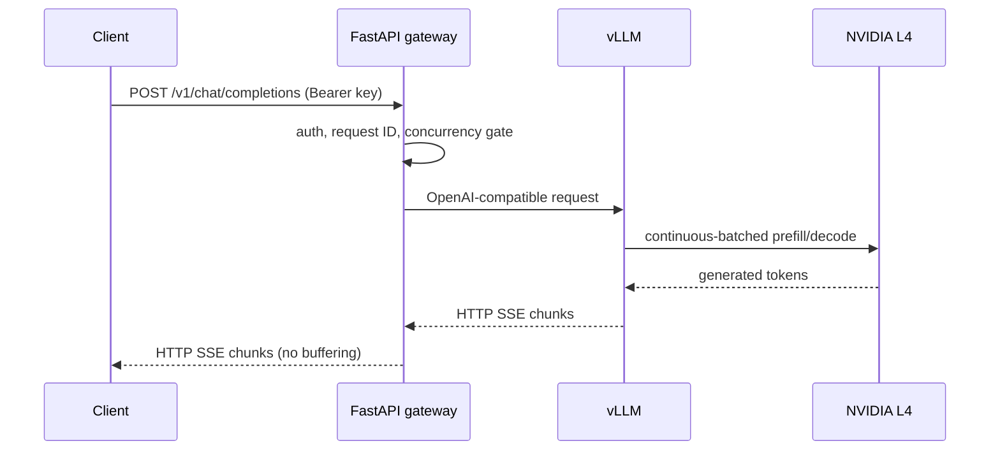

# 架构与工程设计依据 / Architecture and engineering rationale

## 目标与非目标 / Goal and non-goals

目标是构建可复现、可观测、成本受控的单模型实时推理平台；第一阶段不宣称高可用、完整多租户隔离、分布式训练或零秒冷启动。

The goal is a reproducible, observable and cost-bounded real-time inference
platform for one open-weight model. It demonstrates the operating concerns
behind a shared GenAI platform without pretending that one L4 is a hyperscale
fleet.

Phase 1 serves one quantised 8B LLM. It does not claim high availability, full
multi-tenant isolation, distributed training or zero-second scale-from-zero.
Those require more GPUs and a materially larger budget.

## 数据平面 / Data plane

请求经 FastAPI 网关完成身份验证、请求 ID 和并发控制，再由 vLLM 在 NVIDIA L4 上生成 Token，并通过 HTTP SSE 流式返回。

Streaming is ordinary HTTP with `text/event-stream`. WebSocket is not required.
The connection remains open while the server sends SSE events and closes after
`[DONE]`.

### API 网关职责 / API gateway responsibilities

网关负责稳定 API 契约、身份验证、并发上限、日志、指标和过载响应，但不执行模型推理。

- Stable OpenAI-compatible endpoint independent of the serving engine.
- API-key authentication and a bounded concurrency queue.
- Request IDs, structured logs, latency/error metrics and overload response.
- A future home for per-tenant quotas, routing, guardrails and cost attribution.

The gateway intentionally does not perform model inference. vLLM is reachable
only through a ClusterIP service and NetworkPolicy.

### vLLM 职责 / vLLM responsibilities

vLLM 负责加载模型、管理 GPU/KV Cache、连续批处理、OpenAI 兼容接口、指标和流式生成。

- Load the pinned Qwen checkpoint.
- Allocate and manage GPU/KV-cache memory.
- Apply continuous batching across concurrent requests.
- Provide OpenAI-compatible chat/completions and Prometheus metrics.
- Stream generated tokens.

vLLM is an inference engine, not a model. TensorRT-LLM and SGLang are alternative
engines that can be benchmarked against the same functional contract.

## 控制平面 / Control plane

Terraform 管云资源，Helm 管工作负载打包，Argo CD 管 Git 协调，Prometheus/Grafana 管指标与仪表盘；同一对象不能由两个协调器共同管理。

| Concern | Owner | Why |
|---|---|---|
| VPC, GKE, node pools, IAM, GCS, registry, budget | Terraform | Cloud-resource lifecycle and reviewable plans |
| Kubernetes deployments/configuration | Helm | Reusable workload packaging |
| Continuous reconciliation from Git | Argo CD | Drift correction and rollback to a Git revision |
| Model weights | Hugging Face revision + persistent cache | Explicit identity without rebuilding the serving image |
| Metrics/alerts | Prometheus rules | Workload-focused operational signals |
| Dashboards | Grafana | Correlates client latency, vLLM queues and GPU saturation |

Terraform must not manage the same Kubernetes workload as Argo CD. Two
reconcilers owning the same object create confusing drift and unsafe rollbacks.

## 计算资源布局 / Compute layout

### 系统节点池 / System pool

单个 e2-standard-2 节点运行网关、Argo CD 和小型监控栈；这是作品集配置，不是高可用生产配置。

One `e2-standard-2` node runs the gateway, Argo CD and a deliberately small
monitoring stack. This is not HA. A production platform would use a regional
cluster and at least three system nodes spread across zones.

### GPU 节点池 / GPU pool

单个 g2-standard-8 节点含一张 24 GB NVIDIA L4，使用 Spot、0..1 自动扩缩、污点、GKE 驱动和持久模型缓存。

One `g2-standard-8` node contains one NVIDIA L4 with 24 GB VRAM. The pool:

- uses Spot capacity;
- autoscale range `0..1`;
- is tainted so normal Pods cannot consume it;
- installs the NVIDIA driver through GKE;
- uses a persistent model cache to reduce repeated checkpoint downloads.

The vLLM Deployment defaults to zero replicas. Scaling it to one makes a GPU Pod
unschedulable, which causes the cluster autoscaler to request the L4 node.
Scaling it back to zero allows the node pool to return to zero.

## 模型与内存选择 / Model and memory choice

Qwen3-8B-AWQ 的 4-bit 权重约 6.1 GB，比 BF16 更能为 KV Cache 和并发留出显存；上下文 8192 和最大 8 序列只是安全起点。

`Qwen/Qwen3-8B-AWQ` is an official 4-bit AWQ checkpoint of roughly 6.1 GB. It
leaves substantially more of the 24 GB L4 for KV cache and concurrency than the
BF16 checkpoint, whose weights alone are roughly 16.4 GB.

The first deployment caps context at 8,192 tokens and concurrent sequences at
eight. These are safe starting limits, not assumed optima. Benchmark evidence
decides whether to change them.

## 扩缩容语义 / Scaling semantics

需要区分网关副本、单 GPU 并发请求和 GPU 副本三种扩缩容；缩容到零可节省费用，但会产生较长冷启动。

There are three different scaling questions:

1. **Gateway replicas** scale ordinary CPU request handling. An HPA is included
   but disabled for the one-node portfolio environment.
2. **Requests per GPU** are multiplexed by vLLM continuous batching. This usually
   improves aggregate throughput but can increase per-user latency at saturation.
3. **GPU replicas** increase fleet capacity. They do not automatically make one
   8B request generate twice as fast. Tensor parallelism across GPUs is mainly
   needed when a model does not fit one GPU; communication can make single-user
   decode slower rather than faster.

Scale-to-zero has a long cold start: provision node, pull image, attach cache,
load weights and compile kernels. A synchronous public service normally keeps a
minimum warm replica or routes to a fallback model/API. This portfolio chooses
cost over immediate availability and makes that trade-off explicit.

## 可靠性与 Spot 中断 / Reliability and Spot interruption

Spot VM 可能被快速回收，因此请求应无状态、可重试，并通过 readiness、回退路由和多可用区副本逐步增强可靠性。

The L4 Spot VM can disappear with short notice. The platform therefore treats
individual inference requests as retryable and stateless. Readiness prevents
traffic before model load. Termination grace gives current streams a chance to
finish, but Spot eviction can still terminate them.

A production design would add:

- at least two warm replicas across zones;
- Pod topology spread and disruption budgets;
- client retry with idempotency/request IDs;
- fallback routing to a smaller model or managed API;
- queue-aware GPU autoscaling with capacity reservations where required.

## 安全边界 / Security boundaries

使用私有节点、管理员 /32 CIDR、Workload Identity、专用服务账号、非 root 容器、Kubernetes Secret、ClusterIP 和 NetworkPolicy。

- Private GKE nodes; Cloud NAT supplies controlled outbound access.
- GKE API restricted to an explicit administrator `/32` CIDR.
- Workload Identity and a dedicated node service account.
- Gateway container runs non-root with a read-only root filesystem.
- API key lives in a Kubernetes Secret created outside Git.
- vLLM uses ClusterIP plus NetworkPolicy and is not publicly exposed.
- Public LoadBalancer is disabled; initial access uses `kubectl port-forward`.

For a public production API, add HTTPS load balancing, managed certificate,
Cloud Armor, Secret Manager CSI/External Secrets, tenant-specific credentials
and an audit-log retention policy.

## SLO 建议 / SLO proposal

先测量基线，再确定成功率、TTFT、端到端延迟、5xx 率和 GPU 利用率目标，不能在基线前编造性能成果。

SLOs are established after baseline measurement. Initial portfolio targets:

| SLI | Initial target | Notes |
|---|---:|---|
| Successful request rate while warm | >= 99% | Excludes deliberate scale-to-zero window |
| Warm p95 TTFT at concurrency 1 | Measured baseline + 20% | Never invent target before baseline |
| Warm p95 end-to-end latency | Measured per output length | Output length must be controlled |
| Gateway 5xx rate | < 1% over 15 minutes | 429 tracked separately as capacity signal |
| GPU utilisation under load | 60-95% | Low means waste; sustained 100% means queue risk |

## 向生产演进 / Production evolution

先完成 AWQ 基线，再按证据比较 BF16/TensorRT-LLM，随后才考虑 VLM、批量评估和 LoRA 工作流。

1. Run correctness and performance baseline on AWQ.
2. Compare BF16 on L4 only if memory/concurrency permits.
3. Compare vLLM with TensorRT-LLM using identical prompts, model revision and
   concurrency; retain the simpler engine unless measured benefit is material.
4. Add a VLM such as Qwen3-VL as a separate deployment and route by model name.
5. Add batch evaluation and optional LoRA workflow after a real task/evaluation
   dataset exists.

