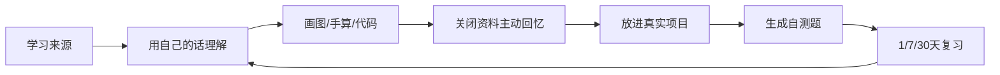

# 学习保持与个人技术知识库管理

本文解决两个问题：为什么曾经理解的Transformer后来想不起来，以及怎样用Markdown、Git和主动回忆建立可持续的个人知识系统。

## 1. 忘记不等于当时没有理解

学习至少有三个不同能力：

| 能力 | 问题 | 你的描述提供的线索 |
|---|---|---|
| 理解/编码 | 当时能否形成正确模型？ | 你能跟随多个课程、理解代码和训练结果，说明不是完全没理解。 |
| 保持/提取 | 过一段时间能否主动想起？ | 长期不用且没有复习，提取变弱。 |
| 迁移/应用 | 新问题中能否重新使用？ | 现在做vLLM项目时开始重新连接KV、context和GPU，正在发生迁移。 |

你的情况更像：

```text
兴趣驱动和理解速度不错
+ 能跟着实现形成一轮完整认知
- 学完后没有主动回忆和间隔复习
- 当时知识没有和长期项目/问题反复连接
= 一段时间后感觉“几乎全忘了”
```

这不是对智力或学习能力的诊断。仅凭聊天不能准确测量学习能力，但“曾经能理解并手写实现”至少说明你有建立复杂心智模型的能力。

## 2. 为什么看懂了仍然会忘

### 2.1 识别不等于提取

看视频时老师给出了顺序、图和提示，你做的是recognition：看到以后觉得合理。

面试或工作需要recall：没有提示时自己从token推导到Q/K/V和KV cache。这是另一项技能，必须单独训练。

### 2.2 熟悉感错觉

反复看同一解释会越来越流畅，容易误判为“已经会了”。有效检查是关闭资料后：

- 画图；
- 手算；
- 解释为什么；
- 修改代码；
- 排查一个错误。

### 2.3 不使用导致检索路径变弱

大脑不需要长期保留所有暂时不用的细节。长期不用后，知识可能不是完全消失，而是提取线索不足。第二次学习通常会比第一次快，这叫relearning savings，可以作为“潜在知识还在”的证据。

### 2.4 文档也可能制造新问题

记录文档是好事，但如果流程变成：

```text
让AI生成很长文档 → 保存 → 从不主动回忆
```

文档只会从“视频收藏夹”变成“Markdown收藏夹”。知识库解决外部检索，不能替代脑内提取训练。

## 3. 更适合你的学习闭环



每个主题至少留下四种输出：

1. **一句话模型**：它解决什么问题；
2. **一张图**：数据怎样流动；
3. **一个最小例子**：手算或代码；
4. **五个闭卷问题**：以后用于提取。

## 4. 怎样判断自己是真的会了

采用下面证据，而不是学习时长：

| 证据 | Transformer例子 |
|---|---|
| Explain | 不看资料解释Q/K/V。 |
| Derive | 从层数、KV heads、head dim推导KV bytes/token。 |
| Trace | 写出X/Q/K/V/logits所有shape。 |
| Build | 写一个最小causal attention block。 |
| Debug | 发现mask方向、shape或OOM问题。 |
| Transfer | 把原理用于vLLM并发、显存和autoscaling。 |

如果第二次用两小时能恢复第一次一个月的大部分结构，说明第一次并非白学，而是缺乏长期提取。

## 5. 个人文档的推荐原则

### 单一源文件

推荐：**普通Markdown文件 + Git仓库是source of truth。**

- GitBook、MkDocs或网站只是显示层；
- 不把唯一副本锁在某个在线编辑器；
- 图片和附件与Markdown一起版本化；
- 使用相对链接；
- 定期clone/backup验证可恢复。

GitBook官方说明，直接Markdown导出依赖GitHub/GitLab Sync，而且部分自定义block导出会变成HTML，这正是“平台不是唯一源文件”的理由。

### 项目知识与通用知识分开

```text
TradeBalanceLlm仓库/docs
→ 只放这个项目的架构、runbook、故障、benchmark、决策和学习材料

personal-knowledge-base仓库
→ 放跨项目可复用的Transformer、API、分布式系统、云和学习笔记

private-notes
→ 日记、账号、个人敏感信息；不要放公开GitHub
```

不要把同一篇文档复制到多个仓库。个人知识库写概念，项目仓库写该概念在项目中的具体选择，并用链接关联。

## 6. 推荐知识库目录

建议新建一个单独仓库，例如`personal-knowledge-base`：

```text
personal-knowledge-base/
├─ README.md                    # 总入口/学习地图
├─ 00-inbox/                    # 临时捕获，定期清理
├─ 10-foundations/
│  ├─ math/
│  ├─ machine-learning/
│  ├─ transformers/
│  ├─ distributed-systems/
│  └─ operating-systems/
├─ 20-engineering/
│  ├─ api-design/
│  ├─ python/
│  ├─ kubernetes/
│  ├─ terraform/
│  ├─ observability/
│  └─ security/
├─ 30-guides/                   # 可执行how-to/runbook
├─ 40-projects/                 # 项目索引与复盘，不复制项目docs
├─ 50-career/
│  ├─ interviews/
│  ├─ system-design/
│  └─ role-research/
├─ 60-source-notes/             # 书/课/视频的原始摘记
├─ 70-reviews/                  # 周/月复习和知识缺口
├─ 90-archive/                  # 过期但不删除
├─ assets/                      # 图片、PDF附件；注意版权和体积
└─ templates/
```

数字前缀只是保持排序稳定，不需要建立十层目录。一个文件尽量只讲一个可链接概念。

## 7. 文档类型不要混在一起

| 类型 | 回答什么 | 例子 |
|---|---|---|
| Concept | 它是什么、为什么 | `kv-cache.md` |
| Tutorial | 跟着做一遍学会 | `build-mini-transformer.md` |
| How-to | 已经懂以后怎样操作 | `debug-gke-pending-pod.md` |
| Reference | 参数/命令准确查询 | `vllm-flags.md` |
| Decision/ADR | 为什么选A而不是B | `use-vllm-not-tensorrt.md` |
| Incident | 发生了什么和怎样恢复 | `vllm-servicelinks-incident.md` |
| Source note | 某视频/课程讲了什么 | `wangmutou-embedding-video.md` |
| Review | 我哪里不会、下一步是什么 | `2026-08-transformer-review.md` |

一篇文档同时混合教程、命令、个人日记和参考表，会越来越难维护。

## 8. 每篇技术概念模板

```markdown
---
title: KV Cache
type: concept
status: verified
tags: [transformer, inference, gpu]
created: 2026-08-16
updated: 2026-08-16
sources:
  - https://...
---

# KV Cache

## 一句话
保存历史token每层的K/V，避免decode反复计算历史投影。

## 它解决什么问题

## 最小图

## 公式与维度

## 手算/代码例子

## 在我的项目里

## 常见误区和失败模式

## 与其他概念的连接
- [Prefill](02-llm-inference-01-transformer-inference-fundamentals.md#5-prefill和decode)
- [GQA](01-ai-learning-02-transformer-from-first-principles.md#11-mhamqa和gqa多头多查询与分组查询注意力)

## 闭卷自测
1. ...

## 来源与验证日期
```

`status`推荐只用：`draft`、`verified`、`stale`。AI生成后先标记draft，自己验证和完成闭卷解释后再改verified。

## 9. Map of Content比深目录更重要

每个大主题建立入口页：

```text
transformers/README.md
  1. tokenization
  2. embedding
  3. attention
  4. decoder block
  5. training
  6. inference
  7. serving
```

入口页表达学习顺序和依赖关系。文件夹只负责存放；README/MOC负责导航。

## 10. AI怎样参与而不让知识变成AI的

适合让AI做：

- 把你口述的理解整理成结构；
- 检查遗漏和公式维度；
- 生成反例和自测题；
- 根据错误答案追问；
- 对比两个版本并提示过期内容；
- 把项目故障整理成incident格式。

不应该完全交给AI：

- 替你决定“我是否真的理解”；
- 无来源生成大量事实并标verified；
- 只生成总结而不让你闭卷复述；
- 自动发布含secret、个人数据或版权材料的内容。

推荐流程：

```text
你先闭卷写/说5分钟
→ AI整理并指出缺口
→ 你查一手来源
→ AI出题
→ 你闭卷回答
→ 标记verified
```

## 11. GitBook、GitHub和MkDocs怎样选

### 推荐组合

```text
编辑/存储：本地Markdown + Git
版本/备份：GitHub private或public repository
本地阅读：VS Code/Codex或任意Markdown编辑器
可选网站：Material for MkDocs
可选托管：GitHub Pages
```

Material for MkDocs直接从Markdown建立带导航和搜索的静态网站，并明确强调保留完整source/output控制；可通过GitHub Actions发布到GitHub Pages。

### GitBook怎样处理

如果旧GitBook中仍有内容：

1. 新建空GitHub private repo；
2. 使用GitBook Git Sync把内容同步出来；
3. 检查custom blocks导出成HTML的问题；
4. 检查图片、相对链接和`SUMMARY.md`；
5. 本地clone并确认所有页面可以读取；
6. 再决定是否继续把GitBook当展示层；
7. 在验证Git仓库和备份前，不删除GitBook内容。

GitBook官方说明不能直接在应用内逐页导出Markdown，建议通过Git Sync导出；这也是迁移时必须先验证的风险。

### 是否立刻搭网站

不用。先把目录、链接、模板和复习流程稳定下来。网站是展示层；过早调主题、颜色和插件会变成另一种拖延。

## 12. 公开、私有和安全边界

| 内容 | 建议 |
|---|---|
| 项目公开文档、学习文章 | public GitHub可以。 |
| 面试准备、未公开求职信息 | private repo。 |
| 公司内部资料、客户数据 | 不进入个人仓库。 |
| API key、密码、tfstate | 永不进入Markdown/Git。 |
| 个人日记、健康/财务 | 本地加密或专门私有系统。 |
| 课程原文、整段字幕、付费PDF | 不公开复制；写自己的总结并链接来源。 |

## 13. 每周维护流程

每周30–45分钟：

```text
1. 清理00-inbox
2. 合并重复文档
3. 给新文档补来源和status
4. 修复断链
5. 从verified文档抽5个闭卷问题
6. 把stale内容加入复核队列
7. 提交一个清楚的Git commit
```

每月检查：哪些文档实际被项目/面试使用；从未使用且无独特价值的内容可以归档，而不是无限扩张。

## 14. 现在已有很多Markdown怎样整理

不要一次手工全部重写：

1. 先只做文件清单；
2. 按“项目专属/通用知识/来源摘记/个人敏感”四类分流；
3. 保留原文件，用`git mv`移动，避免丢历史；
4. 为每类建立README入口；
5. 只优先整理未来30天会用的文档；
6. 重复内容选择一个canonical page，其他页面改成链接；
7. 最后再迁移GitBook和美化网站。

关键目标不是“所有笔记都排得漂亮”，而是30秒内能找到需要的知识，并能用闭卷题判断自己是否掌握。

## 15. 针对Transformer的实际安排

将深度教材[`01-ai-learning-02-transformer-from-first-principles.md`](01-ai-learning-02-transformer-from-first-principles.md)作为canonical page，现有短版作为面试速查。不要把每个YouTube视频都变成一份互相重复的Transformer总结。

推荐建立来源笔记：

```text
60-source-notes/wangmutou-embedding.md
```

只记录该视频独特的讲解、时间戳和你当时的疑问；通用结论回链到canonical Transformer文档。

## 参考资料

- GitBook Git Sync：https://gitbook.com/docs/getting-started/git-sync
- GitBook内容迁移/导出限制：https://gitbook.com/docs/help-center/editing-content/managing-your-content
- Material for MkDocs：https://squidfunk.github.io/mkdocs-material/
- Material for MkDocs发布：https://squidfunk.github.io/mkdocs-material/publishing-your-site/
- GitHub Pages：https://docs.github.com/en/pages
