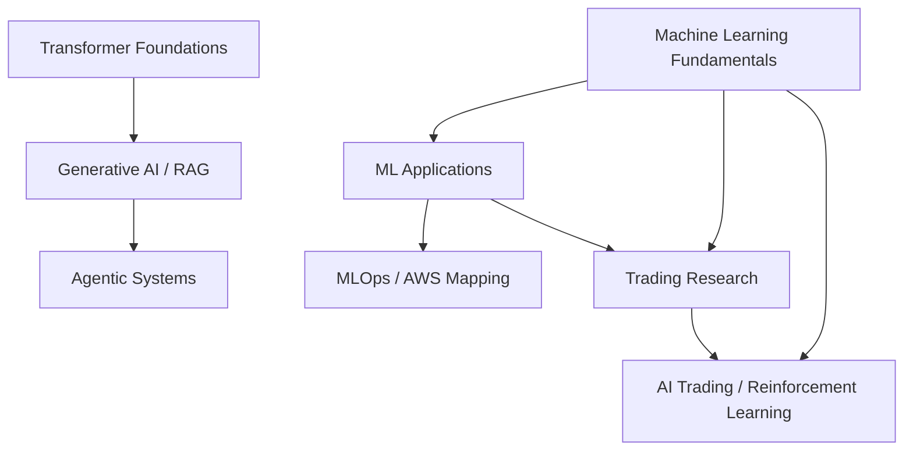

# GitBook内容地图与公开仓库隐私审计

审计对象：[luzhac/book](https://github.com/luzhac/book)

快照：commit `97ab23dbd0a4ff68712a635e045fbc62ccaeb3a7`（2026-08-16）。本次同时检查当前文件树、完整可见Git历史（9个commits）和4张GitBook图片资产。

## 1. 内容应该怎样分开

| GitBook目录 | 内容定位 | 整理去向 |
|---|---|---|
| 根目录旧页面 | 与`mlbasic/`大量重复的兼容导出 | 不作为新的canonical source |
| `mlbasic/` | ML范式、经典算法、神经网络和RL基础 | 并入独立的Machine Learning教材 |
| `ml-appl/` | ML应用领域和少量金融应用 | 并入Machine Learning教材的应用地图 |
| `mle-aws/` | AWS ML Engineering与MLOps | 在ML教材中提炼通用概念并保留AWS映射；扩写时可独立成册 |
| `trade/` | 加密市场策略、特征和预测研究 | 单独的Trading Research教材 |
| `ai-trading/` | RL trading、momentum、统计检验和策略资源 | 单独的AI Trading应用教材 |
| `gai/` | Generative AI、LLM、multimodal和RAG | [Generative AI and RAG from First Principles](01-ai-learning-03-generative-ai-and-rag-from-first-principles.md) |
| `agent/` | prompting、agentic workflow和multi-agent systems | [AI Agents from First Principles](01-ai-learning-04-ai-agents-from-first-principles.md) |

推荐的知识结构：

关键边界：

- Machine Learning教材不展开Q/K/V、RoPE、KV cache或LLM serving；
- Transformer教材不承载完整的传统ML算法、AWS部署或交易策略；
- RAG依赖embedding和Transformer知识，但它是应用系统，不等于Transformer原理；
- Agent依赖LLM、RAG和工具调用，但它也不等于语言模型训练；
- `gai/`和`agent/`现已分别整理为独立教材，不再只是待整理目录。

## 2. 公开仓库隐私与安全结论

结论：本次没有发现高置信度的密码、API key、access token、private key、数据库连接密码、`.env`文件或云账号凭证。仓库目前最实际的问题是作者身份信息和第三方课程素材，而不是密钥泄露。

| 风险 | 等级 | 发现 |
|---|---|---|
| 密钥或密码 | 未发现 | 当前树和完整Git历史均未命中高置信度secret模式 |
| 敏感配置文件 | 未发现 | 未发现`.env`、PEM/private key、credential或token文件 |
| Commit作者邮箱 | 中等隐私风险 | 全部commits的author metadata包含个人Gmail地址；Git历史公开时任何人都可查看 |
| GitHub身份与学习经历关联 | 低 | 文档链接到同一账号下的AWS ML Nanodegree仓库，会把账号与学习经历关联 |
| 图片中的账号信息 | 未发现 | 4张图片是pipeline、monitoring、神经元公式和网络结构课件，没有控制台账号或个人资料 |
| 第三方课程内容/截图 | 低至中等合规风险 | 可能包含Udacity或课程材料；这不是credential风险，但公开再发布前应确认许可或改画为自己的图 |
| 12位AWS数字 | 非秘密 | 文档中的`763104351884.dkr.ecr.us-east-1.amazonaws.com`是公开AWS Deep Learning Container registry地址，不是你的AWS account ID或credential |

## 3. 建议按优先级处理

1. 在GitHub的Settings → Emails打开“Keep my email addresses private”，并使用GitHub界面显示的`noreply`地址提交；也可打开阻止暴露邮箱的push保护。
2. 新增或更新图片时，先检查浏览器标签、用户名、账号ID、资源ARN、bucket名称、内部hostname和终端环境变量。
3. 在仓库安全设置中启用secret scanning与push protection（以当前GitHub账户/仓库可用功能为准）。
4. 确认课程截图和大段课程笔记的再发布许可；无法确认时，用自己的语言重写并重画示意图。
5. 如果不希望学习记录和GitHub身份被搜索引擎关联，把仓库设为private；公开仓库不存在“只有拿到链接的人才看得到”的保证。

### 是否要删除历史作者邮箱

若目标只是防止以后继续暴露，从下一次commit开始使用GitHub `noreply`地址即可。

若还要删除已经公开的历史邮箱，则需要重写全部Git历史（例如使用`git filter-repo`）并force-push。这样会改变commit SHA，影响旧链接、fork、clone和协作者，因此本次没有自动执行。即使重写，第三方已经抓取或缓存的旧历史也无法保证被删除。

## 4. 审计范围与限制

本次是静态内容审计：检查已clone到本地的公开Git树、9个可见commits、文件名、文本模式和图片可见内容。它不能证明历史内容从未被外部缓存，也不能检查未提交文件、GitHub Actions secrets、GitHub账户设置或其他private repositories。

今后每次公开前至少运行secret scanner，并人工检查图片和Git metadata；自动正则能发现典型token，但无法理解所有业务敏感数据。
